# **Problem Statement**

## **Business Context**

Aeolus Renewables is an independent power producer operating a fleet of 1,150 onshore wind turbines (2.5 MW class) across 16 wind farms in the central plains region, with a combined installed capacity of roughly 2.87 GW. The company sells the electricity its turbines produce to the grid under long-term power purchase agreements, where revenue is tied directly to how much energy is delivered - so every hour a turbine is offline is energy that cannot be sold. A regional operations centre monitors the fleet around the clock, supported by an O&M organisation of about 140 field technicians.

Each turbine continuously streams condition data through its SCADA (Supervisory Control and Data Acquisition) system - drivetrain vibration, bearing and oil temperatures, rotor and generator speed, and power output - recorded as 10-minute averages, the standard logging resolution for utility-scale turbines. The exact channels vary by turbine type, but together they describe the health of the main subassemblies in near-real time. Today, maintenance runs on a mix of fixed-interval inspections and reactive repair: technicians follow a scheduled service calendar, and the control room responds when an automated alarm trips or a turbine faults offline.

The most consequential components are in the drivetrain - the gearbox and main bearing - which are expensive, slow to procure, and require a mobile crane to replace. The gearbox alone represents approximately 13% of the overall capital cost of an onshore turbine, and within gearboxes the failures are dominated by bearings: one widely-cited breakdown puts the split at bearings (70%), gears (26%) and other causes (4%). The core problem is recognition. By the time a drivetrain fault has developed far enough to matter, its signature is real but still tangled in normal operating noise across many channels - and the existing fixed thresholds only trip once the fault is near-catastrophic, when the turbine is already offline or the component has seized. A genuinely fault drivetrain can run for hours or days looking "normal" to a threshold alarm, while a control-room analyst has no practical way to tell it apart from a healthy machine reacting to gusty wind. The consequences:

- Each unplanned drivetrain failure takes a turbine offline for an estimated 7–21 days, directly forfeiting saleable energy under the power purchase agreement.
- Emergency crane mobilisation and expedited parts run at a steep premium over the same work scheduled in advance, making an unplanned gearbox replacement a major cost event.
- A degrading main bearing left running frequently destroys the gearbox it feeds, converting a contained repair into a far larger one.
- Control-room analysts manually scan a flood of channels across 1,150 turbines, and alarm fatigue means genuine degradation signals slip through unnoticed until the machine faults offline.


## **Objective**

This proof of concept builds a drivetrain-condition classifier that reads each turbine's live sensor signature and labels the drivetrain as "fault" or "normal", serving operations-centre analysts and maintenance planners. The solution

- Reads each turbine's multi-channel sensor signature and produces a clear fault-vs-normal signal, so analysts can concentrate on the handful of machines genuinely in a fault condition rather than scanning the whole fleet.
- Distinguishes a truly fault drivetrain from normal operating noise more reliably than fixed thresholds, catching faults that are present but not yet severe enough to trip a catastrophic alarm - the window in which a turbine can still be stopped before a bearing fault cascades into gearbox destruction.
Is deliberately tuned to favour catching true failures over avoiding false alerts, because a missed fault drivetrain costs far more than an unnecessary inspection.
- Establishes a measurable detection baseline on historical fleet data, so the capability's accuracy and its operational value can be judged on evidence before any wider rollout.

Once proven at proof-of-concept scale, this capability would give Aeolus a defensible basis to move drivetrain maintenance from reactive repair toward condition-based intervention - reducing unplanned downtime, protecting saleable energy revenue, and containing repairs before they escalate across a 1150-turbine fleet.

## **Data Dictionary**

The dataset, `wind_turbine_detec.csv` contains 10-minute SCADA records for 15 turbines.

### Identifiers & Metadata

| Column | Data Type | Description |
| --- | --- | --- |
| timestamp | datetime | Date and time of the 10-minute logging interval; establishes chronological sequence. |
| turbine_id | object (categorical) | Unique code identifying individual wind turbines; used to track specific asset history. |

### Environmental Conditions

| Column | Data Type | Description |
| --- | --- | --- |
| rated_power_kW | float | Maximum engineered power capacity of the turbine; defines its performance baseline. |
| wind_speed_mps | float | Velocity of the incoming wind; the primary driver of kinetic energy input. |
| wind_direction_deg | float | Compass direction of oncoming wind; used to assess turbine alignment. |
| turbulence_intensity | float | Measure of wind speed fluctuation; higher intensity increases structural fatigue. |
| air_density_kgm3 | float | Mass of air per unit volume; directly impacts aerodynamic lift and power potential. |
| ambient_temp_C | float | Outdoor air temperature surrounding the turbine; affects cooling efficiency. |
| humidity_pct | float | Relative moisture level in the air; flags risks for electrical insulation degradation or corrosion. |

### Operational Control & State

| Column | Data Type | Description |
| --- | --- | --- |
| power_output_kW | float | Real-time electricity generated; drops or fluctuations can signal mechanical drag. |
| rotor_speed_rpm | float | Rotational speed of the main blades; reflects low-speed shaft dynamics. |
| generator_speed_rpm | float | Rotational speed of the generator shaft; crucial for detecting gearbox slip. |
| blade_pitch_angle_deg | float | Angle of the blades relative to the wind; adjusted to control power and rotor speed. |
| yaw_misalignment_deg | float | Angle deviation between wind direction and nacelle orientation; high values cause uneven drivetrain stress. |

### Thermal Metrics (Component Health)

| Column | Data Type | Description |
| --- | --- | --- |
| gearbox_oil_temp_C | float | Temperature of the lubricating oil; spikes indicate excessive mechanical friction. |
| gearbox_bearing_temp_C | float | Internal temperature of gearbox bearings; a leading indicator of bearing wear. |
| generator_bearing_temp_C | float | Temperature of generator bearings; flags alignment or lubrication issues. |
| generator_winding_temp_C | float | Temperature of internal electrical coils; spikes indicate electrical overload or cooling failure. |
| main_bearing_temp_C | float | Temperature of the primary low-speed shaft bearing; handles massive structural loads. |
| nacelle_temp_C | float | Air temperature inside the enclosed housing; reflects global internal heat dissipation. |

### Vibration & Diagnostics (FFT)

| Column | Data Type | Description |
| --- | --- | --- |
| drivetrain_vibration_rms_mmps | float | Overall energy of drivetrain vibrations; general indicator of mechanical roughness. |
| tower_vibration_mmps | float | Structural oscillation of the turbine tower; flags aerodynamic or rotor imbalance. |
| vib_fft_bearing_bpfo | float | Vibration amplitude at the bearing outer-race defect frequency; tracks outer-ring pitting. |
| vib_fft_bearing_bpfi | float | Vibration amplitude at the bearing inner-race defect frequency; tracks inner-ring pitting. |
| vib_fft_gearmesh | float | Vibration amplitude at the teeth-meshing frequency; isolates gearbox tooth wear or misalignment. |
| vib_fft_sideband | float | Vibration amplitude surrounding main frequencies; flags localized faults like cracked gear teeth. |

### Lubrication & Particle Analysis

| Column | Data Type | Description |
| --- | --- | --- |
| oil_particle_count | float | Quantity of metallic debris suspended in lubricating oil; direct indicator of component wear. |
| oil_pressure_bar | float | Pressure of the lubrication system; drops indicate leaks, pump failures, or oil thinning. |

### Asset Lifecycle & History

| Column | Data Type | Description |
| --- | --- | --- |
| operating_hours_total | float | Cumulative runtime of the turbine; represents the asset's total mechanical mileage. |
| cumulative_energy_MWh | float | Total historical electricity produced; measures the lifetime work done by the drivetrain. |
| load_cycles | int | Total count of fatigue-inducing stress variations; correlates directly with structural aging. |
| hours_since_last_maintenance | float | Time elapsed since last service; crucial for identifying maintenance-cycle fatigue. |
| prior_fault_count | int | Total historical fault events triggered; highlights chronic or poorly repaired issues. |
| component_age_days | float | Elapsed lifetime of active components; captures chronological wear independent of runtime. |

### Targets (Labels)

| Column | Data Type | Description |
| --- | --- | --- |
| failure | int (0/1) | The target variable; boolean flag indicating if the drivetrain or turbine is healthy (0) or failing (1). |

# **Please read the instructions carefully before starting the project.**

This is a template Python notebook file in which high-level instructions and tasks to be performed are mentioned, along with pre-filled code blocks in certain sections.

* Feel free to conduct the analysis and build and evaluate the predictive models using AI to generate the necessary code or writing the necessary code from scratch yourself.
* For the code blocks with pre-filled code, please feel free to
    * leverage the pre-filled code blocks as they are, or
    * update the pre-filled code blocks to incorporate necessary changes as per your desired solution workflow for the business problem at hand, or
    * discard the pre-filled code blocks and write the entire code from scratch
* Notebook sections and pre-filled code blocks that contain instructions and tasks to be performed are mentioned.
* Identify the task to be performed correctly, and only then proceed to write the required code.
* Sequentially run the code cells from the beginning to avoid any unnecessary errors.
* Add the results/observations derived from the analysis in markdown cells under the respective notebook sections as per the grading rubric requirements.

# **Installing and Importing the Necessary Libraries**


```python
from google.colab import drive
drive.mount('/content/drive')
```

    Mounted at /content/drive


*Note: I wasn't able to fix the install issue below in Colab. However it doesn't affect the actual code.*


```python
!pip3 install pandas==2.2.2 numpy==1.22.0 scikit-learn==1.6.1 keras==3.13.2 xgboost==3.2.0 seaborn==0.13.2 matplotlib==3.10.0 -q
```

    [?25l     ━━━━━━━━━━━━━━━━━━━━━━━━━━━━━━━━━━━━━━━━ 0.0/4.4 MB ? eta -:--:--
     ━━━━━━━━━━━╺━━━━━━━━━━━━━━━━━━━━━━━━━━━━ 1.2/4.4 MB 38.8 MB/s eta 0:00:01
     ━━━━━━━━━━━━━━━━━━━━━━━━━━━━━━━━━━━━━━━━ 4.4/4.4 MB 64.4 MB/s eta 0:00:00
    [?25h  Installing build dependencies ... [?25l[?25hdone
      Getting requirements to build wheel ... [?25l[?25hdone
      Installing backend dependencies ... [?25l[?25hdone
      Preparing metadata (pyproject.toml) ... [?25l[?25hdone
         ━━━━━━━━━━━━━━━━━━━━━━━━━━━━━━━━━━━━━━━━ 11.3/11.3 MB 91.9 MB/s eta 0:00:00
    [?25h  Installing build dependencies ... [?25l[?25hdone
      error: subprocess-exited-with-error
      
      × Getting requirements to build wheel did not run successfully.
      │ exit code: 1
      ╰─> See above for output.
      
      note: This error originates from a subprocess, and is likely not a problem with pip.
      Getting requirements to build wheel ... [?25l[?25herror
    error: subprocess-exited-with-error
    
    × Getting requirements to build wheel did not run successfully.
    │ exit code: 1
    ╰─> See above for output.
    
    note: This error originates from a subprocess, and is likely not a problem with pip.


```python
!pip install matplotlib

```

    Requirement already satisfied: matplotlib in /usr/local/lib/python3.13/dist-packages (3.10.0)
    Requirement already satisfied: contourpy>=1.0.1 in /usr/local/lib/python3.13/dist-packages (from matplotlib) (1.3.3)
    Requirement already satisfied: cycler>=0.10 in /usr/local/lib/python3.13/dist-packages (from matplotlib) (0.12.1)
    Requirement already satisfied: fonttools>=4.22.0 in /usr/local/lib/python3.13/dist-packages (from matplotlib) (4.63.0)
    Requirement already satisfied: kiwisolver>=1.3.1 in /usr/local/lib/python3.13/dist-packages (from matplotlib) (1.5.0)
    Requirement already satisfied: numpy>=1.23 in /usr/local/lib/python3.13/dist-packages (from matplotlib) (2.1.3)
    Requirement already satisfied: packaging>=20.0 in /usr/local/lib/python3.13/dist-packages (from matplotlib) (26.3)
    Requirement already satisfied: pillow>=8 in /usr/local/lib/python3.13/dist-packages (from matplotlib) (11.3.0)
    Requirement already satisfied: pyparsing>=2.3.1 in /usr/local/lib/python3.13/dist-packages (from matplotlib) (3.3.2)
    Requirement already satisfied: python-dateutil>=2.7 in /usr/local/lib/python3.13/dist-packages (from matplotlib) (2.9.0.post0)
    Requirement already satisfied: six>=1.5 in /usr/local/lib/python3.13/dist-packages (from python-dateutil>=2.7->matplotlib) (1.17.0)


**Note**:
- After running the above cell, kindly restart the notebook kernel (for VS Code) or runtime (for Google Colab), and run all cells sequentially from the next cell.
- On executing the above line of code, you might see a warning regarding package dependencies. This message can be ignored as the above code ensures that all necessary libraries and their dependencies are maintained to successfully execute the code in ***this notebook***.


```python
# Standard libraries for tracking execution time and vector/matrix operations
import time
import numpy as np

# Data manipulation and visualization libraries
import pandas as pd
import matplotlib.pyplot as plt
import seaborn as sns
import sklearn as sk
from scipy.stats import iqr

# Tree-based and ensemble machine learning classifiers
from sklearn.tree import DecisionTreeClassifier
from sklearn.ensemble import RandomForestClassifier, GradientBoostingClassifier
from xgboost import XGBClassifier

# Utilities for handling class imbalance, model evaluation, and metric calculations
from sklearn.utils.class_weight import compute_class_weight
from sklearn.metrics import (accuracy_score, recall_score, precision_score, f1_score,
                             confusion_matrix, ConfusionMatrixDisplay)

# Deep learning framework and specific layers for building Artificial Neural Networks (ANNs)
import tensorflow as tf
from keras.models import Sequential  # Model for building NN sequentially.
from keras.layers import Dense, Dropout, BatchNormalization

# Preprocessing tools for scaling data and tools for model optimization/explainability
from sklearn.preprocessing import StandardScaler
from sklearn.model_selection import RandomizedSearchCV  # To tune different models
from sklearn.inspection import permutation_importance

# Configuration settings to suppress warnings and format data display outputs
import warnings
warnings.filterwarnings('ignore')              # Suppress warnings for cleaner output logs
sns.set_style('whitegrid')                     # Set a consistent clean grid style for plots
pd.set_option('display.max_columns', None)     # Prevent truncation of columns when displaying dataframes
```

# **Loading the Data**


```python
data = pd.read_csv('/content/drive/MyDrive/data/wind_turbine_detection.csv')
```

# **Data Overview**

## Viewing the first and last 5 rows of the dataset

Examine the first and last five rows of the dataset. Identify the available features, observe the values stored in each column, and become familiar with the dataset's structure.


```python
print("head")
data.head()
```

    head


  <div id="df-ed0d5887-1582-407a-acd8-83b992dbaf71" class="colab-df-container">
    <div>
<style scoped>
    .dataframe tbody tr th:only-of-type {
        vertical-align: middle;
    }

    .dataframe tbody tr th {
        vertical-align: top;
    }

    .dataframe thead th {
        text-align: right;
    }
</style>
<table border="1" class="dataframe">
  <thead>
    <tr style="text-align: right;">
      <th></th>
      <th>timestamp</th>
      <th>turbine_id</th>
      <th>rated_power_kW</th>
      <th>wind_speed_mps</th>
      <th>wind_direction_deg</th>
      <th>turbulence_intensity</th>
      <th>air_density_kgm3</th>
      <th>ambient_temp_C</th>
      <th>humidity_pct</th>
      <th>power_output_kW</th>
      <th>rotor_speed_rpm</th>
      <th>generator_speed_rpm</th>
      <th>blade_pitch_angle_deg</th>
      <th>yaw_misalignment_deg</th>
      <th>gearbox_oil_temp_C</th>
      <th>gearbox_bearing_temp_C</th>
      <th>generator_bearing_temp_C</th>
      <th>generator_winding_temp_C</th>
      <th>main_bearing_temp_C</th>
      <th>nacelle_temp_C</th>
      <th>drivetrain_vibration_rms_mmps</th>
      <th>tower_vibration_mmps</th>
      <th>vib_fft_bearing_bpfo</th>
      <th>vib_fft_bearing_bpfi</th>
      <th>vib_fft_gearmesh</th>
      <th>vib_fft_sideband</th>
      <th>oil_particle_count</th>
      <th>oil_pressure_bar</th>
      <th>operating_hours_total</th>
      <th>cumulative_energy_MWh</th>
      <th>load_cycles</th>
      <th>hours_since_last_maintenance</th>
      <th>prior_fault_count</th>
      <th>component_age_days</th>
      <th>failure</th>
    </tr>
  </thead>
  <tbody>
    <tr>
      <th>0</th>
      <td>1/1/2024 0:00</td>
      <td>T001</td>
      <td>1500</td>
      <td>2.335</td>
      <td>151.993</td>
      <td>0.149</td>
      <td>1.205</td>
      <td>21.820</td>
      <td>68.717</td>
      <td>0.000</td>
      <td>0.000</td>
      <td>14.414</td>
      <td>87.761</td>
      <td>-5.455</td>
      <td>53.728</td>
      <td>56.728</td>
      <td>57.637</td>
      <td>61.546</td>
      <td>48.728</td>
      <td>29.820</td>
      <td>1.518</td>
      <td>0.974</td>
      <td>0.455</td>
      <td>0.391</td>
      <td>0.455</td>
      <td>0.399</td>
      <td>55.756</td>
      <td>6.032</td>
      <td>19319.612</td>
      <td>9587.146</td>
      <td>0.000</td>
      <td>769.284</td>
      <td>0.0</td>
      <td>1360.703</td>
      <td>0.0</td>
    </tr>
    <tr>
      <th>1</th>
      <td>1/1/2024 0:10</td>
      <td>T001</td>
      <td>1500</td>
      <td>9.166</td>
      <td>152.957</td>
      <td>0.153</td>
      <td>1.200</td>
      <td>22.893</td>
      <td>74.002</td>
      <td>486.762</td>
      <td>12.554</td>
      <td>1134.433</td>
      <td>-0.159</td>
      <td>0.489</td>
      <td>64.105</td>
      <td>67.798</td>
      <td>66.841</td>
      <td>85.072</td>
      <td>58.544</td>
      <td>33.649</td>
      <td>1.480</td>
      <td>0.992</td>
      <td>0.455</td>
      <td>0.391</td>
      <td>0.455</td>
      <td>0.399</td>
      <td>55.756</td>
      <td>5.776</td>
      <td>19319.778</td>
      <td>9587.227</td>
      <td>1.528</td>
      <td>769.450</td>
      <td>0.0</td>
      <td>1360.710</td>
      <td>0.0</td>
    </tr>
    <tr>
      <th>2</th>
      <td>1/1/2024 0:20</td>
      <td>T001</td>
      <td>1500</td>
      <td>9.034</td>
      <td>158.402</td>
      <td>0.201</td>
      <td>1.219</td>
      <td>22.899</td>
      <td>59.616</td>
      <td>454.109</td>
      <td>12.579</td>
      <td>1143.435</td>
      <td>1.061</td>
      <td>4.220</td>
      <td>63.868</td>
      <td>66.635</td>
      <td>66.093</td>
      <td>82.383</td>
      <td>58.365</td>
      <td>32.667</td>
      <td>1.753</td>
      <td>1.074</td>
      <td>0.455</td>
      <td>0.391</td>
      <td>0.455</td>
      <td>0.399</td>
      <td>55.756</td>
      <td>5.994</td>
      <td>19319.945</td>
      <td>9587.302</td>
      <td>3.539</td>
      <td>769.617</td>
      <td>0.0</td>
      <td>1360.717</td>
      <td>0.0</td>
    </tr>
    <tr>
      <th>3</th>
      <td>1/1/2024 0:30</td>
      <td>T001</td>
      <td>1500</td>
      <td>13.284</td>
      <td>159.023</td>
      <td>0.159</td>
      <td>1.181</td>
      <td>22.727</td>
      <td>64.676</td>
      <td>1446.811</td>
      <td>16.941</td>
      <td>1526.358</td>
      <td>5.718</td>
      <td>1.584</td>
      <td>83.654</td>
      <td>89.761</td>
      <td>85.749</td>
      <td>128.484</td>
      <td>77.257</td>
      <td>36.349</td>
      <td>1.924</td>
      <td>1.379</td>
      <td>0.455</td>
      <td>0.391</td>
      <td>0.455</td>
      <td>0.399</td>
      <td>55.756</td>
      <td>5.541</td>
      <td>19320.112</td>
      <td>9587.544</td>
      <td>5.126</td>
      <td>769.784</td>
      <td>0.0</td>
      <td>1360.724</td>
      <td>0.0</td>
    </tr>
    <tr>
      <th>4</th>
      <td>1/1/2024 0:40</td>
      <td>T001</td>
      <td>1500</td>
      <td>2.239</td>
      <td>159.842</td>
      <td>0.189</td>
      <td>1.173</td>
      <td>23.742</td>
      <td>65.423</td>
      <td>0.000</td>
      <td>0.194</td>
      <td>27.405</td>
      <td>88.452</td>
      <td>3.400</td>
      <td>54.573</td>
      <td>57.150</td>
      <td>56.817</td>
      <td>60.963</td>
      <td>51.506</td>
      <td>32.234</td>
      <td>1.497</td>
      <td>0.936</td>
      <td>0.455</td>
      <td>0.391</td>
      <td>0.455</td>
      <td>0.399</td>
      <td>55.756</td>
      <td>6.018</td>
      <td>19320.112</td>
      <td>9587.544</td>
      <td>5.126</td>
      <td>769.950</td>
      <td>0.0</td>
      <td>1360.731</td>
      <td>0.0</td>
    </tr>
  </tbody>
</table>
</div>
    <div class="colab-df-buttons">

  <div class="colab-df-container">
    <button class="colab-df-convert" onclick="convertToInteractive('df-ed0d5887-1582-407a-acd8-83b992dbaf71')"
            title="Convert this dataframe to an interactive table."
            style="display:none;">

  <svg xmlns="http://www.w3.org/2000/svg" height="24px" viewBox="0 -960 960 960">
    <path d="M120-120v-720h720v720H120Zm60-500h600v-160H180v160Zm220 220h160v-160H400v160Zm0 220h160v-160H400v160ZM180-400h160v-160H180v160Zm440 0h160v-160H620v160ZM180-180h160v-160H180v160Zm440 0h160v-160H620v160Z"/>
  </svg>
    </button>

  <style>
    .colab-df-container {
      display:flex;
      gap: 12px;
    }

    .colab-df-convert {
      background-color: #E8F0FE;
      border: none;
      border-radius: 50%;
      cursor: pointer;
      display: none;
      fill: #1967D2;
      height: 32px;
      padding: 0 0 0 0;
      width: 32px;
    }

    .colab-df-convert:hover {
      background-color: #E2EBFA;
      box-shadow: 0px 1px 2px rgba(60, 64, 67, 0.3), 0px 1px 3px 1px rgba(60, 64, 67, 0.15);
      fill: #174EA6;
    }

    .colab-df-buttons div {
      margin-bottom: 4px;
    }

    [theme=dark] .colab-df-convert {
      background-color: #3B4455;
      fill: #D2E3FC;
    }

    [theme=dark] .colab-df-convert:hover {
      background-color: #434B5C;
      box-shadow: 0px 1px 3px 1px rgba(0, 0, 0, 0.15);
      filter: drop-shadow(0px 1px 2px rgba(0, 0, 0, 0.3));
      fill: #FFFFFF;
    }
  </style>

    <script>
      const buttonEl =
        document.querySelector('#df-ed0d5887-1582-407a-acd8-83b992dbaf71 button.colab-df-convert');
      buttonEl.style.display =
        google.colab.kernel.accessAllowed ? 'block' : 'none';

      async function convertToInteractive(key) {
        const element = document.querySelector('#df-ed0d5887-1582-407a-acd8-83b992dbaf71');
        const dataTable =
          await google.colab.kernel.invokeFunction('convertToInteractive',
                                                    [key], {});
        if (!dataTable) return;

        const docLinkHtml = 'Like what you see? Visit the ' +
          '<a target="_blank" href=https://colab.research.google.com/notebooks/data_table.ipynb>data table notebook</a>'
          + ' to learn more about interactive tables.';
        element.innerHTML = '';
        dataTable['output_type'] = 'display_data';
        await google.colab.output.renderOutput(dataTable, element);
        const docLink = document.createElement('div');
        docLink.innerHTML = docLinkHtml;
        element.appendChild(docLink);
      }
    </script>
  </div>


    </div>
  </div>


```python
print("tail")
data.tail()
```

    tail


  <div id="df-8e04106a-051a-4b0b-af57-b32c06e339b6" class="colab-df-container">
    <div>
<style scoped>
    .dataframe tbody tr th:only-of-type {
        vertical-align: middle;
    }

    .dataframe tbody tr th {
        vertical-align: top;
    }

    .dataframe thead th {
        text-align: right;
    }
</style>
<table border="1" class="dataframe">
  <thead>
    <tr style="text-align: right;">
      <th></th>
      <th>timestamp</th>
      <th>turbine_id</th>
      <th>rated_power_kW</th>
      <th>wind_speed_mps</th>
      <th>wind_direction_deg</th>
      <th>turbulence_intensity</th>
      <th>air_density_kgm3</th>
      <th>ambient_temp_C</th>
      <th>humidity_pct</th>
      <th>power_output_kW</th>
      <th>rotor_speed_rpm</th>
      <th>generator_speed_rpm</th>
      <th>blade_pitch_angle_deg</th>
      <th>yaw_misalignment_deg</th>
      <th>gearbox_oil_temp_C</th>
      <th>gearbox_bearing_temp_C</th>
      <th>generator_bearing_temp_C</th>
      <th>generator_winding_temp_C</th>
      <th>main_bearing_temp_C</th>
      <th>nacelle_temp_C</th>
      <th>drivetrain_vibration_rms_mmps</th>
      <th>tower_vibration_mmps</th>
      <th>vib_fft_bearing_bpfo</th>
      <th>vib_fft_bearing_bpfi</th>
      <th>vib_fft_gearmesh</th>
      <th>vib_fft_sideband</th>
      <th>oil_particle_count</th>
      <th>oil_pressure_bar</th>
      <th>operating_hours_total</th>
      <th>cumulative_energy_MWh</th>
      <th>load_cycles</th>
      <th>hours_since_last_maintenance</th>
      <th>prior_fault_count</th>
      <th>component_age_days</th>
      <th>failure</th>
    </tr>
  </thead>
  <tbody>
    <tr>
      <th>39684</th>
      <td>2/1/2024 14:00</td>
      <td>T005</td>
      <td>1500</td>
      <td>13.264</td>
      <td>353.887</td>
      <td>0.173</td>
      <td>1.278</td>
      <td>2.809</td>
      <td>59.759</td>
      <td>1530.000</td>
      <td>17.201</td>
      <td>1543.424</td>
      <td>5.182</td>
      <td>-3.112</td>
      <td>77.458</td>
      <td>83.345</td>
      <td>81.113</td>
      <td>128.460</td>
      <td>68.510</td>
      <td>18.187</td>
      <td>1.850</td>
      <td>1.828</td>
      <td>0.411</td>
      <td>0.425</td>
      <td>0.5</td>
      <td>0.276</td>
      <td>51.464</td>
      <td>5.662</td>
      <td>56369.522</td>
      <td>29322.205</td>
      <td>7063.407</td>
      <td>1285.738</td>
      <td>0.0</td>
      <td>1938.263</td>
      <td>0.0</td>
    </tr>
    <tr>
      <th>39685</th>
      <td>2/1/2024 14:10</td>
      <td>T005</td>
      <td>1500</td>
      <td>8.301</td>
      <td>357.181</td>
      <td>0.154</td>
      <td>1.292</td>
      <td>2.775</td>
      <td>68.978</td>
      <td>336.719</td>
      <td>11.574</td>
      <td>1032.016</td>
      <td>-0.337</td>
      <td>-1.571</td>
      <td>53.506</td>
      <td>57.348</td>
      <td>56.869</td>
      <td>72.345</td>
      <td>47.743</td>
      <td>12.647</td>
      <td>1.443</td>
      <td>1.356</td>
      <td>0.411</td>
      <td>0.425</td>
      <td>0.5</td>
      <td>0.276</td>
      <td>51.464</td>
      <td>5.906</td>
      <td>56369.689</td>
      <td>29322.261</td>
      <td>7064.947</td>
      <td>1285.904</td>
      <td>0.0</td>
      <td>1938.270</td>
      <td>0.0</td>
    </tr>
    <tr>
      <th>39686</th>
      <td>2/1/2024 14:20</td>
      <td>T005</td>
      <td>1500</td>
      <td>5.651</td>
      <td>355.880</td>
      <td>0.138</td>
      <td>1.286</td>
      <td>1.958</td>
      <td>67.117</td>
      <td>57.939</td>
      <td>8.546</td>
      <td>770.711</td>
      <td>0.005</td>
      <td>-1.102</td>
      <td>47.608</td>
      <td>50.864</td>
      <td>NaN</td>
      <td>60.461</td>
      <td>41.269</td>
      <td>10.466</td>
      <td>1.445</td>
      <td>0.904</td>
      <td>0.411</td>
      <td>0.425</td>
      <td>0.5</td>
      <td>0.276</td>
      <td>51.464</td>
      <td>5.879</td>
      <td>56369.855</td>
      <td>29322.271</td>
      <td>7066.329</td>
      <td>1286.071</td>
      <td>0.0</td>
      <td>1938.277</td>
      <td>0.0</td>
    </tr>
    <tr>
      <th>39687</th>
      <td>2/1/2024 14:30</td>
      <td>T005</td>
      <td>1500</td>
      <td>7.082</td>
      <td>357.513</td>
      <td>0.175</td>
      <td>1.273</td>
      <td>1.989</td>
      <td>61.366</td>
      <td>179.522</td>
      <td>10.191</td>
      <td>915.105</td>
      <td>0.417</td>
      <td>1.530</td>
      <td>48.958</td>
      <td>53.109</td>
      <td>54.743</td>
      <td>65.387</td>
      <td>43.762</td>
      <td>10.758</td>
      <td>1.411</td>
      <td>1.010</td>
      <td>0.411</td>
      <td>0.425</td>
      <td>0.5</td>
      <td>0.276</td>
      <td>51.464</td>
      <td>5.994</td>
      <td>56370.022</td>
      <td>29322.301</td>
      <td>7068.078</td>
      <td>1286.238</td>
      <td>0.0</td>
      <td>1938.283</td>
      <td>0.0</td>
    </tr>
    <tr>
      <th>39688</th>
      <td>2/1/2024 14:40</td>
      <td>T005</td>
      <td>1500</td>
      <td>4.044</td>
      <td>355.060</td>
      <td>0.193</td>
      <td>1.275</td>
      <td>2.232</td>
      <td>58.426</td>
      <td>0.000</td>
      <td>6.682</td>
      <td>614.847</td>
      <td>1.570</td>
      <td>-3.811</td>
      <td>45.650</td>
      <td>48.926</td>
      <td>51.091</td>
      <td>56.893</td>
      <td>40.877</td>
      <td>10.349</td>
      <td>2.109</td>
      <td>0.983</td>
      <td>0.411</td>
      <td>0.425</td>
      <td>0.5</td>
      <td>0.276</td>
      <td>51.464</td>
      <td>6.113</td>
      <td>56370.189</td>
      <td>2.000</td>
      <td>NaN</td>
      <td>NaN</td>
      <td>NaN</td>
      <td>NaN</td>
      <td>NaN</td>
    </tr>
  </tbody>
</table>
</div>
    <div class="colab-df-buttons">

  <div class="colab-df-container">
    <button class="colab-df-convert" onclick="convertToInteractive('df-8e04106a-051a-4b0b-af57-b32c06e339b6')"
            title="Convert this dataframe to an interactive table."
            style="display:none;">

  <svg xmlns="http://www.w3.org/2000/svg" height="24px" viewBox="0 -960 960 960">
    <path d="M120-120v-720h720v720H120Zm60-500h600v-160H180v160Zm220 220h160v-160H400v160Zm0 220h160v-160H400v160ZM180-400h160v-160H180v160Zm440 0h160v-160H620v160ZM180-180h160v-160H180v160Zm440 0h160v-160H620v160Z"/>
  </svg>
    </button>

  <style>
    .colab-df-container {
      display:flex;
      gap: 12px;
    }

    .colab-df-convert {
      background-color: #E8F0FE;
      border: none;
      border-radius: 50%;
      cursor: pointer;
      display: none;
      fill: #1967D2;
      height: 32px;
      padding: 0 0 0 0;
      width: 32px;
    }

    .colab-df-convert:hover {
      background-color: #E2EBFA;
      box-shadow: 0px 1px 2px rgba(60, 64, 67, 0.3), 0px 1px 3px 1px rgba(60, 64, 67, 0.15);
      fill: #174EA6;
    }

    .colab-df-buttons div {
      margin-bottom: 4px;
    }

    [theme=dark] .colab-df-convert {
      background-color: #3B4455;
      fill: #D2E3FC;
    }

    [theme=dark] .colab-df-convert:hover {
      background-color: #434B5C;
      box-shadow: 0px 1px 3px 1px rgba(0, 0, 0, 0.15);
      filter: drop-shadow(0px 1px 2px rgba(0, 0, 0, 0.3));
      fill: #FFFFFF;
    }
  </style>

    <script>
      const buttonEl =
        document.querySelector('#df-8e04106a-051a-4b0b-af57-b32c06e339b6 button.colab-df-convert');
      buttonEl.style.display =
        google.colab.kernel.accessAllowed ? 'block' : 'none';

      async function convertToInteractive(key) {
        const element = document.querySelector('#df-8e04106a-051a-4b0b-af57-b32c06e339b6');
        const dataTable =
          await google.colab.kernel.invokeFunction('convertToInteractive',
                                                    [key], {});
        if (!dataTable) return;

        const docLinkHtml = 'Like what you see? Visit the ' +
          '<a target="_blank" href=https://colab.research.google.com/notebooks/data_table.ipynb>data table notebook</a>'
          + ' to learn more about interactive tables.';
        element.innerHTML = '';
        dataTable['output_type'] = 'display_data';
        await google.colab.output.renderOutput(dataTable, element);
        const docLink = document.createElement('div');
        docLink.innerHTML = docLinkHtml;
        element.appendChild(docLink);
      }
    </script>
  </div>


    </div>
  </div>


## Checking the shape of the dataset

Identify the total number of rows and columns to understand the size of the dataset before proceeding with the analysis.


```python
print('Shape:', data.shape)
```

    Shape: (39689, 35)


## Checking the attribute types

Identify the data type of each feature and determine whether it is numerical, categorical, or datetime. This helps in selecting appropriate preprocessing and analysis techniques.


```python
data.info()
```

    <class 'pandas.core.frame.DataFrame'>
    RangeIndex: 39689 entries, 0 to 39688
    Data columns (total 35 columns):
     #   Column                         Non-Null Count  Dtype  
    ---  ------                         --------------  -----  
     0   timestamp                      39689 non-null  object 
     1   turbine_id                     39689 non-null  object 
     2   rated_power_kW                 39689 non-null  int64  
     3   wind_speed_mps                 39689 non-null  float64
     4   wind_direction_deg             39689 non-null  float64
     5   turbulence_intensity           39689 non-null  float64
     6   air_density_kgm3               39689 non-null  float64
     7   ambient_temp_C                 39689 non-null  float64
     8   humidity_pct                   39689 non-null  float64
     9   power_output_kW                39689 non-null  float64
     10  rotor_speed_rpm                39689 non-null  float64
     11  generator_speed_rpm            39689 non-null  float64
     12  blade_pitch_angle_deg          39689 non-null  float64
     13  yaw_misalignment_deg           39689 non-null  float64
     14  gearbox_oil_temp_C             39492 non-null  float64
     15  gearbox_bearing_temp_C         39689 non-null  float64
     16  generator_bearing_temp_C       39493 non-null  float64
     17  generator_winding_temp_C       39689 non-null  float64
     18  main_bearing_temp_C            39689 non-null  float64
     19  nacelle_temp_C                 39689 non-null  float64
     20  drivetrain_vibration_rms_mmps  39689 non-null  float64
     21  tower_vibration_mmps           39689 non-null  float64
     22  vib_fft_bearing_bpfo           39689 non-null  float64
     23  vib_fft_bearing_bpfi           39689 non-null  float64
     24  vib_fft_gearmesh               39689 non-null  float64
     25  vib_fft_sideband               39689 non-null  float64
     26  oil_particle_count             39689 non-null  float64
     27  oil_pressure_bar               39507 non-null  float64
     28  operating_hours_total          39689 non-null  float64
     29  cumulative_energy_MWh          39689 non-null  float64
     30  load_cycles                    39688 non-null  float64
     31  hours_since_last_maintenance   39688 non-null  float64
     32  prior_fault_count              39688 non-null  float64
     33  component_age_days             39688 non-null  float64
     34  failure                        39688 non-null  float64
    dtypes: float64(32), int64(1), object(2)
    memory usage: 10.6+ MB


## Checking the statistical summary

Examine the statistical summary of the numerical features. Observe the key statistics to understand the data distribution and identify any unusual values.


```python
data.describe()
```


  <div id="df-b8ef99d6-d2c4-4f35-8f93-c6f9cfef17c3" class="colab-df-container">
    <div>
<style scoped>
    .dataframe tbody tr th:only-of-type {
        vertical-align: middle;
    }

    .dataframe tbody tr th {
        vertical-align: top;
    }

    .dataframe thead th {
        text-align: right;
    }
</style>
<table border="1" class="dataframe">
  <thead>
    <tr style="text-align: right;">
      <th></th>
      <th>rated_power_kW</th>
      <th>wind_speed_mps</th>
      <th>wind_direction_deg</th>
      <th>turbulence_intensity</th>
      <th>air_density_kgm3</th>
      <th>ambient_temp_C</th>
      <th>humidity_pct</th>
      <th>power_output_kW</th>
      <th>rotor_speed_rpm</th>
      <th>generator_speed_rpm</th>
      <th>blade_pitch_angle_deg</th>
      <th>yaw_misalignment_deg</th>
      <th>gearbox_oil_temp_C</th>
      <th>gearbox_bearing_temp_C</th>
      <th>generator_bearing_temp_C</th>
      <th>generator_winding_temp_C</th>
      <th>main_bearing_temp_C</th>
      <th>nacelle_temp_C</th>
      <th>drivetrain_vibration_rms_mmps</th>
      <th>tower_vibration_mmps</th>
      <th>vib_fft_bearing_bpfo</th>
      <th>vib_fft_bearing_bpfi</th>
      <th>vib_fft_gearmesh</th>
      <th>vib_fft_sideband</th>
      <th>oil_particle_count</th>
      <th>oil_pressure_bar</th>
      <th>operating_hours_total</th>
      <th>cumulative_energy_MWh</th>
      <th>load_cycles</th>
      <th>hours_since_last_maintenance</th>
      <th>prior_fault_count</th>
      <th>component_age_days</th>
      <th>failure</th>
    </tr>
  </thead>
  <tbody>
    <tr>
      <th>count</th>
      <td>39689.000000</td>
      <td>39689.000000</td>
      <td>39689.000000</td>
      <td>39689.000000</td>
      <td>39689.000000</td>
      <td>39689.000000</td>
      <td>39689.000000</td>
      <td>39689.000000</td>
      <td>39689.000000</td>
      <td>39689.000000</td>
      <td>39689.000000</td>
      <td>39689.000000</td>
      <td>39492.000000</td>
      <td>39689.000000</td>
      <td>39493.000000</td>
      <td>39689.000000</td>
      <td>39689.000000</td>
      <td>39689.000000</td>
      <td>39689.000000</td>
      <td>39689.000000</td>
      <td>39689.000000</td>
      <td>39689.000000</td>
      <td>39689.000000</td>
      <td>39689.000000</td>
      <td>39689.000000</td>
      <td>39507.000000</td>
      <td>39689.000000</td>
      <td>39689.000000</td>
      <td>39688.000000</td>
      <td>39688.000000</td>
      <td>39688.000000</td>
      <td>39688.000000</td>
      <td>39688.000000</td>
    </tr>
    <tr>
      <th>mean</th>
      <td>2296.754768</td>
      <td>7.872307</td>
      <td>158.562655</td>
      <td>0.175840</td>
      <td>1.248081</td>
      <td>9.253243</td>
      <td>60.952464</td>
      <td>728.007424</td>
      <td>10.129724</td>
      <td>911.928057</td>
      <td>12.434458</td>
      <td>0.006765</td>
      <td>58.525978</td>
      <td>63.217936</td>
      <td>62.789224</td>
      <td>79.795495</td>
      <td>52.477473</td>
      <td>19.134956</td>
      <td>1.840327</td>
      <td>1.175530</td>
      <td>0.447714</td>
      <td>0.404018</td>
      <td>0.587451</td>
      <td>0.294664</td>
      <td>73.396253</td>
      <td>5.880433</td>
      <td>35161.134325</td>
      <td>30672.635146</td>
      <td>6477.628654</td>
      <td>1028.296758</td>
      <td>4.147375</td>
      <td>1857.300756</td>
      <td>0.033083</td>
    </tr>
    <tr>
      <th>std</th>
      <td>916.078220</td>
      <td>4.302353</td>
      <td>107.200832</td>
      <td>0.033571</td>
      <td>0.037353</td>
      <td>8.987373</td>
      <td>13.044047</td>
      <td>1007.617136</td>
      <td>4.956796</td>
      <td>445.688837</td>
      <td>27.887861</td>
      <td>4.077233</td>
      <td>11.886226</td>
      <td>13.515602</td>
      <td>11.643515</td>
      <td>26.536260</td>
      <td>10.871039</td>
      <td>9.051387</td>
      <td>0.497778</td>
      <td>0.301498</td>
      <td>0.281421</td>
      <td>0.071678</td>
      <td>0.213555</td>
      <td>0.129984</td>
      <td>31.128181</td>
      <td>0.244580</td>
      <td>10668.279375</td>
      <td>15348.263853</td>
      <td>3943.812930</td>
      <td>605.147735</td>
      <td>19.232245</td>
      <td>325.859210</td>
      <td>0.178856</td>
    </tr>
    <tr>
      <th>min</th>
      <td>1500.000000</td>
      <td>0.030000</td>
      <td>0.004000</td>
      <td>0.121000</td>
      <td>1.143000</td>
      <td>-8.679000</td>
      <td>23.086000</td>
      <td>0.000000</td>
      <td>0.000000</td>
      <td>0.000000</td>
      <td>-2.000000</td>
      <td>-25.764000</td>
      <td>35.814000</td>
      <td>39.835000</td>
      <td>41.375000</td>
      <td>44.771000</td>
      <td>33.241000</td>
      <td>-2.171000</td>
      <td>1.231000</td>
      <td>0.802000</td>
      <td>0.303000</td>
      <td>0.302000</td>
      <td>0.405000</td>
      <td>0.204000</td>
      <td>50.565000</td>
      <td>4.096000</td>
      <td>19319.612000</td>
      <td>2.000000</td>
      <td>0.000000</td>
      <td>0.000000</td>
      <td>0.000000</td>
      <td>1360.703000</td>
      <td>0.000000</td>
    </tr>
    <tr>
      <th>25%</th>
      <td>1500.000000</td>
      <td>4.660000</td>
      <td>65.550000</td>
      <td>0.152000</td>
      <td>1.217000</td>
      <td>1.612000</td>
      <td>51.104000</td>
      <td>18.211000</td>
      <td>7.336000</td>
      <td>660.417000</td>
      <td>0.254000</td>
      <td>-2.155000</td>
      <td>49.616000</td>
      <td>52.979000</td>
      <td>54.053000</td>
      <td>59.759000</td>
      <td>44.360000</td>
      <td>11.617000</td>
      <td>1.511000</td>
      <td>0.966000</td>
      <td>0.345000</td>
      <td>0.349000</td>
      <td>0.478000</td>
      <td>0.241000</td>
      <td>58.146000</td>
      <td>5.767000</td>
      <td>31102.320000</td>
      <td>19881.022000</td>
      <td>3104.350000</td>
      <td>562.737500</td>
      <td>0.000000</td>
      <td>1617.282250</td>
      <td>0.000000</td>
    </tr>
    <tr>
      <th>50%</th>
      <td>1500.000000</td>
      <td>7.296000</td>
      <td>142.304000</td>
      <td>0.168000</td>
      <td>1.250000</td>
      <td>8.534000</td>
      <td>61.286000</td>
      <td>226.541000</td>
      <td>10.372000</td>
      <td>933.222000</td>
      <td>0.776000</td>
      <td>-0.005000</td>
      <td>54.517000</td>
      <td>58.436000</td>
      <td>58.743000</td>
      <td>66.821000</td>
      <td>49.017000</td>
      <td>18.768000</td>
      <td>1.706000</td>
      <td>1.099000</td>
      <td>0.386000</td>
      <td>0.387000</td>
      <td>0.533000</td>
      <td>0.267000</td>
      <td>63.555000</td>
      <td>5.911000</td>
      <td>36304.034000</td>
      <td>29085.439000</td>
      <td>6181.815000</td>
      <td>994.931500</td>
      <td>0.000000</td>
      <td>1922.481500</td>
      <td>0.000000</td>
    </tr>
    <tr>
      <th>75%</th>
      <td>3000.000000</td>
      <td>10.406000</td>
      <td>244.689000</td>
      <td>0.192000</td>
      <td>1.279000</td>
      <td>17.056000</td>
      <td>70.977000</td>
      <td>1194.957000</td>
      <td>13.930000</td>
      <td>1254.288000</td>
      <td>2.535000</td>
      <td>2.142000</td>
      <td>66.551500</td>
      <td>72.498000</td>
      <td>70.533000</td>
      <td>97.270000</td>
      <td>59.782000</td>
      <td>26.522000</td>
      <td>1.995000</td>
      <td>1.303000</td>
      <td>0.440000</td>
      <td>0.447000</td>
      <td>0.649000</td>
      <td>0.308000</td>
      <td>74.506000</td>
      <td>6.036000</td>
      <td>41530.591000</td>
      <td>46364.332000</td>
      <td>9814.794250</td>
      <td>1398.571750</td>
      <td>1.000000</td>
      <td>2178.221250</td>
      <td>0.000000</td>
    </tr>
    <tr>
      <th>max</th>
      <td>3600.000000</td>
      <td>32.000000</td>
      <td>359.986000</td>
      <td>0.433000</td>
      <td>1.341000</td>
      <td>28.767000</td>
      <td>99.693000</td>
      <td>3672.000000</td>
      <td>17.628000</td>
      <td>1590.833000</td>
      <td>90.000000</td>
      <td>25.294000</td>
      <td>100.417000</td>
      <td>109.355000</td>
      <td>99.303000</td>
      <td>140.964000</td>
      <td>83.801000</td>
      <td>44.331000</td>
      <td>4.898000</td>
      <td>3.717000</td>
      <td>2.495000</td>
      <td>0.690000</td>
      <td>2.398000</td>
      <td>1.315000</td>
      <td>266.487000</td>
      <td>6.689000</td>
      <td>56370.189000</td>
      <td>48379.382000</td>
      <td>14003.749000</td>
      <td>2567.486000</td>
      <td>129.000000</td>
      <td>2230.804000</td>
      <td>1.000000</td>
    </tr>
  </tbody>
</table>
</div>
    <div class="colab-df-buttons">

  <div class="colab-df-container">
    <button class="colab-df-convert" onclick="convertToInteractive('df-b8ef99d6-d2c4-4f35-8f93-c6f9cfef17c3')"
            title="Convert this dataframe to an interactive table."
            style="display:none;">

  <svg xmlns="http://www.w3.org/2000/svg" height="24px" viewBox="0 -960 960 960">
    <path d="M120-120v-720h720v720H120Zm60-500h600v-160H180v160Zm220 220h160v-160H400v160Zm0 220h160v-160H400v160ZM180-400h160v-160H180v160Zm440 0h160v-160H620v160ZM180-180h160v-160H180v160Zm440 0h160v-160H620v160Z"/>
  </svg>
    </button>

  <style>
    .colab-df-container {
      display:flex;
      gap: 12px;
    }

    .colab-df-convert {
      background-color: #E8F0FE;
      border: none;
      border-radius: 50%;
      cursor: pointer;
      display: none;
      fill: #1967D2;
      height: 32px;
      padding: 0 0 0 0;
      width: 32px;
    }

    .colab-df-convert:hover {
      background-color: #E2EBFA;
      box-shadow: 0px 1px 2px rgba(60, 64, 67, 0.3), 0px 1px 3px 1px rgba(60, 64, 67, 0.15);
      fill: #174EA6;
    }

    .colab-df-buttons div {
      margin-bottom: 4px;
    }

    [theme=dark] .colab-df-convert {
      background-color: #3B4455;
      fill: #D2E3FC;
    }

    [theme=dark] .colab-df-convert:hover {
      background-color: #434B5C;
      box-shadow: 0px 1px 3px 1px rgba(0, 0, 0, 0.15);
      filter: drop-shadow(0px 1px 2px rgba(0, 0, 0, 0.3));
      fill: #FFFFFF;
    }
  </style>

    <script>
      const buttonEl =
        document.querySelector('#df-b8ef99d6-d2c4-4f35-8f93-c6f9cfef17c3 button.colab-df-convert');
      buttonEl.style.display =
        google.colab.kernel.accessAllowed ? 'block' : 'none';

      async function convertToInteractive(key) {
        const element = document.querySelector('#df-b8ef99d6-d2c4-4f35-8f93-c6f9cfef17c3');
        const dataTable =
          await google.colab.kernel.invokeFunction('convertToInteractive',
                                                    [key], {});
        if (!dataTable) return;

        const docLinkHtml = 'Like what you see? Visit the ' +
          '<a target="_blank" href=https://colab.research.google.com/notebooks/data_table.ipynb>data table notebook</a>'
          + ' to learn more about interactive tables.';
        element.innerHTML = '';
        dataTable['output_type'] = 'display_data';
        await google.colab.output.renderOutput(dataTable, element);
        const docLink = document.createElement('div');
        docLink.innerHTML = docLinkHtml;
        element.appendChild(docLink);
      }
    </script>
  </div>


    </div>
  </div>


## Checking for missing values

Check for missing values in each feature. Identify which columns contain missing values and the extent of missing data.


```python
data.isnull().sum()
```


<div>
<style scoped>
    .dataframe tbody tr th:only-of-type {
        vertical-align: middle;
    }

    .dataframe tbody tr th {
        vertical-align: top;
    }

    .dataframe thead th {
        text-align: right;
    }
</style>
<table border="1" class="dataframe">
  <thead>
    <tr style="text-align: right;">
      <th></th>
      <th>0</th>
    </tr>
  </thead>
  <tbody>
    <tr>
      <th>timestamp</th>
      <td>0</td>
    </tr>
    <tr>
      <th>turbine_id</th>
      <td>0</td>
    </tr>
    <tr>
      <th>rated_power_kW</th>
      <td>0</td>
    </tr>
    <tr>
      <th>wind_speed_mps</th>
      <td>0</td>
    </tr>
    <tr>
      <th>wind_direction_deg</th>
      <td>0</td>
    </tr>
    <tr>
      <th>turbulence_intensity</th>
      <td>0</td>
    </tr>
    <tr>
      <th>air_density_kgm3</th>
      <td>0</td>
    </tr>
    <tr>
      <th>ambient_temp_C</th>
      <td>0</td>
    </tr>
    <tr>
      <th>humidity_pct</th>
      <td>0</td>
    </tr>
    <tr>
      <th>power_output_kW</th>
      <td>0</td>
    </tr>
    <tr>
      <th>rotor_speed_rpm</th>
      <td>0</td>
    </tr>
    <tr>
      <th>generator_speed_rpm</th>
      <td>0</td>
    </tr>
    <tr>
      <th>blade_pitch_angle_deg</th>
      <td>0</td>
    </tr>
    <tr>
      <th>yaw_misalignment_deg</th>
      <td>0</td>
    </tr>
    <tr>
      <th>gearbox_oil_temp_C</th>
      <td>197</td>
    </tr>
    <tr>
      <th>gearbox_bearing_temp_C</th>
      <td>0</td>
    </tr>
    <tr>
      <th>generator_bearing_temp_C</th>
      <td>196</td>
    </tr>
    <tr>
      <th>generator_winding_temp_C</th>
      <td>0</td>
    </tr>
    <tr>
      <th>main_bearing_temp_C</th>
      <td>0</td>
    </tr>
    <tr>
      <th>nacelle_temp_C</th>
      <td>0</td>
    </tr>
    <tr>
      <th>drivetrain_vibration_rms_mmps</th>
      <td>0</td>
    </tr>
    <tr>
      <th>tower_vibration_mmps</th>
      <td>0</td>
    </tr>
    <tr>
      <th>vib_fft_bearing_bpfo</th>
      <td>0</td>
    </tr>
    <tr>
      <th>vib_fft_bearing_bpfi</th>
      <td>0</td>
    </tr>
    <tr>
      <th>vib_fft_gearmesh</th>
      <td>0</td>
    </tr>
    <tr>
      <th>vib_fft_sideband</th>
      <td>0</td>
    </tr>
    <tr>
      <th>oil_particle_count</th>
      <td>0</td>
    </tr>
    <tr>
      <th>oil_pressure_bar</th>
      <td>182</td>
    </tr>
    <tr>
      <th>operating_hours_total</th>
      <td>0</td>
    </tr>
    <tr>
      <th>cumulative_energy_MWh</th>
      <td>0</td>
    </tr>
    <tr>
      <th>load_cycles</th>
      <td>1</td>
    </tr>
    <tr>
      <th>hours_since_last_maintenance</th>
      <td>1</td>
    </tr>
    <tr>
      <th>prior_fault_count</th>
      <td>1</td>
    </tr>
    <tr>
      <th>component_age_days</th>
      <td>1</td>
    </tr>
    <tr>
      <th>failure</th>
      <td>1</td>
    </tr>
  </tbody>
</table>
</div><br><label><b>dtype:</b> int64</label>


## Checking for duplicate values

Check for duplicate records in the dataset. Identify whether any duplicate rows are present before proceeding with the analysis.


```python
data.duplicated().sum()
```


    np.int64(0)


# **Data Preprocessing**

- Convert the timestamp column to a datetime format. This enables time-based analysis and feature engineering.
- Extract the day of the week from the timestamp. This helps capture weekly patterns in the data.
- Extract the hour from the timestamp. This helps capture hourly patterns in the data.


```python
data["timestamp"] = pd.to_datetime(data["timestamp"], format="%m/%d/%Y %H:%M")
display(data["timestamp"])
```


<div>
<style scoped>
    .dataframe tbody tr th:only-of-type {
        vertical-align: middle;
    }

    .dataframe tbody tr th {
        vertical-align: top;
    }

    .dataframe thead th {
        text-align: right;
    }
</style>
<table border="1" class="dataframe">
  <thead>
    <tr style="text-align: right;">
      <th></th>
      <th>timestamp</th>
    </tr>
  </thead>
  <tbody>
    <tr>
      <th>0</th>
      <td>2024-01-01 00:00:00</td>
    </tr>
    <tr>
      <th>1</th>
      <td>2024-01-01 00:10:00</td>
    </tr>
    <tr>
      <th>2</th>
      <td>2024-01-01 00:20:00</td>
    </tr>
    <tr>
      <th>3</th>
      <td>2024-01-01 00:30:00</td>
    </tr>
    <tr>
      <th>4</th>
      <td>2024-01-01 00:40:00</td>
    </tr>
    <tr>
      <th>...</th>
      <td>...</td>
    </tr>
    <tr>
      <th>39684</th>
      <td>2024-02-01 14:00:00</td>
    </tr>
    <tr>
      <th>39685</th>
      <td>2024-02-01 14:10:00</td>
    </tr>
    <tr>
      <th>39686</th>
      <td>2024-02-01 14:20:00</td>
    </tr>
    <tr>
      <th>39687</th>
      <td>2024-02-01 14:30:00</td>
    </tr>
    <tr>
      <th>39688</th>
      <td>2024-02-01 14:40:00</td>
    </tr>
  </tbody>
</table>
<p>39689 rows × 1 columns</p>
</div><br><label><b>dtype:</b> datetime64[ns]</label>


```python
data["dayofweek"] = data["timestamp"].dt.day_of_week
display(data["dayofweek"])
```


<div>
<style scoped>
    .dataframe tbody tr th:only-of-type {
        vertical-align: middle;
    }

    .dataframe tbody tr th {
        vertical-align: top;
    }

    .dataframe thead th {
        text-align: right;
    }
</style>
<table border="1" class="dataframe">
  <thead>
    <tr style="text-align: right;">
      <th></th>
      <th>dayofweek</th>
    </tr>
  </thead>
  <tbody>
    <tr>
      <th>0</th>
      <td>0</td>
    </tr>
    <tr>
      <th>1</th>
      <td>0</td>
    </tr>
    <tr>
      <th>2</th>
      <td>0</td>
    </tr>
    <tr>
      <th>3</th>
      <td>0</td>
    </tr>
    <tr>
      <th>4</th>
      <td>0</td>
    </tr>
    <tr>
      <th>...</th>
      <td>...</td>
    </tr>
    <tr>
      <th>39684</th>
      <td>3</td>
    </tr>
    <tr>
      <th>39685</th>
      <td>3</td>
    </tr>
    <tr>
      <th>39686</th>
      <td>3</td>
    </tr>
    <tr>
      <th>39687</th>
      <td>3</td>
    </tr>
    <tr>
      <th>39688</th>
      <td>3</td>
    </tr>
  </tbody>
</table>
<p>39689 rows × 1 columns</p>
</div><br><label><b>dtype:</b> int32</label>


```python
data["hour"] = data["timestamp"].dt.hour
display(data["hour"])
```


<div>
<style scoped>
    .dataframe tbody tr th:only-of-type {
        vertical-align: middle;
    }

    .dataframe tbody tr th {
        vertical-align: top;
    }

    .dataframe thead th {
        text-align: right;
    }
</style>
<table border="1" class="dataframe">
  <thead>
    <tr style="text-align: right;">
      <th></th>
      <th>hour</th>
    </tr>
  </thead>
  <tbody>
    <tr>
      <th>0</th>
      <td>0</td>
    </tr>
    <tr>
      <th>1</th>
      <td>0</td>
    </tr>
    <tr>
      <th>2</th>
      <td>0</td>
    </tr>
    <tr>
      <th>3</th>
      <td>0</td>
    </tr>
    <tr>
      <th>4</th>
      <td>0</td>
    </tr>
    <tr>
      <th>...</th>
      <td>...</td>
    </tr>
    <tr>
      <th>39684</th>
      <td>14</td>
    </tr>
    <tr>
      <th>39685</th>
      <td>14</td>
    </tr>
    <tr>
      <th>39686</th>
      <td>14</td>
    </tr>
    <tr>
      <th>39687</th>
      <td>14</td>
    </tr>
    <tr>
      <th>39688</th>
      <td>14</td>
    </tr>
  </tbody>
</table>
<p>39689 rows × 1 columns</p>
</div><br><label><b>dtype:</b> int32</label>


# **Exploratory Data Analysis**

## Utility Functions


```python
def histogram(data_df, col, title='Histogram', xlabel=None, ylabel='Frequency'):
    plt.figure(figsize=(9, 3.6))
    sns.histplot(data_df[col], bins=50, kde=True)
    plt.title(title)
    plt.xlabel(xlabel if xlabel else col)
    plt.ylabel(ylabel)
    plt.tight_layout()
    plt.show()

def barchart(data_df, x_col, y_col=None, title='Bar Chart', xlabel=None, ylabel=None, rot_degrees=30):
    plt.figure(figsize=(10, 6))
    if y_col: # Bivariate bar chart (x vs y)
        sns.barplot(x=x_col, y=y_col, data=data_df)
    else: # Univariate count plot
        order = data_df[x_col].value_counts().index
        sns.countplot(data=data_df, x=x_col, order=order)

    plt.title(title)
    plt.xlabel(xlabel if xlabel else x_col)
    plt.ylabel(ylabel if ylabel else ('Count' if not y_col else y_col))
    plt.xticks(rotation=rot_degrees, ha='right')
    plt.grid(axis='y', linestyle='--', alpha=0.7)
    plt.tight_layout()
    plt.show()

def boxplot(data_df, x_col, y_col, title='Box Plot', xlabel=None, ylabel=None):
    plt.figure(figsize=(6, 3.8))
    sns.boxplot(data=data_df, x=x_col, y=y_col)
    plt.title(title)
    plt.xlabel(xlabel if xlabel else x_col)
    plt.ylabel(ylabel if ylabel else y_col)
    plt.tight_layout()
    plt.show()

def scatterplot(data_df, x_col, y_col, title='Scatter Plot', xlabel=None, ylabel=None):
    plt.figure(figsize=(6, 3.8))
    sns.scatterplot(data=data_df, x=x_col, y=y_col)
    plt.title(title)
    plt.xlabel(xlabel if xlabel else x_col)
    plt.ylabel(ylabel if ylabel else y_col)
    plt.tight_layout()
    plt.show()
```

## Univariate Analysis

### `failure`


```python
barchart(data, 'failure', title='Target Distribution: Drivetrain Condition', xlabel='failure (0 = normal, 1 = fault)')
```


    
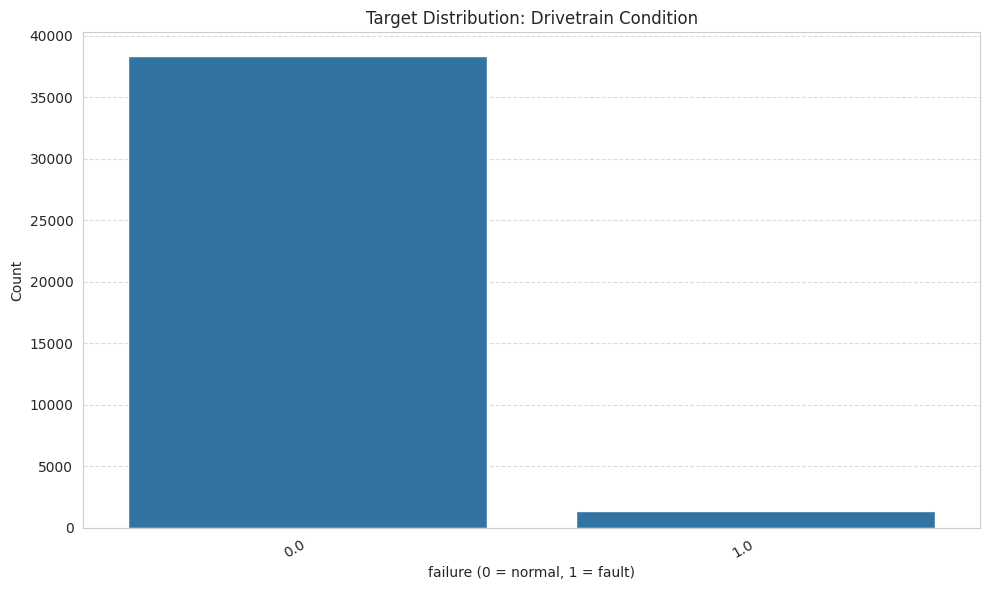
    


Many more expected failures vs unexpected failures.

### ```wind_speed_mps```

Generate a histogram of the `wind_speed_mps` feature. Identify the range where most observations are concentrated and check for any skewness or unusual values.


```python
histogram(data, "wind_speed_mps", title='Wind Speed', xlabel="wind_speed_mps")
```


    
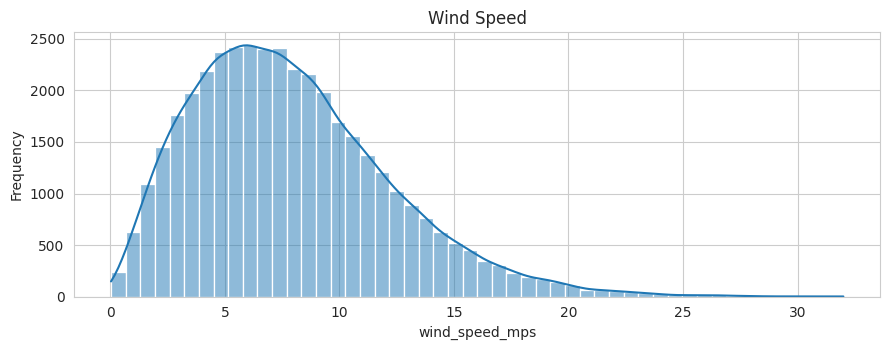
    


Right skewed a bit to the higher wind speeds.  Lower wind speeds are more common.

### ```air_density_kgm3```

Generate a histogram of the `air_density_kgm3` feature. Observe where most air density values are concentrated, assess the spread of the data, and identify any skewness or unusual values.


```python
histogram(data, 'air_density_kgm3', title='Air Density', xlabel='air_density_kgm3' )
```


    
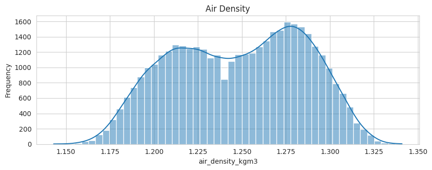
    


Looking at the Air Density histogram we a peaks between 1.2 and 1.28 densities indicating that there may be multiple sources for the data.
The skew isn't convincing indicating the mean and the median values are close.

### ```gearbox_oil_temp_C```

Generate a histogram of the `gearbox_oil_temp_C` feature. Observe where most gearbox oil temperature values are concentrated, assess the spread of the data, and identify any skewness or unusual values.


```python
histogram(data, 'gearbox_oil_temp_C', title='Gearbox Oil Temp', xlabel='Oil temp in Celcius')
```


    
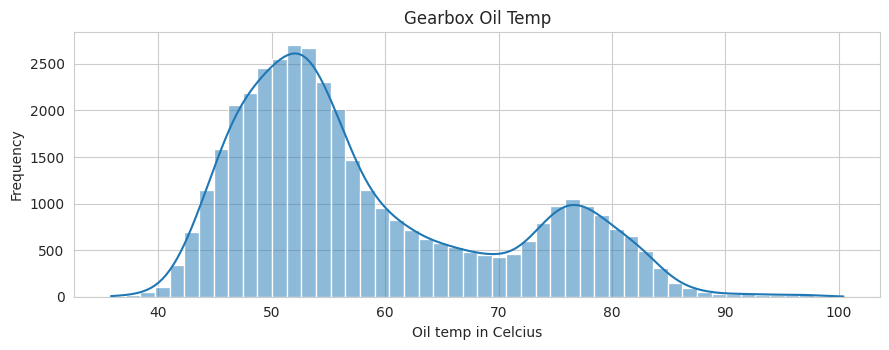
    


We see multiple peaks in the histogram perhaps indicating multiple sources.
Also the skew is slightly to the left indicating the median is greater than the mean.

### ```generator_winding_temp_C```

Generate a histogram of the `generator_winding_temp_C` feature. Observe where most generator winding temperature values are concentrated, assess the spread of the data, and identify any skewness or unusual values.


```python
histogram(data, 'generator_winding_temp_C', xlabel='Generator Winding Temp in Celcius')
```


    
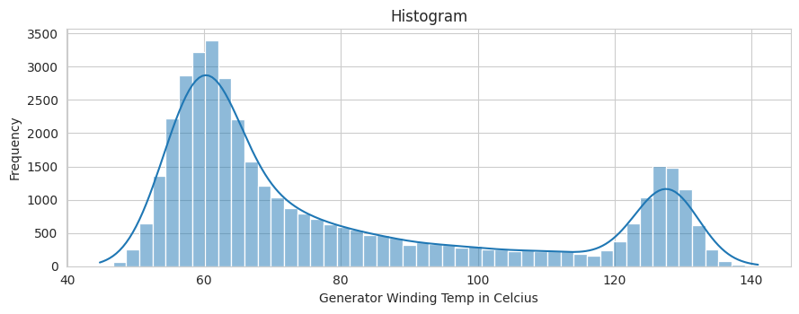
    


There are two peaks spread far apart.  This might indicate again that there are multiple data sources - 2 perhaps with seperate mechanisms.
Skewness is minimal it appears although there are a few values popping up between the two peaks.  This might indicate that each distinct group has it's own mean and median.

### ```drivetrain_vibration_rms_mmps```

Generate a histogram of the `drivetrain_vibration_rms_mmps` feature. Observe where most vibration values are concentrated, assess the spread of the data, and identify any skewness or unusual values.


```python
histogram(data, 'drivetrain_vibration_rms_mmps', title='Drivetrain vibration', xlabel='Drivetrain vibration in RMS MMPS')
```


    
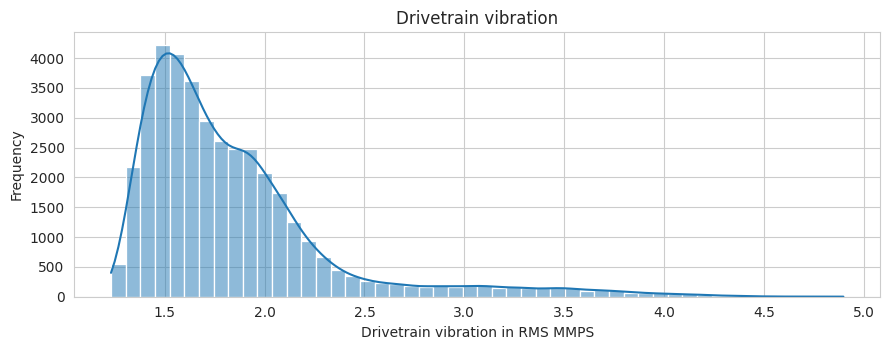
    


Heavy right skewness to the right indicating the mean is greater than the median.  Assuming multiple sources from previous charts it appears that vibration is similar in both sources.

### ```tower_vibration_mmps```

Generate a histogram of the `tower_vibration_mmps` feature. Observe where most tower vibration values are concentrated, assess the spread of the data, and identify any skewness or unusual values.


```python
histogram(data, 'tower_vibration_mmps', title='Tower Vibration', xlabel='tower_vibration_mmps')
```


    
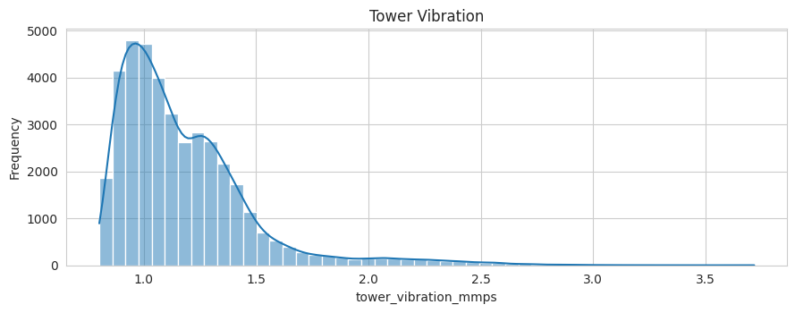
    


Again strong right skewness.  Mean is greater than the median indicating offsetting high frequencies to the lower vibrations.

### ```oil_particle_count```

Generate a histogram of the `oil_particle_count` feature. Observe where most oil particle count values are concentrated, assess the spread of the data, and identify any skewness or unusual values.


```python
histogram(data, 'oil_particle_count', title='Oil Particle Count', xlabel='oil_oarticle_count')
```


    
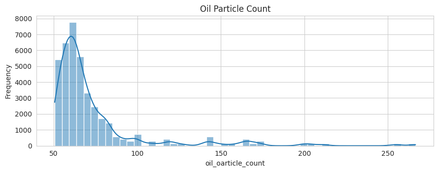
    


Again right skewness with curious outliers in higher values.  Higher particle frequencies are located with lower counts.  Why?

### ```prior_fault_count```

Generate a histogram of the `prior_fault_count` feature. Observe where most prior fault count values are concentrated, assess the spread of the data, and identify any skewness or unusual values.


```python
histogram(data, 'prior_fault_count', title='Prior Fault Count', xlabel='prior_fault_count')
```


    

    


Fault counts look to be pretty high in the low counts but there are a few that occur every so often.

### ```component_age_days```

Generate a histogram of the `component_age_days` feature. Observe where most component age values are concentrated, assess the spread of the data, and identify any skewness or unusual values.


```python
histogram(data, 'component_age_days', title='Component Age in Days', xlabel='component_age_days')
```


    
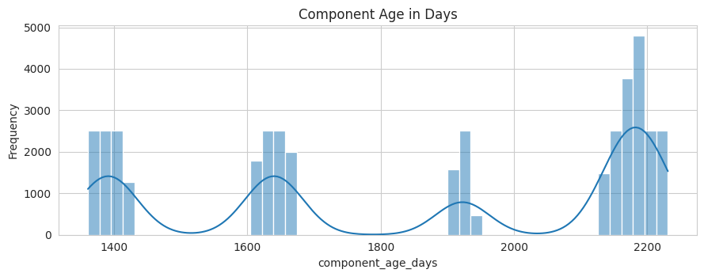
    


Multimodal result.  Various groupings.  More components aged around 6 years than any other group

##oil_pressure_bar
Create histogram of oil_pressure_bar so I know how to impute NaN values


```python
histogram(data, 'oil_pressure_bar', title='Oil pressure barometer reading', xlabel='oil_pressure_bar')
```


    
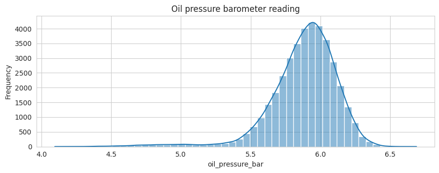
    


##generator_bearing_temp_C
Create histogram of generator_bearing_temp_C so I know how to impute.


```python
histogram(data, 'generator_bearing_temp_C', title='Generator Bearing Temp Celcius', xlabel='generator_bearing_temp_C')
```


    
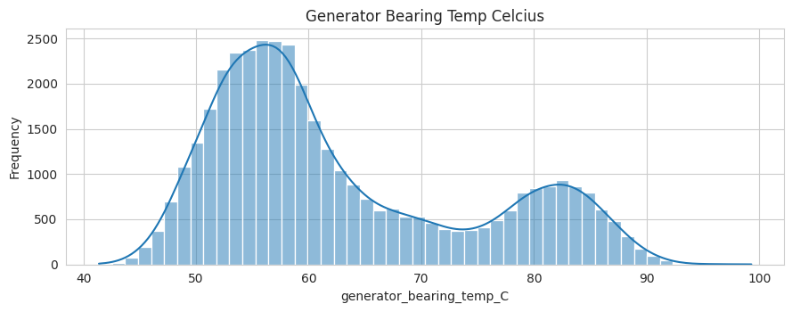
    


##load_cycles
Create histogram of load_cycles so I know how to impute.


```python
histogram(data, 'load_cycles', title='Load Cycles', xlabel='load_cycles')
```


    
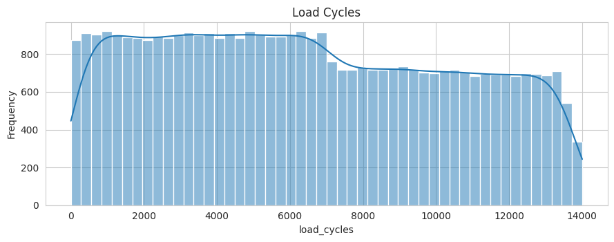
    


##hours_since_last_maintenance
Create histogram of hours_since_last_maintenance so I know how to impute


```python
histogram(data, 'hours_since_last_maintenance', title='Hours Since Last Maintenance', xlabel='hours_since_last_maintenance')
```


    
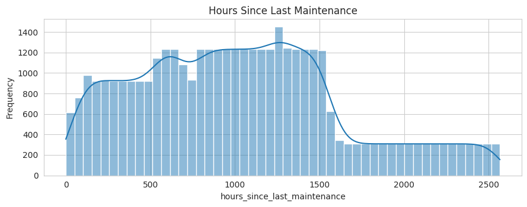
    


##prior_fault_count
Create histogram for prior_fault_count so I know how to impute


```python
histogram(data, 'prior_fault_count', title='Prior Fault Count', xlabel='prior_fault_count')
```


    
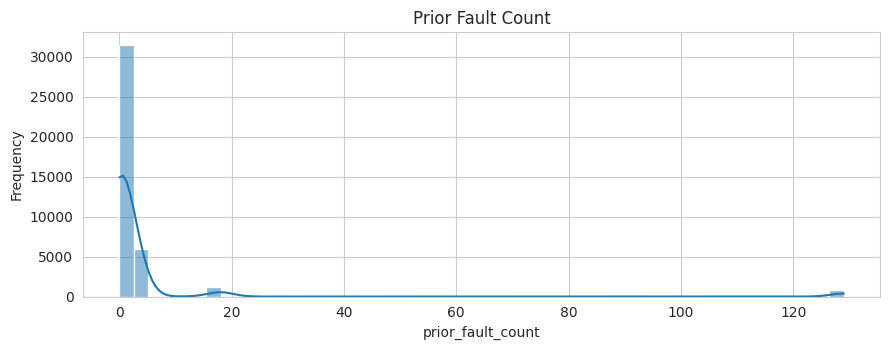
    


## Bivariate Analysis

### ```turbine_id``` vs ```failure```


```python
barchart(data_df=data, x_col='turbine_id', y_col='failure', title='Failure Rate Across Turbines', xlabel='Turbine ID', ylabel='Failure Rate (0 = normal, 1 = fault)')
```


    
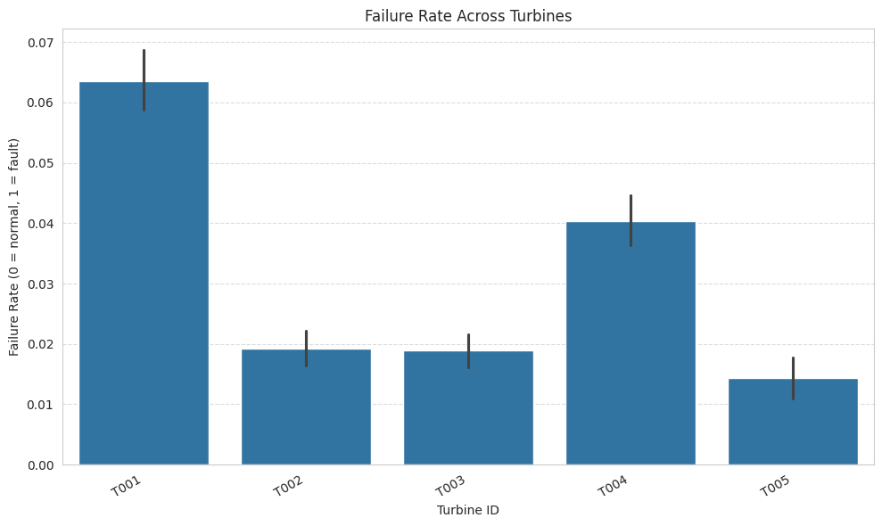
    


T001 has the most failures clearly.
More focus should be applied to this turbine.

### `wind_speed_mps` vs `power_output_kW`

Perform the following steps to analyze the relationship between wind speed and power output:

1. Group the `wind_speed_mps` values into intervals (bins).
2. Calculate the average `power_output_kW` for each wind speed interval.
3. Plot the average power output against the wind speed intervals.
4. Observe how power output changes as wind speed increases and identify any trends or patterns.


```python
wind_speed_bins_pd = pd.cut(data['wind_speed_mps'], bins=20, precision=1)
power_output_mean = data.groupby(wind_speed_bins_pd)['power_output_kW'].mean()

plt.figure(figsize=(10, 6))
plt.plot(power_output_mean.index.astype(str), power_output_mean.values, marker='o')
plt.xlabel('Wind Speed (m/s) Bins')
plt.ylabel('Average Power Output (kW)')
plt.title('Average Power Output vs. Wind Speed Bins')
plt.xticks(rotation=45, ha='right')
plt.grid(True)
plt.tight_layout()
plt.show()
```


    
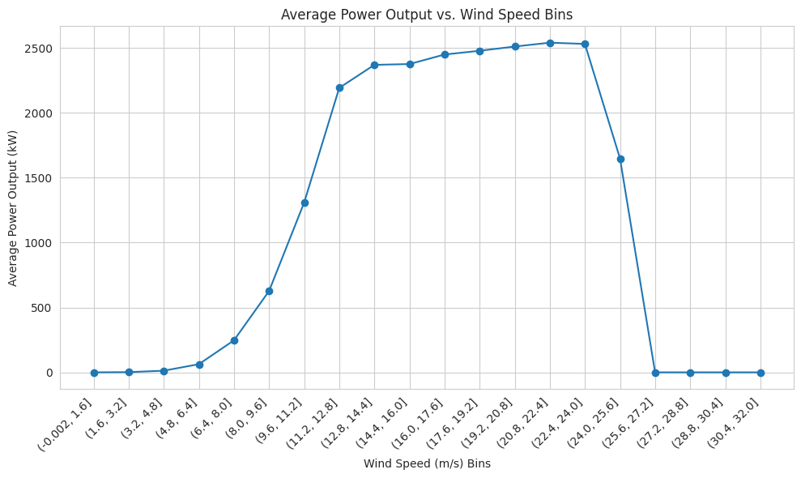
    


The data binning shows that most of the power generated happens betwween 11.2 and 24 wind speeds.  Interesting that the higher wind speeds don't generate any power but that's likely because there the wind never hit those speeds.

### ```rotor_speed_rpm``` vs ```generator_speed_rpm```

Generate a scatter plot using `rotor_speed_rpm` and `generator_speed_rpm`. Observe whether a relationship exists between the two variables, identify the overall trend, and look for any unusual observations or outliers.


```python
scatterplot(data, x_col='rotor_speed_rpm', y_col='generator_speed_rpm',
            title='Generator Speed vs. Rotor Speed',
            xlabel='Rotor Speed (rpm)',
            ylabel='Generator Speed (rpm)')
```


    
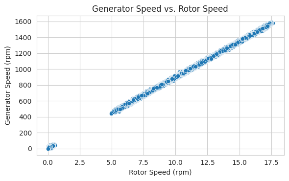
    


Pretty linear relationship between generator speed and rotor speed which makes sense.  There is a significant gap in the lower rotor speeds, perhaps because those speeds were either not recorded or didn't happen.

### ```wind_speed_mps``` vs ```rotor_speed_rpm```

Generate a scatter plot using `wind_speed_mps` and `rotor_speed_rpm`. Observe how rotor speed changes with increasing wind speed, identify the overall relationship between the two variables, and look for any unusual observations or outliers.


```python
scatterplot(data, x_col='wind_speed_mps', y_col='rotor_speed_rpm',
            title='Rotor Speed vs. Wind Speed',
            xlabel='Wind Speed (m/s)',
            ylabel='Rotor Speed (rpm)')
```


    
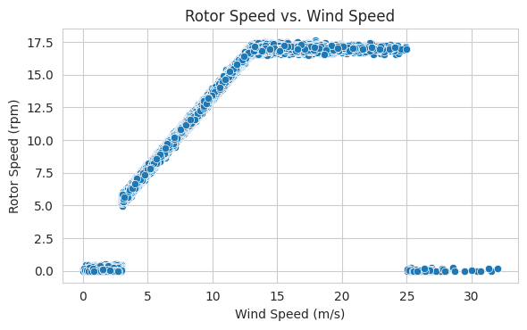
    


Again no data for the same range in rotor speed as the previous plot.  Appears that the rotor speed levels out at wind speed of about 13 m/s.  Might want to put a note of this lack of data for that range

### `drivetrain_vibration_rms_mmps` vs `failure`

Generate a box plot of `drivetrain_vibration_rms_mmps` across the `failure` classes. Compare the distribution of vibration levels between normal and fault conditions, and identify any differences in central tendency, spread, and potential outliers.


```python
from scipy.stats import iqr
boxplot(data, x_col='failure', y_col='drivetrain_vibration_rms_mmps',
        title='Drivetrain Vibration vs. Failure',
        xlabel='Failure (0 = normal, 1 = fault)',
        ylabel='Drivetrain Vibration (RMS MMPS)')

spread = data.groupby('failure')['drivetrain_vibration_rms_mmps'].apply(lambda x: iqr(x))
print('Spread:', spread)

medians = data.groupby('failure')['drivetrain_vibration_rms_mmps'].median()
print(f"Medians: {medians}")
```


    
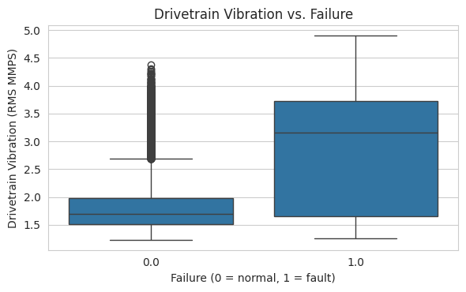
    


    Spread: failure
    0.0    0.470
    1.0    2.063
    Name: drivetrain_vibration_rms_mmps, dtype: float64
    Medians: failure
    0.0    1.699
    1.0    3.159
    Name: drivetrain_vibration_rms_mmps, dtype: float64


The median for the normal failure box plot is 1.699  The median for the fault failure is 3.159.  These medians indicate the central tendancy for both plots.  The spread of Drive train Vibration is .470 for the normal failures and 2.063 for the fault failures.  Potential outliers are all on the normal failures.  More faults when the drive train vibrations are higher.

### `oil_particle_count` vs `failure`

Generate a box plot of `oil_particle_count` across the `failure` classes. Compare the distribution of oil particle counts between normal and fault conditions, and identify any differences in central tendency, spread, and potential outliers.


```python
boxplot(data, x_col='failure', y_col='oil_particle_count',
        title='Oil Particle Count vs. Failure',
        xlabel='Failure (0 = normal, 1 = fault)',
        ylabel='Oil Particle Count')

spread = data.groupby('failure')['oil_particle_count'].apply(lambda x: iqr(x))
print('Spread:', spread)

medians = data.groupby('failure')['oil_particle_count'].median()
print(f"Medians: {medians}")
```


    
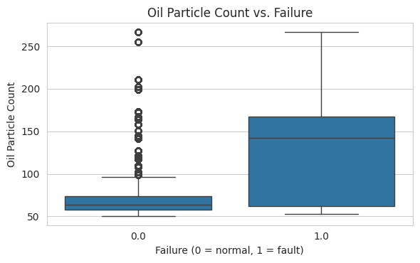
    


    Spread: failure
    0.0     15.589
    1.0    105.253
    Name: oil_particle_count, dtype: float64
    Medians: failure
    0.0     63.520
    1.0    141.934
    Name: oil_particle_count, dtype: float64


Mostly fault failures.  The spread of oil particle count for normal failures is 15.589.  The spread of oil particle count for fault failures is 105.253.  The median for normal failures is 63.52 and the median for fault failures is 141.934.  These medians indicate the central tendency for each bin.
This is important since a higher number of oil particles leads to more faults.

### `gearbox_bearing_temp_C` vs `failure`

Generate a box plot of `gearbox_bearing_temp_C` across the `failure` classes. Compare the distribution of gearbox bearing temperatures between normal and fault conditions, and identify any differences in central tendency, spread, and potential outliers.


```python
boxplot(data, x_col='failure', y_col='gearbox_bearing_temp_C',
        title='Gearbox Bearing Temp vs. Failure',
        xlabel='Failure (0 = normal, 1 = fault)',
        ylabel='Gearbox Bearing Temp (C)')

spread = data.groupby('failure')['gearbox_bearing_temp_C'].apply(lambda x: iqr(x))
print(f'Spread: {spread}')

medians = data.groupby('failure')['gearbox_bearing_temp_C'].median()
print(f"Medians: {medians}")
```


    
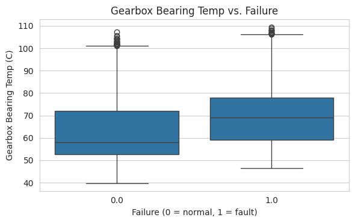
    


    Spread: failure
    0.0    19.306
    1.0    18.845
    Name: gearbox_bearing_temp_C, dtype: float64
    Medians: failure
    0.0    58.199
    1.0    69.099
    Name: gearbox_bearing_temp_C, dtype: float64


The spread is very close between the two bins.  19.306 and 18.845.  The central tendancy for normal failures tends towards 58.199 and for fault failures is 69.099.  Fault and normal failures are similar.  This relationship might not be important in the evaluation.

### `power_output_kW` vs `failure`

Generate a box plot of `power_output_kW` across the `failure` classes. Compare the distribution of power output between normal and fault conditions, and identify any differences in central tendency, spread, and potential outliers.


```python
boxplot(data, x_col='failure', y_col='power_output_kW',
        title='Power Output vs. Failure',
        xlabel='Failure (0 = normal, 1 = fault)',
        ylabel='Power Output (kW)')

gearbox_bearing_temp_C_spread = data.groupby('failure')['power_output_kW'].apply(lambda x: iqr(x))
print(f'Spread: {gearbox_bearing_temp_C_spread}')

medians = data.groupby('failure')['power_output_kW'].median()
print(f"Medians: {medians}")
```


    
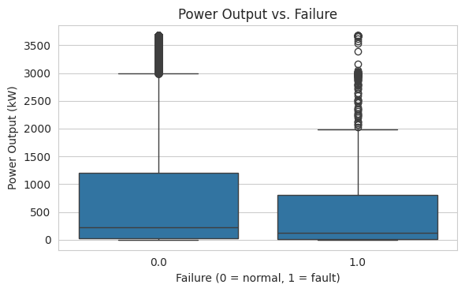
    


    Spread: failure
    0.0    1188.098
    1.0     794.479
    Name: power_output_kW, dtype: float64
    Medians: failure
    0.0    231.092
    1.0    125.083
    Name: power_output_kW, dtype: float64


The distribution of power output between the normal and fault conditions is fairly close with normal faults occuring at about 25% more power output than the fault failures.  The spread of normal failures is 1188.098C with a central tendency towards 231.092C
The spread of fault failures is 794.479 with a tendency toward 123.083C.  Lots of outliers in both bins mostly in the higher power output ranges.  Power output doesn't appear to be that important for the evaluation.

### `prior_fault_count` vs `failure`

Generate a box plot of `prior_fault_count` across the `failure` classes. Compare the distribution of prior fault counts between normal and fault conditions, and identify any differences in central tendency, spread, and potential outliers.


```python
boxplot(data, x_col='failure', y_col='prior_fault_count',
        title='Prior Fault Count vs. Failure',
        xlabel='Failure (0 = normal, 1 = fault)',
        ylabel='Prior Fault Count')

spread = data.groupby('failure')['prior_fault_count'].apply(lambda x: iqr(x))
print(f'Spread: {spread}')

medians = data.groupby('failure')['prior_fault_count'].median()
print(f"Medians: {medians}")
```


    
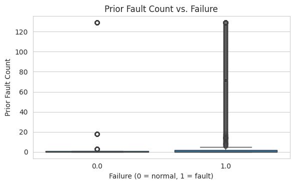
    


    Spread: failure
    0.0    1.0
    1.0    2.0
    Name: prior_fault_count, dtype: float64
    Medians: failure
    0.0    0.0
    1.0    0.0
    Name: prior_fault_count, dtype: float64


For the most part we see outliers in this plot.  The spread for normal failures in only 1.0 and for fault failures only 2.0.  These compact plots tell us the prior fault count is very consistent.  Both of the bins tend toward 0 prior failures.  However there are many more outliers in the faults if there have been prior faults.  This is important in the evaluation.

### ```failure``` vs ```hour```

Perform the following steps to analyze how failure rates vary throughout the day:

1. Calculate the failure rate for each hour of the day.
2. Convert the failure rate into percentage values for easier interpretation.
3. Generate a bar chart to visualize the hourly failure rates.
4. Identify the hours with the highest and lowest failure rates, and observe any time-based patterns in failures.


```python
# Failure rate per hour
failure_rate_by_hour_df = data.groupby('hour')['failure'].mean().reset_index()

failure_rate_by_hour_df['failure_rate_pct'] = failure_rate_by_hour_df['failure'] * 100

# Plot using the barchart utility function
barchart(data_df=failure_rate_by_hour_df, x_col='hour', y_col='failure_rate_pct',
         title='Failure Rate by Hour of Day',
         xlabel='Hour of Day', ylabel='Failure Rate (%)', rot_degrees=0)
```


    
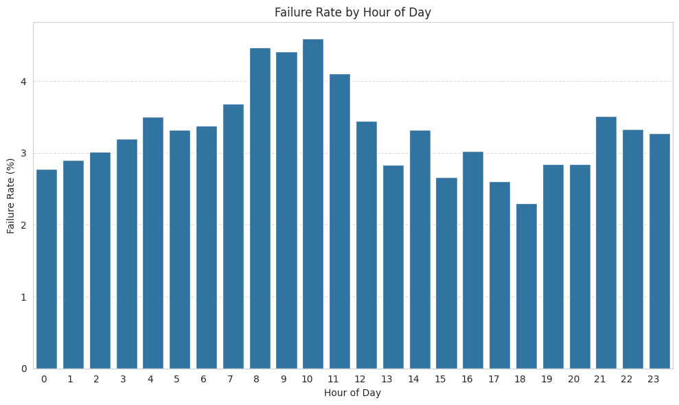
    


Failures look pretty consitent across hours with peaks in the morning.  More activity then it appears.  Not that important in the evaluation.

### ```failure``` vs ```dayofweek```

Perform the following steps to analyze how failure rates vary across the days of the week:

1. Calculate the failure rate for each day of the week.
2. Convert the failure rate into percentage values for easier interpretation.
3. Arrange the days in chronological order from Monday to Sunday.
4. Generate a bar chart to visualize the failure rates across the week.
5. Identify the days with the highest and lowest failure rates, and observe any weekly patterns in failures.


```python
failure_rate_per_weekday_df = data.groupby('dayofweek')['failure'].mean().reset_index()
failure_rate_per_weekday_df['failure_rate_pct'] = failure_rate_per_weekday_df['failure'] * 100
# Define the chronological order of days for sorting
day_order = ['Monday', 'Tuesday', 'Wednesday', 'Thursday', 'Friday', 'Saturday', 'Sunday']
# Map numerical dayofweek to names
day_name_map = {0: 'Monday', 1: 'Tuesday', 2: 'Wednesday', 3: 'Thursday', 4: 'Friday', 5: 'Saturday', 6: 'Sunday'}
failure_rate_per_weekday_df['dayofweek'] = failure_rate_per_weekday_df['dayofweek'].map(day_name_map)

# Convert 'dayofweek' to a categorical type with the defined order
failure_rate_per_weekday_df['dayofweek'] = pd.Categorical(failure_rate_per_weekday_df['dayofweek'], categories=day_order, ordered=True)

# Sort the DataFrame by the ordered 'dayofweek'
failure_rate_per_weekday_df = failure_rate_per_weekday_df.sort_values('dayofweek')

barchart(data_df=failure_rate_per_weekday_df, x_col='dayofweek', y_col='failure_rate_pct',
         title='Failure Rate by Week Day',
         xlabel='Weekday', ylabel='Failure Rate (%)', rot_degrees=30)
```


    
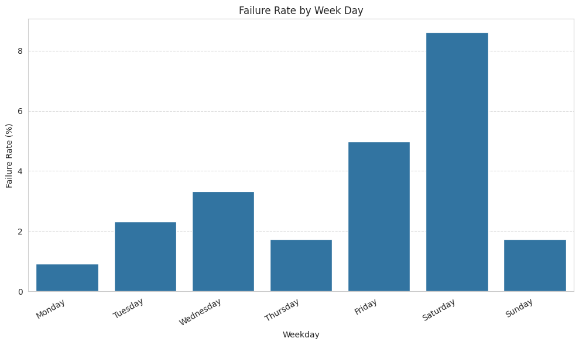
    


More fails on Satuday.

##yaw_misalignment_deg vs failure


```python
boxplot(data, x_col='failure', y_col='yaw_misalignment_deg',
        title='Yaw Misalignment vs. Failure',
        xlabel='Failure (0 = normal, 1 = fault)',
        ylabel='Yaw Misalignment in Degrees')

medians = data.groupby('failure')['yaw_misalignment_deg'].median()
print(f"Medians: {medians}")

```


    
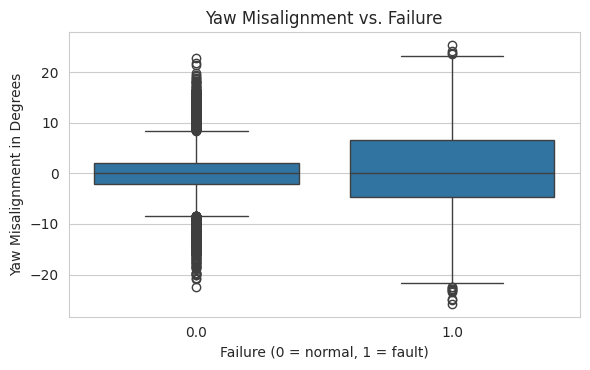
    


    Medians: failure
    0.0   -0.006
    1.0    0.060
    Name: yaw_misalignment_deg, dtype: float64


##Drivetrain vibrations vs Failure


```python
boxplot(data, x_col='failure', y_col='drivetrain_vibration_rms_mmps',
        title='Vibration vs. Failure',
        xlabel='Failure (0 = normal, 1 = fault)',
        ylabel='Vibration')

medians = data.groupby('failure')['drivetrain_vibration_rms_mmps'].median()
print(f"Medians: {medians}")
```


    
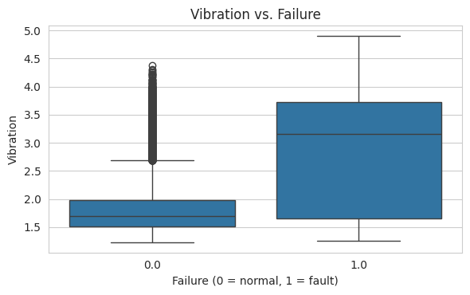
    


    Medians: failure
    0.0    1.699
    1.0    3.159
    Name: drivetrain_vibration_rms_mmps, dtype: float64


##Tower Vibration vs Failure


```python
boxplot(data, x_col='failure', y_col='tower_vibration_mmps',
        title='Tower vibration vs. Failure',
        xlabel='Failure (0 = normal, 1 = fault)',
        ylabel='Tower Vibration in mmps')

medians = data.groupby('failure')['tower_vibration_mmps'].median()
print(f"Medians: {medians}")
```


    
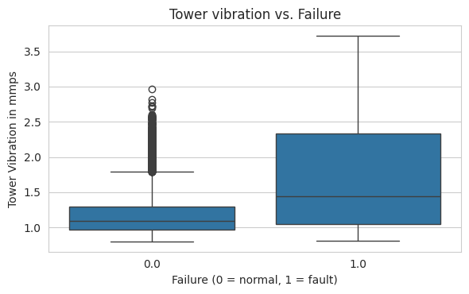
    


    Medians: failure
    0.0    1.095
    1.0    1.437
    Name: tower_vibration_mmps, dtype: float64


```python
boxplot(data, x_col='failure', y_col='nacelle_temp_C',
        title='Nacelle Temperature vs. Failure',
        xlabel='Failure (0 = normal, 1 = fault)',
        ylabel='Nacelle temparation in C')

medians = data.groupby('failure')['nacelle_temp_C'].median()
print(f"Medians: {medians}")
```


    
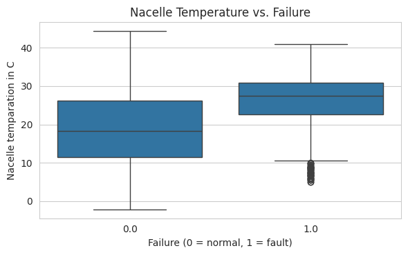
    


    Medians: failure
    0.0    18.337
    1.0    27.419
    Name: nacelle_temp_C, dtype: float64


## Multivariate Analysis

### Correlation Analysis

Create a list of all numerical features that will be used for correlation analysis. These features will be used to examine relationships between numerical variables and identify patterns that may be useful for further analysis and model building.


```python
numeric_cols = data.select_dtypes(include=['number']).columns.tolist()
display(numeric_cols)
```


    ['rated_power_kW',
     'wind_speed_mps',
     'wind_direction_deg',
     'turbulence_intensity',
     'air_density_kgm3',
     'ambient_temp_C',
     'humidity_pct',
     'power_output_kW',
     'rotor_speed_rpm',
     'generator_speed_rpm',
     'blade_pitch_angle_deg',
     'yaw_misalignment_deg',
     'gearbox_oil_temp_C',
     'gearbox_bearing_temp_C',
     'generator_bearing_temp_C',
     'generator_winding_temp_C',
     'main_bearing_temp_C',
     'nacelle_temp_C',
     'drivetrain_vibration_rms_mmps',
     'tower_vibration_mmps',
     'vib_fft_bearing_bpfo',
     'vib_fft_bearing_bpfi',
     'vib_fft_gearmesh',
     'vib_fft_sideband',
     'oil_particle_count',
     'oil_pressure_bar',
     'operating_hours_total',
     'cumulative_energy_MWh',
     'load_cycles',
     'hours_since_last_maintenance',
     'prior_fault_count',
     'component_age_days',
     'failure',
     'dayofweek',
     'hour']


Generate a correlation matrix for the numerical features. Examine the strength and direction of relationships between variables, identify highly correlated feature pairs, and look for potential multicollinearity that may affect model performance.


```python
plt.figure(figsize=(10, 8))
sns.heatmap(data[numeric_cols].corr(), annot=False, cmap='vlag', fmt=".2f")
plt.title('Correlation Matrix of Numericals')
plt.show()
```


    
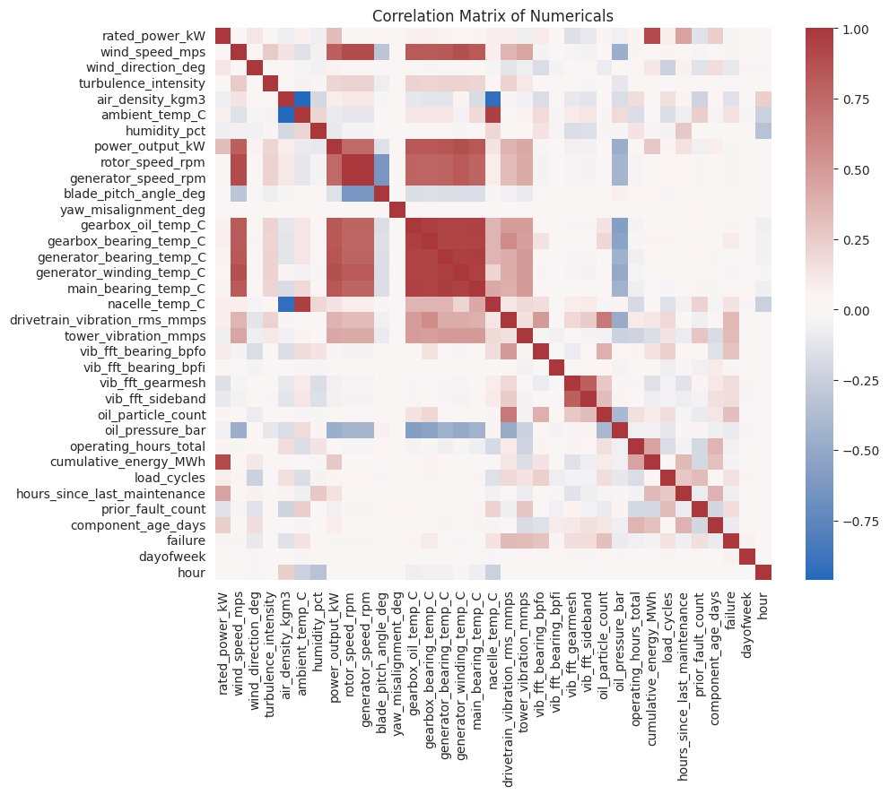
    


High correllation between wind speed and power output, rotor speed, and generator speed.  Also between wind speed and gearbox oil temp, gearbox bearing temp, generator bearing temp, generator winding temp and main bearing temp.

Also there is a high correllation between nacelle temp and ambiant temp.

Also a high correllation between rated power in KWh and cumulative energy in MWh

# **Data Preprocessing**

## Splitting the data into train, validation, and test sets

This data is **panel time-series**: 15 turbines, each logged every 10 minutes over two months, and a single degradation episode spans many consecutive rows. A random split would scatter rows from the same episode across train and test, letting the model effectively see failures it is later scored on - inflating every metric.


```python
data = data.sort_values(by=['timestamp','turbine_id'])
```


```python
nan_rows = data[data.isna().any(axis=1)]
print(nan_rows)
```

                    timestamp turbine_id  rated_power_kW  wind_speed_mps  \
    35146 2024-01-01 01:40:00       T005            1500          12.765   
    17596 2024-01-01 04:40:00       T003            3600          11.261   
    26382 2024-01-01 05:00:00       T004            3000           7.404   
    8824  2024-01-01 06:40:00       T002            1500           6.388   
    26392 2024-01-01 06:40:00       T004            3000          10.345   
    ...                   ...        ...             ...             ...   
    8702  2024-03-01 10:20:00       T001            1500          10.534   
    8733  2024-03-01 15:30:00       T001            1500           3.428   
    17525 2024-03-01 16:50:00       T002            1500           1.093   
    17529 2024-03-01 17:30:00       T002            1500          15.160   
    17543 2024-03-01 19:50:00       T002            1500          12.190   
    
           wind_direction_deg  turbulence_intensity  air_density_kgm3  \
    35146              51.970                 0.172             1.213   
    17596             185.733                 0.163             1.247   
    26382             236.518                 0.152             1.202   
    8824              233.555                 0.163             1.259   
    26392             248.153                 0.147             1.197   
    ...                   ...                   ...               ...   
    8702               50.551                 0.151             1.191   
    8733                6.929                 0.163             1.206   
    17525             213.610                 0.156             1.308   
    17529             218.857                 0.189             1.303   
    17543             221.874                 0.180             1.292   
    
           ambient_temp_C  humidity_pct  power_output_kW  rotor_speed_rpm  \
    35146          17.577        51.226         1477.453           16.600   
    17596          10.747        59.910         2849.415           15.056   
    26382          25.424        63.662          344.738           10.673   
    8824            2.788        73.221           66.890            9.173   
    26392          24.702        67.378         1581.825           13.697   
    ...               ...           ...              ...              ...   
    8702           26.136        69.429          826.762           14.307   
    8733           18.917        54.134            0.000            5.846   
    17525          -3.326        49.143            0.000            0.000   
    17529          -3.243        59.955         1530.000           17.051   
    17543          -2.364        55.595         1530.000           15.895   
    
           generator_speed_rpm  blade_pitch_angle_deg  yaw_misalignment_deg  \
    35146             1477.520                  3.592                -2.207   
    17596             1358.763                  0.652                -3.128   
    26382              954.788                  0.153                 0.868   
    8824               824.413                  0.768                -0.708   
    26392             1228.973                 -0.761                 4.498   
    ...                    ...                    ...                   ...   
    8702              1289.841                  0.424                -1.083   
    8733               526.861                 -0.020                -0.223   
    17525                0.662                 87.216                 1.770   
    17529             1534.052                 12.131                 0.672   
    17543             1415.827                  0.793                -4.214   
    
           gearbox_oil_temp_C  gearbox_bearing_temp_C  generator_bearing_temp_C  \
    35146              83.065                  87.898                       NaN   
    17596              73.679                  77.162                    77.649   
    26382                 NaN                  62.547                    60.866   
    8824               49.858                  49.658                       NaN   
    26392              70.435                  75.860                       NaN   
    ...                   ...                     ...                       ...   
    8702               72.922                  78.257                       NaN   
    8733                  NaN                  52.131                    59.827   
    17525              43.732                  47.999                    51.171   
    17529              73.870                  83.213                       NaN   
    17543                 NaN                  83.740                    81.219   
    
           generator_winding_temp_C  main_bearing_temp_C  nacelle_temp_C  \
    35146                   130.785               77.961          30.632   
    17596                   112.975               67.657          23.605   
    26382                    67.956               50.051          34.992   
    8824                     59.223               43.215          12.590   
    26392                    97.273               62.309          36.396   
    ...                         ...                  ...             ...   
    8702                    103.711               68.537          39.419   
    8733                     67.529               51.752          25.224   
    17525                    58.068               36.997           2.691   
    17529                   128.295               67.846           9.387   
    17543                   126.101               68.578          12.168   
    
           drivetrain_vibration_rms_mmps  tower_vibration_mmps  \
    35146                          2.118                 1.333   
    17596                          1.843                 1.356   
    26382                          1.731                 0.972   
    8824                           1.417                 0.997   
    26392                          2.151                 1.172   
    ...                              ...                   ...   
    8702                           1.906                 1.232   
    8733                           1.552                 0.913   
    17525                          1.387                 0.810   
    17529                          2.013                 1.427   
    17543                          2.358                 1.299   
    
           vib_fft_bearing_bpfo  vib_fft_bearing_bpfi  vib_fft_gearmesh  \
    35146                 0.436                 0.489             0.490   
    17596                 0.342                 0.384             0.501   
    26382                 0.383                 0.330             0.577   
    8824                  0.342                 0.393             0.761   
    26392                 0.383                 0.330             0.577   
    ...                     ...                   ...               ...   
    8702                  0.545                 0.488             0.895   
    8733                  0.545                 0.488             0.895   
    17525                 0.410                 0.328             0.666   
    17529                 0.410                 0.328             0.666   
    17543                 0.410                 0.328             0.666   
    
           vib_fft_sideband  oil_particle_count  oil_pressure_bar  \
    35146             0.268              65.806             5.747   
    17596             0.369              66.520               NaN   
    26382             0.221              54.612             6.103   
    8824              0.332              61.683             5.791   
    26392             0.221              54.612             5.791   
    ...                 ...                 ...               ...   
    8702              0.228              51.590             5.889   
    8733              0.228              51.590             6.201   
    17525             0.343              63.555               NaN   
    17529             0.343              63.555             5.805   
    17543             0.343              63.555             5.937   
    
           operating_hours_total  cumulative_energy_MWh  load_cycles  \
    35146              55709.689              28937.364       18.792   
    17596              30933.653              44852.249       49.007   
    26382              41027.925              47113.665       54.129   
    8824               35972.367              19795.076       66.975   
    26392              41029.591              47116.292       71.907   
    ...                      ...                    ...          ...   
    8702               20624.112              10311.163    13881.397   
    8733               20628.612              10313.432    13930.740   
    17525              37263.034              20369.621    13679.345   
    17529              37263.534              20369.898    13684.296   
    17543              37265.701              20371.419    13706.447   
    
           hours_since_last_maintenance  prior_fault_count  component_age_days  \
    35146                       529.404                0.0            1906.749   
    17596                      1251.819                0.0            2133.739   
    26382                        83.902                0.0            1609.589   
    8824                        141.080                0.0            2170.088   
    26392                        85.569                0.0            1609.659   
    ...                             ...                ...                 ...   
    8702                        680.333              129.0            1421.134   
    8733                        685.500              129.0            1421.349   
    17525                      1591.246                3.0            2230.512   
    17529                      1591.913                3.0            2230.540   
    17543                      1594.246                3.0            2230.637   
    
           failure  dayofweek  hour  
    35146      0.0          0     1  
    17596      0.0          0     4  
    26382      0.0          0     5  
    8824       0.0          0     6  
    26392      0.0          0     6  
    ...        ...        ...   ...  
    8702       0.0          4    10  
    8733       0.0          4    15  
    17525      0.0          4    16  
    17529      0.0          4    17  
    17543      0.0          4    19  
    
    [576 rows x 37 columns]


```python
n = len(data)
print(n)
```

    39689


```python
# Uncomment the below train and validation indices to create a 70% train, 15% validation, and 15% test split.
i_train = int(n * 0.70)
i_val = int(n * 0.85)

print(f'Train split: {i_train}')
print(f'Validation split: {i_val}')

# Uncomment the below train and validation indices to create a 90% train, 5% validation, and 5% test split.
# i_train = int(n * 0.90)
# i_val = int(n * 0.95)

# Uncomment the below train and validation indices to create a 80% train, 10% validation, and 10% test split.
# i_train = int(n * 0.80)
# i_val = int(n * 0.90)
```

    Train split: 27782
    Validation split: 33735


```python
data_train = data.iloc[:i_train]
data_val = data.iloc[i_train:i_val]
data_test = data.iloc[i_val:]

x_train = data_train.drop(columns=['failure', 'timestamp', 'turbine_id'])
y_train = data_train['failure']

x_valid = data_val.drop(columns=['failure', 'timestamp', 'turbine_id'])
y_valid = data_val['failure']

x_test = data_test.drop(columns=['failure', 'timestamp', 'turbine_id'])
y_test = data_test['failure']
```


```python
# See which columns have NaN values after the split
x_train.columns[x_train.isna().any()].tolist()
# y_train is a series so this doesn't work
# y_train.columns[y_train.isna().any()].tolist()
```


    ['gearbox_oil_temp_C',
     'generator_bearing_temp_C',
     'oil_pressure_bar',
     'load_cycles',
     'hours_since_last_maintenance',
     'prior_fault_count',
     'component_age_days']


```python
x_valid.columns[x_valid.isna().any()].tolist()
```


    ['gearbox_oil_temp_C', 'generator_bearing_temp_C', 'oil_pressure_bar']


```python
x_test.columns[x_test.isna().any()].tolist()
```


    ['gearbox_oil_temp_C', 'generator_bearing_temp_C', 'oil_pressure_bar']


```python
# Remove Nan from y
print (y_train.shape)
y_train = y_train.fillna(0)
print (y_train.shape)
print (y_valid.shape)
y_valid = y_valid.fillna(0)
print (y_valid.shape)
print (y_test.shape)
y_test = y_test.fillna(0)
print (y_test.shape)
```

    (27782,)
    (27782,)
    (5953,)
    (5953,)
    (5954,)
    (5954,)


```python
print(f'Train split failure rate: {y_train.mean()*100:.2f}%')
print(f'Validation split failure rate: {y_valid.mean()*100:.2f}%')
print(f'Test split failure rate: {y_test.mean()*100:.2f}%')
```

    Train split failure rate: 1.49%
    Validation split failure rate: 2.40%
    Test split failure rate: 12.71%


The failure rate after the split is troubling. I suppose I'll have to account for that.  I can't drop these columns so I'll have to fill in with zero or something else.

## Missing Value Treatment

### Display the percentage of missing values

Check the percentage of missing values in the training, validation, and test datasets. Identify the features with missing values before selecting an appropriate imputation strategy.


```python
x_train_missing = x_train.isna().mean() * 100
y_train_missing = y_train.isna().mean() * 100
x_valid_missing = x_valid.isna().mean() * 100
y_valid_missing = y_valid.isna().mean() * 100
x_test_missing = x_test.isna().mean() * 100
y_test_missing = y_test.isna().mean() * 100

print(((x_train.isnull().sum() / len(x_train) * 100).round(2)).loc[lambda x: x > 0])

print('x_train')
print(x_train_missing)
print('end x_train')
print('x_valid')
print(x_valid_missing)
print('end x_valid')
print('x_test')
print(x_test_missing)
print('end x_test')
```

    gearbox_oil_temp_C          0.53
    generator_bearing_temp_C    0.49
    oil_pressure_bar            0.44
    dtype: float64
    x_train
    rated_power_kW                   0.000000
    wind_speed_mps                   0.000000
    wind_direction_deg               0.000000
    turbulence_intensity             0.000000
    air_density_kgm3                 0.000000
    ambient_temp_C                   0.000000
    humidity_pct                     0.000000
    power_output_kW                  0.000000
    rotor_speed_rpm                  0.000000
    generator_speed_rpm              0.000000
    blade_pitch_angle_deg            0.000000
    yaw_misalignment_deg             0.000000
    gearbox_oil_temp_C               0.529120
    gearbox_bearing_temp_C           0.000000
    generator_bearing_temp_C         0.493125
    generator_winding_temp_C         0.000000
    main_bearing_temp_C              0.000000
    nacelle_temp_C                   0.000000
    drivetrain_vibration_rms_mmps    0.000000
    tower_vibration_mmps             0.000000
    vib_fft_bearing_bpfo             0.000000
    vib_fft_bearing_bpfi             0.000000
    vib_fft_gearmesh                 0.000000
    vib_fft_sideband                 0.000000
    oil_particle_count               0.000000
    oil_pressure_bar                 0.435534
    operating_hours_total            0.000000
    cumulative_energy_MWh            0.000000
    load_cycles                      0.003599
    hours_since_last_maintenance     0.003599
    prior_fault_count                0.003599
    component_age_days               0.003599
    dayofweek                        0.000000
    hour                             0.000000
    dtype: float64
    end x_train
    x_valid
    rated_power_kW                   0.000000
    wind_speed_mps                   0.000000
    wind_direction_deg               0.000000
    turbulence_intensity             0.000000
    air_density_kgm3                 0.000000
    ambient_temp_C                   0.000000
    humidity_pct                     0.000000
    power_output_kW                  0.000000
    rotor_speed_rpm                  0.000000
    generator_speed_rpm              0.000000
    blade_pitch_angle_deg            0.000000
    yaw_misalignment_deg             0.000000
    gearbox_oil_temp_C               0.386360
    gearbox_bearing_temp_C           0.000000
    generator_bearing_temp_C         0.520746
    generator_winding_temp_C         0.000000
    main_bearing_temp_C              0.000000
    nacelle_temp_C                   0.000000
    drivetrain_vibration_rms_mmps    0.000000
    tower_vibration_mmps             0.000000
    vib_fft_bearing_bpfo             0.000000
    vib_fft_bearing_bpfi             0.000000
    vib_fft_gearmesh                 0.000000
    vib_fft_sideband                 0.000000
    oil_particle_count               0.000000
    oil_pressure_bar                 0.503948
    operating_hours_total            0.000000
    cumulative_energy_MWh            0.000000
    load_cycles                      0.000000
    hours_since_last_maintenance     0.000000
    prior_fault_count                0.000000
    component_age_days               0.000000
    dayofweek                        0.000000
    hour                             0.000000
    dtype: float64
    end x_valid
    x_test
    rated_power_kW                   0.000000
    wind_speed_mps                   0.000000
    wind_direction_deg               0.000000
    turbulence_intensity             0.000000
    air_density_kgm3                 0.000000
    ambient_temp_C                   0.000000
    humidity_pct                     0.000000
    power_output_kW                  0.000000
    rotor_speed_rpm                  0.000000
    generator_speed_rpm              0.000000
    blade_pitch_angle_deg            0.000000
    yaw_misalignment_deg             0.000000
    gearbox_oil_temp_C               0.453477
    gearbox_bearing_temp_C           0.000000
    generator_bearing_temp_C         0.470272
    generator_winding_temp_C         0.000000
    main_bearing_temp_C              0.000000
    nacelle_temp_C                   0.000000
    drivetrain_vibration_rms_mmps    0.000000
    tower_vibration_mmps             0.000000
    vib_fft_bearing_bpfo             0.000000
    vib_fft_bearing_bpfi             0.000000
    vib_fft_gearmesh                 0.000000
    vib_fft_sideband                 0.000000
    oil_particle_count               0.000000
    oil_pressure_bar                 0.520658
    operating_hours_total            0.000000
    cumulative_energy_MWh            0.000000
    load_cycles                      0.000000
    hours_since_last_maintenance     0.000000
    prior_fault_count                0.000000
    component_age_days               0.000000
    dayofweek                        0.000000
    hour                             0.000000
    dtype: float64
    end x_test


The percentage missing is obvious in the table.  Two fields are missing a percentage in x_train, three in x_valid, and three in x_test.  After dropping those rows with NaN the percentage is zero

### `gearbox_oil_temp_C`

Perform the following steps to handle missing values in the `gearbox_oil_temp_C` feature:

1. Choose an imputation strategy (`mean`, `median`, or `mode`) based on the distribution of the feature.
2. Calculate the selected statistic using only the training data.
3. Use the calculated value to fill the missing values in the training, validation, and test datasets.
4. Apply the same imputation value across all three datasets to ensure a consistent preprocessing strategy and prevent data leakage.

Note:  Gearbox oil temp has two peaks in the histogram so using KNN to impute


```python
from sklearn.impute import KNNImputer

imputer = KNNImputer(n_neighbors=5)
x_train['gearbox_oil_temp_C'] = imputer.fit_transform(x_train[['gearbox_oil_temp_C']])
display(x_train['gearbox_oil_temp_C'])
# x_train['gearbox_oil_temp_C'] = x_train['gearbox_oil_temp_C'].fillna(x_train['gearbox_oil_temp_C'].mode()[0])
display(x_train['gearbox_oil_temp_C'])
#display(x_valid['gearbox_oil_temp_C'])
x_valid['gearbox_oil_temp_C'] = imputer.fit_transform(x_valid[['gearbox_oil_temp_C']])
#display(x_valid['gearbox_oil_temp_C'])
display(x_test['gearbox_oil_temp_C'])
x_test['gearbox_oil_temp_C'] = imputer.fit_transform(x_test[['gearbox_oil_temp_C']])
display(x_test['gearbox_oil_temp_C'])
```


<div>
<style scoped>
    .dataframe tbody tr th:only-of-type {
        vertical-align: middle;
    }

    .dataframe tbody tr th {
        vertical-align: top;
    }

    .dataframe thead th {
        text-align: right;
    }
</style>
<table border="1" class="dataframe">
  <thead>
    <tr style="text-align: right;">
      <th></th>
      <th>gearbox_oil_temp_C</th>
    </tr>
  </thead>
  <tbody>
    <tr>
      <th>0</th>
      <td>53.728</td>
    </tr>
    <tr>
      <th>8784</th>
      <td>75.600</td>
    </tr>
    <tr>
      <th>17568</th>
      <td>53.901</td>
    </tr>
    <tr>
      <th>26352</th>
      <td>53.313</td>
    </tr>
    <tr>
      <th>35136</th>
      <td>51.343</td>
    </tr>
    <tr>
      <th>...</th>
      <td>...</td>
    </tr>
    <tr>
      <th>5806</th>
      <td>46.824</td>
    </tr>
    <tr>
      <th>14590</th>
      <td>79.776</td>
    </tr>
    <tr>
      <th>23374</th>
      <td>55.351</td>
    </tr>
    <tr>
      <th>32158</th>
      <td>53.180</td>
    </tr>
    <tr>
      <th>5807</th>
      <td>57.714</td>
    </tr>
  </tbody>
</table>
<p>27782 rows × 1 columns</p>
</div><br><label><b>dtype:</b> float64</label>


<div>
<style scoped>
    .dataframe tbody tr th:only-of-type {
        vertical-align: middle;
    }

    .dataframe tbody tr th {
        vertical-align: top;
    }

    .dataframe thead th {
        text-align: right;
    }
</style>
<table border="1" class="dataframe">
  <thead>
    <tr style="text-align: right;">
      <th></th>
      <th>gearbox_oil_temp_C</th>
    </tr>
  </thead>
  <tbody>
    <tr>
      <th>0</th>
      <td>53.728</td>
    </tr>
    <tr>
      <th>8784</th>
      <td>75.600</td>
    </tr>
    <tr>
      <th>17568</th>
      <td>53.901</td>
    </tr>
    <tr>
      <th>26352</th>
      <td>53.313</td>
    </tr>
    <tr>
      <th>35136</th>
      <td>51.343</td>
    </tr>
    <tr>
      <th>...</th>
      <td>...</td>
    </tr>
    <tr>
      <th>5806</th>
      <td>46.824</td>
    </tr>
    <tr>
      <th>14590</th>
      <td>79.776</td>
    </tr>
    <tr>
      <th>23374</th>
      <td>55.351</td>
    </tr>
    <tr>
      <th>32158</th>
      <td>53.180</td>
    </tr>
    <tr>
      <th>5807</th>
      <td>57.714</td>
    </tr>
  </tbody>
</table>
<p>27782 rows × 1 columns</p>
</div><br><label><b>dtype:</b> float64</label>


<div>
<style scoped>
    .dataframe tbody tr th:only-of-type {
        vertical-align: middle;
    }

    .dataframe tbody tr th {
        vertical-align: top;
    }

    .dataframe thead th {
        text-align: right;
    }
</style>
<table border="1" class="dataframe">
  <thead>
    <tr style="text-align: right;">
      <th></th>
      <th>gearbox_oil_temp_C</th>
    </tr>
  </thead>
  <tbody>
    <tr>
      <th>24863</th>
      <td>74.205</td>
    </tr>
    <tr>
      <th>33647</th>
      <td>59.485</td>
    </tr>
    <tr>
      <th>7296</th>
      <td>48.015</td>
    </tr>
    <tr>
      <th>16080</th>
      <td>52.754</td>
    </tr>
    <tr>
      <th>24864</th>
      <td>74.655</td>
    </tr>
    <tr>
      <th>...</th>
      <td>...</td>
    </tr>
    <tr>
      <th>35134</th>
      <td>79.462</td>
    </tr>
    <tr>
      <th>8783</th>
      <td>57.028</td>
    </tr>
    <tr>
      <th>17567</th>
      <td>47.739</td>
    </tr>
    <tr>
      <th>26351</th>
      <td>79.634</td>
    </tr>
    <tr>
      <th>35135</th>
      <td>77.545</td>
    </tr>
  </tbody>
</table>
<p>5954 rows × 1 columns</p>
</div><br><label><b>dtype:</b> float64</label>


<div>
<style scoped>
    .dataframe tbody tr th:only-of-type {
        vertical-align: middle;
    }

    .dataframe tbody tr th {
        vertical-align: top;
    }

    .dataframe thead th {
        text-align: right;
    }
</style>
<table border="1" class="dataframe">
  <thead>
    <tr style="text-align: right;">
      <th></th>
      <th>gearbox_oil_temp_C</th>
    </tr>
  </thead>
  <tbody>
    <tr>
      <th>24863</th>
      <td>74.205</td>
    </tr>
    <tr>
      <th>33647</th>
      <td>59.485</td>
    </tr>
    <tr>
      <th>7296</th>
      <td>48.015</td>
    </tr>
    <tr>
      <th>16080</th>
      <td>52.754</td>
    </tr>
    <tr>
      <th>24864</th>
      <td>74.655</td>
    </tr>
    <tr>
      <th>...</th>
      <td>...</td>
    </tr>
    <tr>
      <th>35134</th>
      <td>79.462</td>
    </tr>
    <tr>
      <th>8783</th>
      <td>57.028</td>
    </tr>
    <tr>
      <th>17567</th>
      <td>47.739</td>
    </tr>
    <tr>
      <th>26351</th>
      <td>79.634</td>
    </tr>
    <tr>
      <th>35135</th>
      <td>77.545</td>
    </tr>
  </tbody>
</table>
<p>5954 rows × 1 columns</p>
</div><br><label><b>dtype:</b> float64</label>


```python
x_train.columns[x_train.isna().any()].tolist()
```


    ['generator_bearing_temp_C',
     'oil_pressure_bar',
     'load_cycles',
     'hours_since_last_maintenance',
     'prior_fault_count',
     'component_age_days']


```python
x_valid.columns[x_valid.isna().any()].tolist()
```


    ['generator_bearing_temp_C', 'oil_pressure_bar']


```python
x_test.columns[x_test.isna().any()].tolist()
```


    ['generator_bearing_temp_C', 'oil_pressure_bar']


### ```generator_bearing_temp_C```

Perform the following steps to handle missing values in the `generator_bearing_temp_C` feature:

1. Choose an imputation strategy (`mean`, `median`, or `mode`) based on the distribution of the feature.
2. Calculate the selected statistic using only the training data.
3. Use the calculated value to fill the missing values in the training, validation, and test datasets.
4. Apply the same imputation value across all three datasets to ensure a consistent preprocessing strategy and prevent data leakage.

Note:  Using KNN to impute because generator_bearing_temp_C has two peaks.


```python
from sklearn.impute import KNNImputer

imputer = KNNImputer(n_neighbors=5)
display(x_train['generator_bearing_temp_C'])
x_train['generator_bearing_temp_C'] = imputer.fit_transform(x_train[['generator_bearing_temp_C']])
display(x_train['generator_bearing_temp_C'])
display(x_valid['generator_bearing_temp_C'])
x_valid['generator_bearing_temp_C'] = imputer.fit_transform(x_valid[['generator_bearing_temp_C']])
display(x_valid['generator_bearing_temp_C'])
display(x_test['generator_bearing_temp_C'])
x_test['generator_bearing_temp_C'] = imputer.fit_transform(x_test[['generator_bearing_temp_C']])
display(x_test['generator_bearing_temp_C'])

```


<div>
<style scoped>
    .dataframe tbody tr th:only-of-type {
        vertical-align: middle;
    }

    .dataframe tbody tr th {
        vertical-align: top;
    }

    .dataframe thead th {
        text-align: right;
    }
</style>
<table border="1" class="dataframe">
  <thead>
    <tr style="text-align: right;">
      <th></th>
      <th>generator_bearing_temp_C</th>
    </tr>
  </thead>
  <tbody>
    <tr>
      <th>0</th>
      <td>57.637</td>
    </tr>
    <tr>
      <th>8784</th>
      <td>80.600</td>
    </tr>
    <tr>
      <th>17568</th>
      <td>58.500</td>
    </tr>
    <tr>
      <th>26352</th>
      <td>57.293</td>
    </tr>
    <tr>
      <th>35136</th>
      <td>55.550</td>
    </tr>
    <tr>
      <th>...</th>
      <td>...</td>
    </tr>
    <tr>
      <th>5806</th>
      <td>52.839</td>
    </tr>
    <tr>
      <th>14590</th>
      <td>86.262</td>
    </tr>
    <tr>
      <th>23374</th>
      <td>59.417</td>
    </tr>
    <tr>
      <th>32158</th>
      <td>55.866</td>
    </tr>
    <tr>
      <th>5807</th>
      <td>62.917</td>
    </tr>
  </tbody>
</table>
<p>27782 rows × 1 columns</p>
</div><br><label><b>dtype:</b> float64</label>


<div>
<style scoped>
    .dataframe tbody tr th:only-of-type {
        vertical-align: middle;
    }

    .dataframe tbody tr th {
        vertical-align: top;
    }

    .dataframe thead th {
        text-align: right;
    }
</style>
<table border="1" class="dataframe">
  <thead>
    <tr style="text-align: right;">
      <th></th>
      <th>generator_bearing_temp_C</th>
    </tr>
  </thead>
  <tbody>
    <tr>
      <th>0</th>
      <td>57.637</td>
    </tr>
    <tr>
      <th>8784</th>
      <td>80.600</td>
    </tr>
    <tr>
      <th>17568</th>
      <td>58.500</td>
    </tr>
    <tr>
      <th>26352</th>
      <td>57.293</td>
    </tr>
    <tr>
      <th>35136</th>
      <td>55.550</td>
    </tr>
    <tr>
      <th>...</th>
      <td>...</td>
    </tr>
    <tr>
      <th>5806</th>
      <td>52.839</td>
    </tr>
    <tr>
      <th>14590</th>
      <td>86.262</td>
    </tr>
    <tr>
      <th>23374</th>
      <td>59.417</td>
    </tr>
    <tr>
      <th>32158</th>
      <td>55.866</td>
    </tr>
    <tr>
      <th>5807</th>
      <td>62.917</td>
    </tr>
  </tbody>
</table>
<p>27782 rows × 1 columns</p>
</div><br><label><b>dtype:</b> float64</label>


<div>
<style scoped>
    .dataframe tbody tr th:only-of-type {
        vertical-align: middle;
    }

    .dataframe tbody tr th {
        vertical-align: top;
    }

    .dataframe thead th {
        text-align: right;
    }
</style>
<table border="1" class="dataframe">
  <thead>
    <tr style="text-align: right;">
      <th></th>
      <th>generator_bearing_temp_C</th>
    </tr>
  </thead>
  <tbody>
    <tr>
      <th>14591</th>
      <td>56.408</td>
    </tr>
    <tr>
      <th>23375</th>
      <td>50.729</td>
    </tr>
    <tr>
      <th>32159</th>
      <td>56.762</td>
    </tr>
    <tr>
      <th>5808</th>
      <td>52.112</td>
    </tr>
    <tr>
      <th>14592</th>
      <td>59.941</td>
    </tr>
    <tr>
      <th>...</th>
      <td>...</td>
    </tr>
    <tr>
      <th>16078</th>
      <td>49.085</td>
    </tr>
    <tr>
      <th>24862</th>
      <td>49.986</td>
    </tr>
    <tr>
      <th>33646</th>
      <td>86.484</td>
    </tr>
    <tr>
      <th>7295</th>
      <td>52.194</td>
    </tr>
    <tr>
      <th>16079</th>
      <td>58.280</td>
    </tr>
  </tbody>
</table>
<p>5953 rows × 1 columns</p>
</div><br><label><b>dtype:</b> float64</label>


<div>
<style scoped>
    .dataframe tbody tr th:only-of-type {
        vertical-align: middle;
    }

    .dataframe tbody tr th {
        vertical-align: top;
    }

    .dataframe thead th {
        text-align: right;
    }
</style>
<table border="1" class="dataframe">
  <thead>
    <tr style="text-align: right;">
      <th></th>
      <th>generator_bearing_temp_C</th>
    </tr>
  </thead>
  <tbody>
    <tr>
      <th>14591</th>
      <td>56.408</td>
    </tr>
    <tr>
      <th>23375</th>
      <td>50.729</td>
    </tr>
    <tr>
      <th>32159</th>
      <td>56.762</td>
    </tr>
    <tr>
      <th>5808</th>
      <td>52.112</td>
    </tr>
    <tr>
      <th>14592</th>
      <td>59.941</td>
    </tr>
    <tr>
      <th>...</th>
      <td>...</td>
    </tr>
    <tr>
      <th>16078</th>
      <td>49.085</td>
    </tr>
    <tr>
      <th>24862</th>
      <td>49.986</td>
    </tr>
    <tr>
      <th>33646</th>
      <td>86.484</td>
    </tr>
    <tr>
      <th>7295</th>
      <td>52.194</td>
    </tr>
    <tr>
      <th>16079</th>
      <td>58.280</td>
    </tr>
  </tbody>
</table>
<p>5953 rows × 1 columns</p>
</div><br><label><b>dtype:</b> float64</label>


<div>
<style scoped>
    .dataframe tbody tr th:only-of-type {
        vertical-align: middle;
    }

    .dataframe tbody tr th {
        vertical-align: top;
    }

    .dataframe thead th {
        text-align: right;
    }
</style>
<table border="1" class="dataframe">
  <thead>
    <tr style="text-align: right;">
      <th></th>
      <th>generator_bearing_temp_C</th>
    </tr>
  </thead>
  <tbody>
    <tr>
      <th>24863</th>
      <td>80.824</td>
    </tr>
    <tr>
      <th>33647</th>
      <td>67.405</td>
    </tr>
    <tr>
      <th>7296</th>
      <td>50.617</td>
    </tr>
    <tr>
      <th>16080</th>
      <td>57.479</td>
    </tr>
    <tr>
      <th>24864</th>
      <td>81.285</td>
    </tr>
    <tr>
      <th>...</th>
      <td>...</td>
    </tr>
    <tr>
      <th>35134</th>
      <td>90.761</td>
    </tr>
    <tr>
      <th>8783</th>
      <td>59.987</td>
    </tr>
    <tr>
      <th>17567</th>
      <td>50.919</td>
    </tr>
    <tr>
      <th>26351</th>
      <td>85.491</td>
    </tr>
    <tr>
      <th>35135</th>
      <td>88.059</td>
    </tr>
  </tbody>
</table>
<p>5954 rows × 1 columns</p>
</div><br><label><b>dtype:</b> float64</label>


<div>
<style scoped>
    .dataframe tbody tr th:only-of-type {
        vertical-align: middle;
    }

    .dataframe tbody tr th {
        vertical-align: top;
    }

    .dataframe thead th {
        text-align: right;
    }
</style>
<table border="1" class="dataframe">
  <thead>
    <tr style="text-align: right;">
      <th></th>
      <th>generator_bearing_temp_C</th>
    </tr>
  </thead>
  <tbody>
    <tr>
      <th>24863</th>
      <td>80.824</td>
    </tr>
    <tr>
      <th>33647</th>
      <td>67.405</td>
    </tr>
    <tr>
      <th>7296</th>
      <td>50.617</td>
    </tr>
    <tr>
      <th>16080</th>
      <td>57.479</td>
    </tr>
    <tr>
      <th>24864</th>
      <td>81.285</td>
    </tr>
    <tr>
      <th>...</th>
      <td>...</td>
    </tr>
    <tr>
      <th>35134</th>
      <td>90.761</td>
    </tr>
    <tr>
      <th>8783</th>
      <td>59.987</td>
    </tr>
    <tr>
      <th>17567</th>
      <td>50.919</td>
    </tr>
    <tr>
      <th>26351</th>
      <td>85.491</td>
    </tr>
    <tr>
      <th>35135</th>
      <td>88.059</td>
    </tr>
  </tbody>
</table>
<p>5954 rows × 1 columns</p>
</div><br><label><b>dtype:</b> float64</label>


```python
x_train.columns[x_train.isna().any()].tolist()
```


    ['oil_pressure_bar',
     'load_cycles',
     'hours_since_last_maintenance',
     'prior_fault_count',
     'component_age_days']


```python
x_valid.columns[x_valid.isna().any()].tolist()
```


    ['oil_pressure_bar']


```python
x_test.columns[x_test.isna().any()].tolist()
```


    ['oil_pressure_bar']


### ```oil_pressure_bar```

Perform the following steps to handle missing values in the `oil_pressure_bar` feature:

1. Choose an imputation strategy (`mean`, `median`, or `mode`) based on the distribution of the feature.
2. Calculate the selected statistic using only the training data.
3. Use the calculated value to fill the missing values in the training, validation, and test datasets.
4. Apply the same imputation value across all three datasets to ensure a consistent preprocessing strategy and prevent data leakage.

Note:  Using median since it's the data is left skewed.


```python
display(x_train['oil_pressure_bar'])
x_train['oil_pressure_bar'] = x_train['oil_pressure_bar'].fillna(x_train['oil_pressure_bar'].median())
display(x_train['oil_pressure_bar'])
oil_pressure_bar_median = x_train['oil_pressure_bar'].median()
print(oil_pressure_bar_median)

display(x_valid['oil_pressure_bar'])
x_valid['oil_pressure_bar'] = x_valid['oil_pressure_bar'].fillna(oil_pressure_bar_median)
display(x_valid['oil_pressure_bar'])
display(x_test['oil_pressure_bar'])
x_test['oil_pressure_bar'] = x_test['oil_pressure_bar'].fillna(oil_pressure_bar_median)
display(x_test['oil_pressure_bar'])
```


<div>
<style scoped>
    .dataframe tbody tr th:only-of-type {
        vertical-align: middle;
    }

    .dataframe tbody tr th {
        vertical-align: top;
    }

    .dataframe thead th {
        text-align: right;
    }
</style>
<table border="1" class="dataframe">
  <thead>
    <tr style="text-align: right;">
      <th></th>
      <th>oil_pressure_bar</th>
    </tr>
  </thead>
  <tbody>
    <tr>
      <th>0</th>
      <td>6.032</td>
    </tr>
    <tr>
      <th>8784</th>
      <td>5.669</td>
    </tr>
    <tr>
      <th>17568</th>
      <td>5.945</td>
    </tr>
    <tr>
      <th>26352</th>
      <td>6.167</td>
    </tr>
    <tr>
      <th>35136</th>
      <td>5.936</td>
    </tr>
    <tr>
      <th>...</th>
      <td>...</td>
    </tr>
    <tr>
      <th>5806</th>
      <td>5.946</td>
    </tr>
    <tr>
      <th>14590</th>
      <td>5.833</td>
    </tr>
    <tr>
      <th>23374</th>
      <td>5.784</td>
    </tr>
    <tr>
      <th>32158</th>
      <td>5.792</td>
    </tr>
    <tr>
      <th>5807</th>
      <td>5.747</td>
    </tr>
  </tbody>
</table>
<p>27782 rows × 1 columns</p>
</div><br><label><b>dtype:</b> float64</label>


<div>
<style scoped>
    .dataframe tbody tr th:only-of-type {
        vertical-align: middle;
    }

    .dataframe tbody tr th {
        vertical-align: top;
    }

    .dataframe thead th {
        text-align: right;
    }
</style>
<table border="1" class="dataframe">
  <thead>
    <tr style="text-align: right;">
      <th></th>
      <th>oil_pressure_bar</th>
    </tr>
  </thead>
  <tbody>
    <tr>
      <th>0</th>
      <td>6.032</td>
    </tr>
    <tr>
      <th>8784</th>
      <td>5.669</td>
    </tr>
    <tr>
      <th>17568</th>
      <td>5.945</td>
    </tr>
    <tr>
      <th>26352</th>
      <td>6.167</td>
    </tr>
    <tr>
      <th>35136</th>
      <td>5.936</td>
    </tr>
    <tr>
      <th>...</th>
      <td>...</td>
    </tr>
    <tr>
      <th>5806</th>
      <td>5.946</td>
    </tr>
    <tr>
      <th>14590</th>
      <td>5.833</td>
    </tr>
    <tr>
      <th>23374</th>
      <td>5.784</td>
    </tr>
    <tr>
      <th>32158</th>
      <td>5.792</td>
    </tr>
    <tr>
      <th>5807</th>
      <td>5.747</td>
    </tr>
  </tbody>
</table>
<p>27782 rows × 1 columns</p>
</div><br><label><b>dtype:</b> float64</label>


    5.917


<div>
<style scoped>
    .dataframe tbody tr th:only-of-type {
        vertical-align: middle;
    }

    .dataframe tbody tr th {
        vertical-align: top;
    }

    .dataframe thead th {
        text-align: right;
    }
</style>
<table border="1" class="dataframe">
  <thead>
    <tr style="text-align: right;">
      <th></th>
      <th>oil_pressure_bar</th>
    </tr>
  </thead>
  <tbody>
    <tr>
      <th>14591</th>
      <td>6.210</td>
    </tr>
    <tr>
      <th>23375</th>
      <td>6.073</td>
    </tr>
    <tr>
      <th>32159</th>
      <td>5.942</td>
    </tr>
    <tr>
      <th>5808</th>
      <td>5.827</td>
    </tr>
    <tr>
      <th>14592</th>
      <td>5.947</td>
    </tr>
    <tr>
      <th>...</th>
      <td>...</td>
    </tr>
    <tr>
      <th>16078</th>
      <td>5.912</td>
    </tr>
    <tr>
      <th>24862</th>
      <td>5.943</td>
    </tr>
    <tr>
      <th>33646</th>
      <td>5.414</td>
    </tr>
    <tr>
      <th>7295</th>
      <td>5.965</td>
    </tr>
    <tr>
      <th>16079</th>
      <td>5.819</td>
    </tr>
  </tbody>
</table>
<p>5953 rows × 1 columns</p>
</div><br><label><b>dtype:</b> float64</label>


<div>
<style scoped>
    .dataframe tbody tr th:only-of-type {
        vertical-align: middle;
    }

    .dataframe tbody tr th {
        vertical-align: top;
    }

    .dataframe thead th {
        text-align: right;
    }
</style>
<table border="1" class="dataframe">
  <thead>
    <tr style="text-align: right;">
      <th></th>
      <th>oil_pressure_bar</th>
    </tr>
  </thead>
  <tbody>
    <tr>
      <th>14591</th>
      <td>6.210</td>
    </tr>
    <tr>
      <th>23375</th>
      <td>6.073</td>
    </tr>
    <tr>
      <th>32159</th>
      <td>5.942</td>
    </tr>
    <tr>
      <th>5808</th>
      <td>5.827</td>
    </tr>
    <tr>
      <th>14592</th>
      <td>5.947</td>
    </tr>
    <tr>
      <th>...</th>
      <td>...</td>
    </tr>
    <tr>
      <th>16078</th>
      <td>5.912</td>
    </tr>
    <tr>
      <th>24862</th>
      <td>5.943</td>
    </tr>
    <tr>
      <th>33646</th>
      <td>5.414</td>
    </tr>
    <tr>
      <th>7295</th>
      <td>5.965</td>
    </tr>
    <tr>
      <th>16079</th>
      <td>5.819</td>
    </tr>
  </tbody>
</table>
<p>5953 rows × 1 columns</p>
</div><br><label><b>dtype:</b> float64</label>


<div>
<style scoped>
    .dataframe tbody tr th:only-of-type {
        vertical-align: middle;
    }

    .dataframe tbody tr th {
        vertical-align: top;
    }

    .dataframe thead th {
        text-align: right;
    }
</style>
<table border="1" class="dataframe">
  <thead>
    <tr style="text-align: right;">
      <th></th>
      <th>oil_pressure_bar</th>
    </tr>
  </thead>
  <tbody>
    <tr>
      <th>24863</th>
      <td>5.327</td>
    </tr>
    <tr>
      <th>33647</th>
      <td>5.877</td>
    </tr>
    <tr>
      <th>7296</th>
      <td>5.925</td>
    </tr>
    <tr>
      <th>16080</th>
      <td>5.932</td>
    </tr>
    <tr>
      <th>24864</th>
      <td>5.669</td>
    </tr>
    <tr>
      <th>...</th>
      <td>...</td>
    </tr>
    <tr>
      <th>35134</th>
      <td>5.703</td>
    </tr>
    <tr>
      <th>8783</th>
      <td>6.107</td>
    </tr>
    <tr>
      <th>17567</th>
      <td>6.254</td>
    </tr>
    <tr>
      <th>26351</th>
      <td>5.683</td>
    </tr>
    <tr>
      <th>35135</th>
      <td>5.782</td>
    </tr>
  </tbody>
</table>
<p>5954 rows × 1 columns</p>
</div><br><label><b>dtype:</b> float64</label>


<div>
<style scoped>
    .dataframe tbody tr th:only-of-type {
        vertical-align: middle;
    }

    .dataframe tbody tr th {
        vertical-align: top;
    }

    .dataframe thead th {
        text-align: right;
    }
</style>
<table border="1" class="dataframe">
  <thead>
    <tr style="text-align: right;">
      <th></th>
      <th>oil_pressure_bar</th>
    </tr>
  </thead>
  <tbody>
    <tr>
      <th>24863</th>
      <td>5.327</td>
    </tr>
    <tr>
      <th>33647</th>
      <td>5.877</td>
    </tr>
    <tr>
      <th>7296</th>
      <td>5.925</td>
    </tr>
    <tr>
      <th>16080</th>
      <td>5.932</td>
    </tr>
    <tr>
      <th>24864</th>
      <td>5.669</td>
    </tr>
    <tr>
      <th>...</th>
      <td>...</td>
    </tr>
    <tr>
      <th>35134</th>
      <td>5.703</td>
    </tr>
    <tr>
      <th>8783</th>
      <td>6.107</td>
    </tr>
    <tr>
      <th>17567</th>
      <td>6.254</td>
    </tr>
    <tr>
      <th>26351</th>
      <td>5.683</td>
    </tr>
    <tr>
      <th>35135</th>
      <td>5.782</td>
    </tr>
  </tbody>
</table>
<p>5954 rows × 1 columns</p>
</div><br><label><b>dtype:</b> float64</label>


```python
x_train.columns[x_train.isna().any()].tolist()
```


    ['load_cycles',
     'hours_since_last_maintenance',
     'prior_fault_count',
     'component_age_days']


```python
x_valid.columns[x_valid.isna().any()].tolist()
```


    []


```python
x_test.columns[x_test.isna().any()].tolist()
```


    []


##Impute the rest of the missing values from x_train
component_age_days, load_cycles, hours_since_last_maintenance, prior_fault_count


```python
from sklearn.impute import KNNImputer

# Using KNN since there are four peaks in this column
imputer = KNNImputer(n_neighbors=5)
print('x_component_age_days')
#x_train['component_age_days'] = x_train['component_age_days'].fillna(x_train['component_age_days'].mode()[0]
display(x_train['component_age_days'])
x_train['component_age_days'] = imputer.fit_transform(x_train[['component_age_days']])
display(x_train['component_age_days'])
display(x_valid['component_age_days'])
x_valid['component_age_days'] = imputer.fit_transform(x_valid[['component_age_days']])
display(x_valid['component_age_days'])
display(x_test['component_age_days'])
x_test['component_age_days'] = imputer.fit_transform(x_test[['component_age_days']])
display(x_test['component_age_days'])

# Using mean since histogram indicates one single peak across all values
print('x_load_cyles')
x_train['load_cycles'] = x_train['load_cycles'].fillna(x_train['load_cycles'].mean())
x_train_load_mean = x_train['load_cycles'].mean()
print(x_train_load_mean)
x_valid['load_cycles'] = x_valid['load_cycles'].fillna(x_train_load_mean)
x_test['load_cycles'] = x_test['load_cycles'].fillna(x_train_load_mean)

# Using mean since histogram indicates one single peak across all values
print('x_hours_since_last_maintenance')
x_train['hours_since_last_maintenance'] = x_train['hours_since_last_maintenance'].fillna(x_train['hours_since_last_maintenance'].mean())
x_train_hours_mean = x_train['hours_since_last_maintenance'].mean()
print(x_train_hours_mean)
x_valid['hours_since_last_maintenance'] = x_valid['hours_since_last_maintenance'].fillna(x_train_hours_mean)
x_test['hours_since_last_maintenance'] = x_test['hours_since_last_maintenance'].fillna(x_train_hours_mean)

# Using mean since histogram indicates right skewed
print('x_prior_fault_count')
x_train['prior_fault_count'] = x_train['prior_fault_count'].fillna(x_train['prior_fault_count'].mean())
x_train_fault_mean = x_train['prior_fault_count'].mean()
print(x_train_fault_mean)
x_valid['prior_fault_count'] = x_valid['prior_fault_count'].fillna(x_train_fault_mean)
x_test['prior_fault_count'] = x_test['prior_fault_count'].fillna(x_train_fault_mean)


```

    x_component_age_days


<div>
<style scoped>
    .dataframe tbody tr th:only-of-type {
        vertical-align: middle;
    }

    .dataframe tbody tr th {
        vertical-align: top;
    }

    .dataframe thead th {
        text-align: right;
    }
</style>
<table border="1" class="dataframe">
  <thead>
    <tr style="text-align: right;">
      <th></th>
      <th>component_age_days</th>
    </tr>
  </thead>
  <tbody>
    <tr>
      <th>0</th>
      <td>1360.703</td>
    </tr>
    <tr>
      <th>8784</th>
      <td>2169.811</td>
    </tr>
    <tr>
      <th>17568</th>
      <td>2133.545</td>
    </tr>
    <tr>
      <th>26352</th>
      <td>1609.381</td>
    </tr>
    <tr>
      <th>35136</th>
      <td>1906.679</td>
    </tr>
    <tr>
      <th>...</th>
      <td>...</td>
    </tr>
    <tr>
      <th>5806</th>
      <td>1401.023</td>
    </tr>
    <tr>
      <th>14590</th>
      <td>2210.130</td>
    </tr>
    <tr>
      <th>23374</th>
      <td>2173.864</td>
    </tr>
    <tr>
      <th>32158</th>
      <td>1649.701</td>
    </tr>
    <tr>
      <th>5807</th>
      <td>1401.030</td>
    </tr>
  </tbody>
</table>
<p>27782 rows × 1 columns</p>
</div><br><label><b>dtype:</b> float64</label>


<div>
<style scoped>
    .dataframe tbody tr th:only-of-type {
        vertical-align: middle;
    }

    .dataframe tbody tr th {
        vertical-align: top;
    }

    .dataframe thead th {
        text-align: right;
    }
</style>
<table border="1" class="dataframe">
  <thead>
    <tr style="text-align: right;">
      <th></th>
      <th>component_age_days</th>
    </tr>
  </thead>
  <tbody>
    <tr>
      <th>0</th>
      <td>1360.703</td>
    </tr>
    <tr>
      <th>8784</th>
      <td>2169.811</td>
    </tr>
    <tr>
      <th>17568</th>
      <td>2133.545</td>
    </tr>
    <tr>
      <th>26352</th>
      <td>1609.381</td>
    </tr>
    <tr>
      <th>35136</th>
      <td>1906.679</td>
    </tr>
    <tr>
      <th>...</th>
      <td>...</td>
    </tr>
    <tr>
      <th>5806</th>
      <td>1401.023</td>
    </tr>
    <tr>
      <th>14590</th>
      <td>2210.130</td>
    </tr>
    <tr>
      <th>23374</th>
      <td>2173.864</td>
    </tr>
    <tr>
      <th>32158</th>
      <td>1649.701</td>
    </tr>
    <tr>
      <th>5807</th>
      <td>1401.030</td>
    </tr>
  </tbody>
</table>
<p>27782 rows × 1 columns</p>
</div><br><label><b>dtype:</b> float64</label>


<div>
<style scoped>
    .dataframe tbody tr th:only-of-type {
        vertical-align: middle;
    }

    .dataframe tbody tr th {
        vertical-align: top;
    }

    .dataframe thead th {
        text-align: right;
    }
</style>
<table border="1" class="dataframe">
  <thead>
    <tr style="text-align: right;">
      <th></th>
      <th>component_age_days</th>
    </tr>
  </thead>
  <tbody>
    <tr>
      <th>14591</th>
      <td>2210.137</td>
    </tr>
    <tr>
      <th>23375</th>
      <td>2173.871</td>
    </tr>
    <tr>
      <th>32159</th>
      <td>1649.707</td>
    </tr>
    <tr>
      <th>5808</th>
      <td>1401.037</td>
    </tr>
    <tr>
      <th>14592</th>
      <td>2210.144</td>
    </tr>
    <tr>
      <th>...</th>
      <td>...</td>
    </tr>
    <tr>
      <th>16078</th>
      <td>2220.463</td>
    </tr>
    <tr>
      <th>24862</th>
      <td>2184.197</td>
    </tr>
    <tr>
      <th>33646</th>
      <td>1660.034</td>
    </tr>
    <tr>
      <th>7295</th>
      <td>1411.363</td>
    </tr>
    <tr>
      <th>16079</th>
      <td>2220.470</td>
    </tr>
  </tbody>
</table>
<p>5953 rows × 1 columns</p>
</div><br><label><b>dtype:</b> float64</label>


<div>
<style scoped>
    .dataframe tbody tr th:only-of-type {
        vertical-align: middle;
    }

    .dataframe tbody tr th {
        vertical-align: top;
    }

    .dataframe thead th {
        text-align: right;
    }
</style>
<table border="1" class="dataframe">
  <thead>
    <tr style="text-align: right;">
      <th></th>
      <th>component_age_days</th>
    </tr>
  </thead>
  <tbody>
    <tr>
      <th>14591</th>
      <td>2210.137</td>
    </tr>
    <tr>
      <th>23375</th>
      <td>2173.871</td>
    </tr>
    <tr>
      <th>32159</th>
      <td>1649.707</td>
    </tr>
    <tr>
      <th>5808</th>
      <td>1401.037</td>
    </tr>
    <tr>
      <th>14592</th>
      <td>2210.144</td>
    </tr>
    <tr>
      <th>...</th>
      <td>...</td>
    </tr>
    <tr>
      <th>16078</th>
      <td>2220.463</td>
    </tr>
    <tr>
      <th>24862</th>
      <td>2184.197</td>
    </tr>
    <tr>
      <th>33646</th>
      <td>1660.034</td>
    </tr>
    <tr>
      <th>7295</th>
      <td>1411.363</td>
    </tr>
    <tr>
      <th>16079</th>
      <td>2220.470</td>
    </tr>
  </tbody>
</table>
<p>5953 rows × 1 columns</p>
</div><br><label><b>dtype:</b> float64</label>


<div>
<style scoped>
    .dataframe tbody tr th:only-of-type {
        vertical-align: middle;
    }

    .dataframe tbody tr th {
        vertical-align: top;
    }

    .dataframe thead th {
        text-align: right;
    }
</style>
<table border="1" class="dataframe">
  <thead>
    <tr style="text-align: right;">
      <th></th>
      <th>component_age_days</th>
    </tr>
  </thead>
  <tbody>
    <tr>
      <th>24863</th>
      <td>2184.204</td>
    </tr>
    <tr>
      <th>33647</th>
      <td>1660.041</td>
    </tr>
    <tr>
      <th>7296</th>
      <td>1411.370</td>
    </tr>
    <tr>
      <th>16080</th>
      <td>2220.477</td>
    </tr>
    <tr>
      <th>24864</th>
      <td>2184.211</td>
    </tr>
    <tr>
      <th>...</th>
      <td>...</td>
    </tr>
    <tr>
      <th>35134</th>
      <td>1670.367</td>
    </tr>
    <tr>
      <th>8783</th>
      <td>1421.696</td>
    </tr>
    <tr>
      <th>17567</th>
      <td>2230.804</td>
    </tr>
    <tr>
      <th>26351</th>
      <td>2194.538</td>
    </tr>
    <tr>
      <th>35135</th>
      <td>1670.374</td>
    </tr>
  </tbody>
</table>
<p>5954 rows × 1 columns</p>
</div><br><label><b>dtype:</b> float64</label>


<div>
<style scoped>
    .dataframe tbody tr th:only-of-type {
        vertical-align: middle;
    }

    .dataframe tbody tr th {
        vertical-align: top;
    }

    .dataframe thead th {
        text-align: right;
    }
</style>
<table border="1" class="dataframe">
  <thead>
    <tr style="text-align: right;">
      <th></th>
      <th>component_age_days</th>
    </tr>
  </thead>
  <tbody>
    <tr>
      <th>24863</th>
      <td>2184.204</td>
    </tr>
    <tr>
      <th>33647</th>
      <td>1660.041</td>
    </tr>
    <tr>
      <th>7296</th>
      <td>1411.370</td>
    </tr>
    <tr>
      <th>16080</th>
      <td>2220.477</td>
    </tr>
    <tr>
      <th>24864</th>
      <td>2184.211</td>
    </tr>
    <tr>
      <th>...</th>
      <td>...</td>
    </tr>
    <tr>
      <th>35134</th>
      <td>1670.367</td>
    </tr>
    <tr>
      <th>8783</th>
      <td>1421.696</td>
    </tr>
    <tr>
      <th>17567</th>
      <td>2230.804</td>
    </tr>
    <tr>
      <th>26351</th>
      <td>2194.538</td>
    </tr>
    <tr>
      <th>35135</th>
      <td>1670.374</td>
    </tr>
  </tbody>
</table>
<p>5954 rows × 1 columns</p>
</div><br><label><b>dtype:</b> float64</label>


    x_load_cyles
    4365.011044562831
    x_hours_since_last_maintenance
    953.4690125985387
    x_prior_fault_count
    0.46409416507685103


```python
x_train.columns[x_train.isna().any()].tolist()
```


    []


```python
x_valid.columns[x_valid.isna().any()].tolist()
```


    []


```python
x_test.columns[x_test.isna().any()].tolist()
```


    []


```python
print("Null sum for sets")
print(y_train.isna().sum())
print(y_valid.isna().sum())
print(y_test.isna().sum())
```

    Null sum for sets
    0
    0
    0


```python
print(y_train.isna())
```

    0        False
    8784     False
    17568    False
    26352    False
    35136    False
             ...  
    5806     False
    14590    False
    23374    False
    32158    False
    5807     False
    Name: failure, Length: 27782, dtype: bool


```python
y_train.shape
```


    (27782,)


```python
y_valid.shape
```


    (5953,)


```python
y_test.shape
```


    (5954,)


# **Model Building**

**Note**: All five models provided in the subsequent subsections need to be built and evaluated.

## Model Evaluation Criterion


```python
# Uncomment one of the following evaluation metrics

# metric_of_choice = 'accuracy'
# metric_of_choice = 'precision'
# metric_of_choice = 'recall'
metric_of_choice = 'f1'
```

## Utility Functions

Before moving ahead, we define a function to check the performance of the model using different metrics.

- We will be using metric functions defined in sklearn for accuracy, precision, recall, f1_score
- We will create a function which will print out all the above metrics in one go.


```python
from sklearn.metrics import accuracy_score, precision_score, recall_score, f1_score, roc_auc_score
def model_performance_classification(model, predictors, target):
    """
    Function to compute different metrics to check classification model performance

    model: classifier (sklearn or tensorflow)
    predictors: independent variables
    target: dependent variable
    """
    # 1. Get raw predictions
    pred_raw = model.predict(predictors)

    # 2. Check the shape or values to handle DL vs ML models safely
    # If the predictions are probabilities (floats between 0 and 1, not exactly 0 or 1)
    # We check if any value falls strictly between 0 and 1
    if np.issubdtype(pred_raw.dtype, np.floating) and not np.all(np.isin(pred_raw, [0.0, 1.0])):
        # FOR TENSORFLOW DL MODELS: threshold the probabilities at 0.5
        pred = (pred_raw > 0.5).astype(int)
    else:
        # FOR SKLEARN ML MODELS: use them directly
        pred = pred_raw

    # Flatten predictions to ensure they match target shape perfectly
    pred = np.array(pred).flatten()

    # 3. Compute metrics
    acc = accuracy_score(target, pred)
    recall = recall_score(target, pred)
    precision = precision_score(target, pred)
    f1 = f1_score(target, pred)

    # 4. Creating a dataframe of metrics
    data_perf = pd.DataFrame(
        {"Accuracy": acc, "Recall": recall, "Precision": precision, "F1": f1},
        index=[0],
    )
    return data_perf
```


```python
def plot_confusion_matrix(model, predictors, target):
    """
    To plot the confusion_matrix with percentages

    model: classifier
    predictors: independent variables
    target: dependent variable
    """
    # 1. Get raw predictions
    y_pred_raw = model.predict(predictors)

    # 2. Check if predictions are probabilities (typical for Keras/TF models or some ML models with predict_proba)
    # If y_pred_raw contains float values between 0 and 1, it's likely probabilities.
    if np.issubdtype(y_pred_raw.dtype, np.floating) and np.any((y_pred_raw > 0) & (y_pred_raw < 1)):
        # Binarize probabilities using a threshold (e.g., 0.5)
        y_pred = (y_pred_raw > 0.5).astype(int)
    else:
        # Use predictions directly (typical for scikit-learn classifiers that return binary labels)
        y_pred = y_pred_raw

    # Ensure y_pred is flattened to a 1D array, as confusion_matrix expects this format.
    y_pred = np.array(y_pred).flatten()

    cm = confusion_matrix(target, y_pred)
    labels = np.asarray(
        [
            ["{0:0.0f}".format(item) + "\n{0:.2%}".format(item / cm.flatten().sum())]
            for item in cm.flatten()
        ]
    ).reshape(2, 2)

    plt.figure(figsize=(6, 4))
    sns.heatmap(cm, annot=labels, fmt="")
    plt.ylabel("True label")
    plt.xlabel("Predicted label")
    display(plt.show()) # Added plt.show() to explicitly display the plot
```

## Decision Tree Classifier

Perform the following steps to train and evaluate the Decision Tree model:

1. Create a Decision Tree classifier using `class_weight='balanced'` to assign higher importance to the minority class and reduce the impact of class imbalance.
2. Train the model using the training dataset.
3. Evaluate the model on the training dataset by generating a confusion matrix and computing the performance metrics.
4. Evaluate the model on the validation dataset by generating a confusion matrix and computing the performance metrics.
5. Compare the training and validation results to assess how well the model generalizes and identify any signs of overfitting or underfitting.


```python
from sklearn.metrics import classification_report

# Initialize the Decision Tree with balanced class weights
dtc = DecisionTreeClassifier(class_weight='balanced', random_state=42)

# Train the classifier for train
dtc.fit(x_train, y_train)
print('Train Analysis')
plot_confusion_matrix(dtc, x_train, y_train)

# Evaluate performance
y_train_pred = dtc.predict(x_train)
print(classification_report(y_train, y_train_pred))
decision_tree_train_perf = model_performance_classification(dtc, x_train, y_train)
display(decision_tree_train_perf)

# Train the classifier for validator
dtc.fit(x_valid, y_valid)
print('Validate Analysis')
plot_confusion_matrix(dtc, x_valid, y_valid)
y_valid_pred = dtc.predict(x_valid)
print(classification_report(y_valid, y_valid_pred))
decision_tree_valid_perf = model_performance_classification(dtc, x_valid, y_valid)
display(decision_tree_valid_perf)

```

    Train Analysis


    

    


    None


                  precision    recall  f1-score   support
    
             0.0       1.00      1.00      1.00     27369
             1.0       1.00      1.00      1.00       413
    
        accuracy                           1.00     27782
       macro avg       1.00      1.00      1.00     27782
    weighted avg       1.00      1.00      1.00     27782
    


  <div id="df-dd57c26b-b6c7-4e36-b4a4-97531b8a7e66" class="colab-df-container">
    <div>
<style scoped>
    .dataframe tbody tr th:only-of-type {
        vertical-align: middle;
    }

    .dataframe tbody tr th {
        vertical-align: top;
    }

    .dataframe thead th {
        text-align: right;
    }
</style>
<table border="1" class="dataframe">
  <thead>
    <tr style="text-align: right;">
      <th></th>
      <th>Accuracy</th>
      <th>Recall</th>
      <th>Precision</th>
      <th>F1</th>
    </tr>
  </thead>
  <tbody>
    <tr>
      <th>0</th>
      <td>1.0</td>
      <td>1.0</td>
      <td>1.0</td>
      <td>1.0</td>
    </tr>
  </tbody>
</table>
</div>
    <div class="colab-df-buttons">

  <div class="colab-df-container">
    <button class="colab-df-convert" onclick="convertToInteractive('df-dd57c26b-b6c7-4e36-b4a4-97531b8a7e66')"
            title="Convert this dataframe to an interactive table."
            style="display:none;">

  <svg xmlns="http://www.w3.org/2000/svg" height="24px" viewBox="0 -960 960 960">
    <path d="M120-120v-720h720v720H120Zm60-500h600v-160H180v160Zm220 220h160v-160H400v160Zm0 220h160v-160H400v160ZM180-400h160v-160H180v160Zm440 0h160v-160H620v160ZM180-180h160v-160H180v160Zm440 0h160v-160H620v160Z"/>
  </svg>
    </button>

  <style>
    .colab-df-container {
      display:flex;
      gap: 12px;
    }

    .colab-df-convert {
      background-color: #E8F0FE;
      border: none;
      border-radius: 50%;
      cursor: pointer;
      display: none;
      fill: #1967D2;
      height: 32px;
      padding: 0 0 0 0;
      width: 32px;
    }

    .colab-df-convert:hover {
      background-color: #E2EBFA;
      box-shadow: 0px 1px 2px rgba(60, 64, 67, 0.3), 0px 1px 3px 1px rgba(60, 64, 67, 0.15);
      fill: #174EA6;
    }

    .colab-df-buttons div {
      margin-bottom: 4px;
    }

    [theme=dark] .colab-df-convert {
      background-color: #3B4455;
      fill: #D2E3FC;
    }

    [theme=dark] .colab-df-convert:hover {
      background-color: #434B5C;
      box-shadow: 0px 1px 3px 1px rgba(0, 0, 0, 0.15);
      filter: drop-shadow(0px 1px 2px rgba(0, 0, 0, 0.3));
      fill: #FFFFFF;
    }
  </style>

    <script>
      const buttonEl =
        document.querySelector('#df-dd57c26b-b6c7-4e36-b4a4-97531b8a7e66 button.colab-df-convert');
      buttonEl.style.display =
        google.colab.kernel.accessAllowed ? 'block' : 'none';

      async function convertToInteractive(key) {
        const element = document.querySelector('#df-dd57c26b-b6c7-4e36-b4a4-97531b8a7e66');
        const dataTable =
          await google.colab.kernel.invokeFunction('convertToInteractive',
                                                    [key], {});
        if (!dataTable) return;

        const docLinkHtml = 'Like what you see? Visit the ' +
          '<a target="_blank" href=https://colab.research.google.com/notebooks/data_table.ipynb>data table notebook</a>'
          + ' to learn more about interactive tables.';
        element.innerHTML = '';
        dataTable['output_type'] = 'display_data';
        await google.colab.output.renderOutput(dataTable, element);
        const docLink = document.createElement('div');
        docLink.innerHTML = docLinkHtml;
        element.appendChild(docLink);
      }
    </script>
  </div>


  <div id="id_03449f86-b9a4-4673-ac7a-2f40f30be329">
    <style>
      .colab-df-generate {
        background-color: #E8F0FE;
        border: none;
        border-radius: 50%;
        cursor: pointer;
        display: none;
        fill: #1967D2;
        height: 32px;
        padding: 0 0 0 0;
        width: 32px;
      }

      .colab-df-generate:hover {
        background-color: #E2EBFA;
        box-shadow: 0px 1px 2px rgba(60, 64, 67, 0.3), 0px 1px 3px 1px rgba(60, 64, 67, 0.15);
        fill: #174EA6;
      }

      [theme=dark] .colab-df-generate {
        background-color: #3B4455;
        fill: #D2E3FC;
      }

      [theme=dark] .colab-df-generate:hover {
        background-color: #434B5C;
        box-shadow: 0px 1px 3px 1px rgba(0, 0, 0, 0.15);
        filter: drop-shadow(0px 1px 2px rgba(0, 0, 0, 0.3));
        fill: #FFFFFF;
      }
    </style>
    <button class="colab-df-generate" onclick="generateWithVariable('decision_tree_train_perf')"
            title="Generate code using this dataframe."
            style="display:none;">

  <svg xmlns="http://www.w3.org/2000/svg" height="24px"viewBox="0 0 24 24"
       width="24px">
    <path d="M7,19H8.4L18.45,9,17,7.55,7,17.6ZM5,21V16.75L18.45,3.32a2,2,0,0,1,2.83,0l1.4,1.43a1.91,1.91,0,0,1,.58,1.4,1.91,1.91,0,0,1-.58,1.4L9.25,21ZM18.45,9,17,7.55Zm-12,3A5.31,5.31,0,0,0,4.9,8.1,5.31,5.31,0,0,0,1,6.5,5.31,5.31,0,0,0,4.9,4.9,5.31,5.31,0,0,0,6.5,1,5.31,5.31,0,0,0,8.1,4.9,5.31,5.31,0,0,0,12,6.5,5.46,5.46,0,0,0,6.5,12Z"/>
  </svg>
    </button>
    <script>
      (() => {
      const buttonEl =
        document.querySelector('#id_03449f86-b9a4-4673-ac7a-2f40f30be329 button.colab-df-generate');
      buttonEl.style.display =
        google.colab.kernel.accessAllowed ? 'block' : 'none';

      buttonEl.onclick = () => {
        google.colab.notebook.generateWithVariable('decision_tree_train_perf');
      }
      })();
    </script>
  </div>

    </div>
  </div>


    Validate Analysis


    

    


    None


                  precision    recall  f1-score   support
    
             0.0       1.00      1.00      1.00      5810
             1.0       1.00      1.00      1.00       143
    
        accuracy                           1.00      5953
       macro avg       1.00      1.00      1.00      5953
    weighted avg       1.00      1.00      1.00      5953
    


  <div id="df-35b181b9-8a10-4a1b-8a51-0942df309635" class="colab-df-container">
    <div>
<style scoped>
    .dataframe tbody tr th:only-of-type {
        vertical-align: middle;
    }

    .dataframe tbody tr th {
        vertical-align: top;
    }

    .dataframe thead th {
        text-align: right;
    }
</style>
<table border="1" class="dataframe">
  <thead>
    <tr style="text-align: right;">
      <th></th>
      <th>Accuracy</th>
      <th>Recall</th>
      <th>Precision</th>
      <th>F1</th>
    </tr>
  </thead>
  <tbody>
    <tr>
      <th>0</th>
      <td>1.0</td>
      <td>1.0</td>
      <td>1.0</td>
      <td>1.0</td>
    </tr>
  </tbody>
</table>
</div>
    <div class="colab-df-buttons">

  <div class="colab-df-container">
    <button class="colab-df-convert" onclick="convertToInteractive('df-35b181b9-8a10-4a1b-8a51-0942df309635')"
            title="Convert this dataframe to an interactive table."
            style="display:none;">

  <svg xmlns="http://www.w3.org/2000/svg" height="24px" viewBox="0 -960 960 960">
    <path d="M120-120v-720h720v720H120Zm60-500h600v-160H180v160Zm220 220h160v-160H400v160Zm0 220h160v-160H400v160ZM180-400h160v-160H180v160Zm440 0h160v-160H620v160ZM180-180h160v-160H180v160Zm440 0h160v-160H620v160Z"/>
  </svg>
    </button>

  <style>
    .colab-df-container {
      display:flex;
      gap: 12px;
    }

    .colab-df-convert {
      background-color: #E8F0FE;
      border: none;
      border-radius: 50%;
      cursor: pointer;
      display: none;
      fill: #1967D2;
      height: 32px;
      padding: 0 0 0 0;
      width: 32px;
    }

    .colab-df-convert:hover {
      background-color: #E2EBFA;
      box-shadow: 0px 1px 2px rgba(60, 64, 67, 0.3), 0px 1px 3px 1px rgba(60, 64, 67, 0.15);
      fill: #174EA6;
    }

    .colab-df-buttons div {
      margin-bottom: 4px;
    }

    [theme=dark] .colab-df-convert {
      background-color: #3B4455;
      fill: #D2E3FC;
    }

    [theme=dark] .colab-df-convert:hover {
      background-color: #434B5C;
      box-shadow: 0px 1px 3px 1px rgba(0, 0, 0, 0.15);
      filter: drop-shadow(0px 1px 2px rgba(0, 0, 0, 0.3));
      fill: #FFFFFF;
    }
  </style>

    <script>
      const buttonEl =
        document.querySelector('#df-35b181b9-8a10-4a1b-8a51-0942df309635 button.colab-df-convert');
      buttonEl.style.display =
        google.colab.kernel.accessAllowed ? 'block' : 'none';

      async function convertToInteractive(key) {
        const element = document.querySelector('#df-35b181b9-8a10-4a1b-8a51-0942df309635');
        const dataTable =
          await google.colab.kernel.invokeFunction('convertToInteractive',
                                                    [key], {});
        if (!dataTable) return;

        const docLinkHtml = 'Like what you see? Visit the ' +
          '<a target="_blank" href=https://colab.research.google.com/notebooks/data_table.ipynb>data table notebook</a>'
          + ' to learn more about interactive tables.';
        element.innerHTML = '';
        dataTable['output_type'] = 'display_data';
        await google.colab.output.renderOutput(dataTable, element);
        const docLink = document.createElement('div');
        docLink.innerHTML = docLinkHtml;
        element.appendChild(docLink);
      }
    </script>
  </div>


  <div id="id_e888ed8f-87f3-41c6-a540-0cdf04ec829f">
    <style>
      .colab-df-generate {
        background-color: #E8F0FE;
        border: none;
        border-radius: 50%;
        cursor: pointer;
        display: none;
        fill: #1967D2;
        height: 32px;
        padding: 0 0 0 0;
        width: 32px;
      }

      .colab-df-generate:hover {
        background-color: #E2EBFA;
        box-shadow: 0px 1px 2px rgba(60, 64, 67, 0.3), 0px 1px 3px 1px rgba(60, 64, 67, 0.15);
        fill: #174EA6;
      }

      [theme=dark] .colab-df-generate {
        background-color: #3B4455;
        fill: #D2E3FC;
      }

      [theme=dark] .colab-df-generate:hover {
        background-color: #434B5C;
        box-shadow: 0px 1px 3px 1px rgba(0, 0, 0, 0.15);
        filter: drop-shadow(0px 1px 2px rgba(0, 0, 0, 0.3));
        fill: #FFFFFF;
      }
    </style>
    <button class="colab-df-generate" onclick="generateWithVariable('decision_tree_valid_perf')"
            title="Generate code using this dataframe."
            style="display:none;">

  <svg xmlns="http://www.w3.org/2000/svg" height="24px"viewBox="0 0 24 24"
       width="24px">
    <path d="M7,19H8.4L18.45,9,17,7.55,7,17.6ZM5,21V16.75L18.45,3.32a2,2,0,0,1,2.83,0l1.4,1.43a1.91,1.91,0,0,1,.58,1.4,1.91,1.91,0,0,1-.58,1.4L9.25,21ZM18.45,9,17,7.55Zm-12,3A5.31,5.31,0,0,0,4.9,8.1,5.31,5.31,0,0,0,1,6.5,5.31,5.31,0,0,0,4.9,4.9,5.31,5.31,0,0,0,6.5,1,5.31,5.31,0,0,0,8.1,4.9,5.31,5.31,0,0,0,12,6.5,5.46,5.46,0,0,0,6.5,12Z"/>
  </svg>
    </button>
    <script>
      (() => {
      const buttonEl =
        document.querySelector('#id_e888ed8f-87f3-41c6-a540-0cdf04ec829f button.colab-df-generate');
      buttonEl.style.display =
        google.colab.kernel.accessAllowed ? 'block' : 'none';

      buttonEl.onclick = () => {
        google.colab.notebook.generateWithVariable('decision_tree_valid_perf');
      }
      })();
    </script>
  </div>

    </div>
  </div>


## Random Forest Classifier

Perform the following steps to train and evaluate the Random Forest model:

1. Create a Random Forest classifier using `class_weight='balanced'` to assign higher importance to the minority class and reduce the impact of class imbalance.
2. Train the model using the training dataset.
3. Evaluate the model on the training dataset by generating a confusion matrix and computing the performance metrics.
4. Evaluate the model on the validation dataset by generating a confusion matrix and computing the performance metrics.
5. Compare the training and validation results to assess how well the model generalizes and identify any signs of overfitting or underfitting.


```python
from sklearn.metrics import classification_report

# Initialize the Decision Tree with balanced class weights
rfc = RandomForestClassifier(class_weight='balanced', random_state=42)

# Train the classifier
rfc.fit(x_train, y_train)
print('Train Analysis')
plot_confusion_matrix(rfc, x_train, y_train)

# Evaluate performance
y_train_pred = rfc.predict(x_train)
print(classification_report(y_train, y_train_pred))
random_forest_train_perf = model_performance_classification(rfc, x_train, y_train)
display(random_forest_train_perf)

# Train the classifier for validator
rfc.fit(x_valid, y_valid)
print('Validate Analysis')
plot_confusion_matrix(rfc, x_valid, y_valid)

# Evaluate performance
y_valid_pred = rfc.predict(x_valid)
print(classification_report(y_valid, y_valid_pred))
random_forest_valid_perf = model_performance_classification(rfc, x_valid, y_valid)
display(random_forest_valid_perf)

```

    Train Analysis


    

    


    None


                  precision    recall  f1-score   support
    
             0.0       1.00      1.00      1.00     27369
             1.0       1.00      1.00      1.00       413
    
        accuracy                           1.00     27782
       macro avg       1.00      1.00      1.00     27782
    weighted avg       1.00      1.00      1.00     27782
    


  <div id="df-92bfe28c-8dad-45e0-aa3a-72d45bc56b28" class="colab-df-container">
    <div>
<style scoped>
    .dataframe tbody tr th:only-of-type {
        vertical-align: middle;
    }

    .dataframe tbody tr th {
        vertical-align: top;
    }

    .dataframe thead th {
        text-align: right;
    }
</style>
<table border="1" class="dataframe">
  <thead>
    <tr style="text-align: right;">
      <th></th>
      <th>Accuracy</th>
      <th>Recall</th>
      <th>Precision</th>
      <th>F1</th>
    </tr>
  </thead>
  <tbody>
    <tr>
      <th>0</th>
      <td>1.0</td>
      <td>1.0</td>
      <td>1.0</td>
      <td>1.0</td>
    </tr>
  </tbody>
</table>
</div>
    <div class="colab-df-buttons">

  <div class="colab-df-container">
    <button class="colab-df-convert" onclick="convertToInteractive('df-92bfe28c-8dad-45e0-aa3a-72d45bc56b28')"
            title="Convert this dataframe to an interactive table."
            style="display:none;">

  <svg xmlns="http://www.w3.org/2000/svg" height="24px" viewBox="0 -960 960 960">
    <path d="M120-120v-720h720v720H120Zm60-500h600v-160H180v160Zm220 220h160v-160H400v160Zm0 220h160v-160H400v160ZM180-400h160v-160H180v160Zm440 0h160v-160H620v160ZM180-180h160v-160H180v160Zm440 0h160v-160H620v160Z"/>
  </svg>
    </button>

  <style>
    .colab-df-container {
      display:flex;
      gap: 12px;
    }

    .colab-df-convert {
      background-color: #E8F0FE;
      border: none;
      border-radius: 50%;
      cursor: pointer;
      display: none;
      fill: #1967D2;
      height: 32px;
      padding: 0 0 0 0;
      width: 32px;
    }

    .colab-df-convert:hover {
      background-color: #E2EBFA;
      box-shadow: 0px 1px 2px rgba(60, 64, 67, 0.3), 0px 1px 3px 1px rgba(60, 64, 67, 0.15);
      fill: #174EA6;
    }

    .colab-df-buttons div {
      margin-bottom: 4px;
    }

    [theme=dark] .colab-df-convert {
      background-color: #3B4455;
      fill: #D2E3FC;
    }

    [theme=dark] .colab-df-convert:hover {
      background-color: #434B5C;
      box-shadow: 0px 1px 3px 1px rgba(0, 0, 0, 0.15);
      filter: drop-shadow(0px 1px 2px rgba(0, 0, 0, 0.3));
      fill: #FFFFFF;
    }
  </style>

    <script>
      const buttonEl =
        document.querySelector('#df-92bfe28c-8dad-45e0-aa3a-72d45bc56b28 button.colab-df-convert');
      buttonEl.style.display =
        google.colab.kernel.accessAllowed ? 'block' : 'none';

      async function convertToInteractive(key) {
        const element = document.querySelector('#df-92bfe28c-8dad-45e0-aa3a-72d45bc56b28');
        const dataTable =
          await google.colab.kernel.invokeFunction('convertToInteractive',
                                                    [key], {});
        if (!dataTable) return;

        const docLinkHtml = 'Like what you see? Visit the ' +
          '<a target="_blank" href=https://colab.research.google.com/notebooks/data_table.ipynb>data table notebook</a>'
          + ' to learn more about interactive tables.';
        element.innerHTML = '';
        dataTable['output_type'] = 'display_data';
        await google.colab.output.renderOutput(dataTable, element);
        const docLink = document.createElement('div');
        docLink.innerHTML = docLinkHtml;
        element.appendChild(docLink);
      }
    </script>
  </div>


  <div id="id_3851a209-95a7-4832-a08c-89721eab1e23">
    <style>
      .colab-df-generate {
        background-color: #E8F0FE;
        border: none;
        border-radius: 50%;
        cursor: pointer;
        display: none;
        fill: #1967D2;
        height: 32px;
        padding: 0 0 0 0;
        width: 32px;
      }

      .colab-df-generate:hover {
        background-color: #E2EBFA;
        box-shadow: 0px 1px 2px rgba(60, 64, 67, 0.3), 0px 1px 3px 1px rgba(60, 64, 67, 0.15);
        fill: #174EA6;
      }

      [theme=dark] .colab-df-generate {
        background-color: #3B4455;
        fill: #D2E3FC;
      }

      [theme=dark] .colab-df-generate:hover {
        background-color: #434B5C;
        box-shadow: 0px 1px 3px 1px rgba(0, 0, 0, 0.15);
        filter: drop-shadow(0px 1px 2px rgba(0, 0, 0, 0.3));
        fill: #FFFFFF;
      }
    </style>
    <button class="colab-df-generate" onclick="generateWithVariable('random_forest_train_perf')"
            title="Generate code using this dataframe."
            style="display:none;">

  <svg xmlns="http://www.w3.org/2000/svg" height="24px"viewBox="0 0 24 24"
       width="24px">
    <path d="M7,19H8.4L18.45,9,17,7.55,7,17.6ZM5,21V16.75L18.45,3.32a2,2,0,0,1,2.83,0l1.4,1.43a1.91,1.91,0,0,1,.58,1.4,1.91,1.91,0,0,1-.58,1.4L9.25,21ZM18.45,9,17,7.55Zm-12,3A5.31,5.31,0,0,0,4.9,8.1,5.31,5.31,0,0,0,1,6.5,5.31,5.31,0,0,0,4.9,4.9,5.31,5.31,0,0,0,6.5,1,5.31,5.31,0,0,0,8.1,4.9,5.31,5.31,0,0,0,12,6.5,5.46,5.46,0,0,0,6.5,12Z"/>
  </svg>
    </button>
    <script>
      (() => {
      const buttonEl =
        document.querySelector('#id_3851a209-95a7-4832-a08c-89721eab1e23 button.colab-df-generate');
      buttonEl.style.display =
        google.colab.kernel.accessAllowed ? 'block' : 'none';

      buttonEl.onclick = () => {
        google.colab.notebook.generateWithVariable('random_forest_train_perf');
      }
      })();
    </script>
  </div>

    </div>
  </div>


    Validate Analysis


    

    


    None


                  precision    recall  f1-score   support
    
             0.0       1.00      1.00      1.00      5810
             1.0       1.00      1.00      1.00       143
    
        accuracy                           1.00      5953
       macro avg       1.00      1.00      1.00      5953
    weighted avg       1.00      1.00      1.00      5953
    


  <div id="df-d4d778fe-323f-47eb-a4cf-2be84685c8ec" class="colab-df-container">
    <div>
<style scoped>
    .dataframe tbody tr th:only-of-type {
        vertical-align: middle;
    }

    .dataframe tbody tr th {
        vertical-align: top;
    }

    .dataframe thead th {
        text-align: right;
    }
</style>
<table border="1" class="dataframe">
  <thead>
    <tr style="text-align: right;">
      <th></th>
      <th>Accuracy</th>
      <th>Recall</th>
      <th>Precision</th>
      <th>F1</th>
    </tr>
  </thead>
  <tbody>
    <tr>
      <th>0</th>
      <td>1.0</td>
      <td>1.0</td>
      <td>1.0</td>
      <td>1.0</td>
    </tr>
  </tbody>
</table>
</div>
    <div class="colab-df-buttons">

  <div class="colab-df-container">
    <button class="colab-df-convert" onclick="convertToInteractive('df-d4d778fe-323f-47eb-a4cf-2be84685c8ec')"
            title="Convert this dataframe to an interactive table."
            style="display:none;">

  <svg xmlns="http://www.w3.org/2000/svg" height="24px" viewBox="0 -960 960 960">
    <path d="M120-120v-720h720v720H120Zm60-500h600v-160H180v160Zm220 220h160v-160H400v160Zm0 220h160v-160H400v160ZM180-400h160v-160H180v160Zm440 0h160v-160H620v160ZM180-180h160v-160H180v160Zm440 0h160v-160H620v160Z"/>
  </svg>
    </button>

  <style>
    .colab-df-container {
      display:flex;
      gap: 12px;
    }

    .colab-df-convert {
      background-color: #E8F0FE;
      border: none;
      border-radius: 50%;
      cursor: pointer;
      display: none;
      fill: #1967D2;
      height: 32px;
      padding: 0 0 0 0;
      width: 32px;
    }

    .colab-df-convert:hover {
      background-color: #E2EBFA;
      box-shadow: 0px 1px 2px rgba(60, 64, 67, 0.3), 0px 1px 3px 1px rgba(60, 64, 67, 0.15);
      fill: #174EA6;
    }

    .colab-df-buttons div {
      margin-bottom: 4px;
    }

    [theme=dark] .colab-df-convert {
      background-color: #3B4455;
      fill: #D2E3FC;
    }

    [theme=dark] .colab-df-convert:hover {
      background-color: #434B5C;
      box-shadow: 0px 1px 3px 1px rgba(0, 0, 0, 0.15);
      filter: drop-shadow(0px 1px 2px rgba(0, 0, 0, 0.3));
      fill: #FFFFFF;
    }
  </style>

    <script>
      const buttonEl =
        document.querySelector('#df-d4d778fe-323f-47eb-a4cf-2be84685c8ec button.colab-df-convert');
      buttonEl.style.display =
        google.colab.kernel.accessAllowed ? 'block' : 'none';

      async function convertToInteractive(key) {
        const element = document.querySelector('#df-d4d778fe-323f-47eb-a4cf-2be84685c8ec');
        const dataTable =
          await google.colab.kernel.invokeFunction('convertToInteractive',
                                                    [key], {});
        if (!dataTable) return;

        const docLinkHtml = 'Like what you see? Visit the ' +
          '<a target="_blank" href=https://colab.research.google.com/notebooks/data_table.ipynb>data table notebook</a>'
          + ' to learn more about interactive tables.';
        element.innerHTML = '';
        dataTable['output_type'] = 'display_data';
        await google.colab.output.renderOutput(dataTable, element);
        const docLink = document.createElement('div');
        docLink.innerHTML = docLinkHtml;
        element.appendChild(docLink);
      }
    </script>
  </div>


  <div id="id_6faa43af-217a-44e2-a366-810b60ea85a2">
    <style>
      .colab-df-generate {
        background-color: #E8F0FE;
        border: none;
        border-radius: 50%;
        cursor: pointer;
        display: none;
        fill: #1967D2;
        height: 32px;
        padding: 0 0 0 0;
        width: 32px;
      }

      .colab-df-generate:hover {
        background-color: #E2EBFA;
        box-shadow: 0px 1px 2px rgba(60, 64, 67, 0.3), 0px 1px 3px 1px rgba(60, 64, 67, 0.15);
        fill: #174EA6;
      }

      [theme=dark] .colab-df-generate {
        background-color: #3B4455;
        fill: #D2E3FC;
      }

      [theme=dark] .colab-df-generate:hover {
        background-color: #434B5C;
        box-shadow: 0px 1px 3px 1px rgba(0, 0, 0, 0.15);
        filter: drop-shadow(0px 1px 2px rgba(0, 0, 0, 0.3));
        fill: #FFFFFF;
      }
    </style>
    <button class="colab-df-generate" onclick="generateWithVariable('random_forest_valid_perf')"
            title="Generate code using this dataframe."
            style="display:none;">

  <svg xmlns="http://www.w3.org/2000/svg" height="24px"viewBox="0 0 24 24"
       width="24px">
    <path d="M7,19H8.4L18.45,9,17,7.55,7,17.6ZM5,21V16.75L18.45,3.32a2,2,0,0,1,2.83,0l1.4,1.43a1.91,1.91,0,0,1,.58,1.4,1.91,1.91,0,0,1-.58,1.4L9.25,21ZM18.45,9,17,7.55Zm-12,3A5.31,5.31,0,0,0,4.9,8.1,5.31,5.31,0,0,0,1,6.5,5.31,5.31,0,0,0,4.9,4.9,5.31,5.31,0,0,0,6.5,1,5.31,5.31,0,0,0,8.1,4.9,5.31,5.31,0,0,0,12,6.5,5.46,5.46,0,0,0,6.5,12Z"/>
  </svg>
    </button>
    <script>
      (() => {
      const buttonEl =
        document.querySelector('#id_6faa43af-217a-44e2-a366-810b60ea85a2 button.colab-df-generate');
      buttonEl.style.display =
        google.colab.kernel.accessAllowed ? 'block' : 'none';

      buttonEl.onclick = () => {
        google.colab.notebook.generateWithVariable('random_forest_valid_perf');
      }
      })();
    </script>
  </div>

    </div>
  </div>


## Gradient Boosting Classifier

Perform the following steps to train and evaluate the Gradient Boosting model:

1. Create a Gradient Boosting classifier using the selected random state.
2. Train the model using the training dataset.
3. Evaluate the model on the training dataset by generating a confusion matrix and computing the performance metrics.
4. Evaluate the model on the validation dataset by generating a confusion matrix and computing the performance metrics.
5. Compare the training and validation results to assess how well the model generalizes and identify any signs of overfitting or underfitting.


```python
from sklearn.metrics import classification_report

# Initialize the Decision Tree with balanced class weights
gbc = GradientBoostingClassifier(n_estimators=50, learning_rate=0.1, max_depth=3, subsample=1.0)

# Train the classifier
gbc.fit(x_train, y_train)
print('Train Analysis')
plot_confusion_matrix(gbc, x_train, y_train)

# Evaluate performance
print("Train Perf")
y_train_pred = dtc.predict(x_train)
print(classification_report(y_train, y_train_pred))
gradient_boost_train_perf = model_performance_classification(gbc, x_train, y_train)
display(gradient_boost_train_perf)

# Train the classifier
gbc.fit(x_valid, y_valid)
print('Validate Analysis')
plot_confusion_matrix(gbc, x_valid, y_valid)

# Evaluate performance
y_valid_pred = dtc.predict(x_valid)
print(classification_report(y_valid, y_valid_pred))
gradient_boost_valid_perf = model_performance_classification(gbc, x_valid, y_valid)
display(gradient_boost_valid_perf)

```

    Train Analysis


    

    


    None


    Train Perf
                  precision    recall  f1-score   support
    
             0.0       0.99      1.00      0.99     27369
             1.0       0.83      0.07      0.13       413
    
        accuracy                           0.99     27782
       macro avg       0.91      0.53      0.56     27782
    weighted avg       0.98      0.99      0.98     27782
    


  <div id="df-8820a2e6-73b1-4667-806f-6c760c92a81f" class="colab-df-container">
    <div>
<style scoped>
    .dataframe tbody tr th:only-of-type {
        vertical-align: middle;
    }

    .dataframe tbody tr th {
        vertical-align: top;
    }

    .dataframe thead th {
        text-align: right;
    }
</style>
<table border="1" class="dataframe">
  <thead>
    <tr style="text-align: right;">
      <th></th>
      <th>Accuracy</th>
      <th>Recall</th>
      <th>Precision</th>
      <th>F1</th>
    </tr>
  </thead>
  <tbody>
    <tr>
      <th>0</th>
      <td>0.99784</td>
      <td>0.903148</td>
      <td>0.949109</td>
      <td>0.925558</td>
    </tr>
  </tbody>
</table>
</div>
    <div class="colab-df-buttons">

  <div class="colab-df-container">
    <button class="colab-df-convert" onclick="convertToInteractive('df-8820a2e6-73b1-4667-806f-6c760c92a81f')"
            title="Convert this dataframe to an interactive table."
            style="display:none;">

  <svg xmlns="http://www.w3.org/2000/svg" height="24px" viewBox="0 -960 960 960">
    <path d="M120-120v-720h720v720H120Zm60-500h600v-160H180v160Zm220 220h160v-160H400v160Zm0 220h160v-160H400v160ZM180-400h160v-160H180v160Zm440 0h160v-160H620v160ZM180-180h160v-160H180v160Zm440 0h160v-160H620v160Z"/>
  </svg>
    </button>

  <style>
    .colab-df-container {
      display:flex;
      gap: 12px;
    }

    .colab-df-convert {
      background-color: #E8F0FE;
      border: none;
      border-radius: 50%;
      cursor: pointer;
      display: none;
      fill: #1967D2;
      height: 32px;
      padding: 0 0 0 0;
      width: 32px;
    }

    .colab-df-convert:hover {
      background-color: #E2EBFA;
      box-shadow: 0px 1px 2px rgba(60, 64, 67, 0.3), 0px 1px 3px 1px rgba(60, 64, 67, 0.15);
      fill: #174EA6;
    }

    .colab-df-buttons div {
      margin-bottom: 4px;
    }

    [theme=dark] .colab-df-convert {
      background-color: #3B4455;
      fill: #D2E3FC;
    }

    [theme=dark] .colab-df-convert:hover {
      background-color: #434B5C;
      box-shadow: 0px 1px 3px 1px rgba(0, 0, 0, 0.15);
      filter: drop-shadow(0px 1px 2px rgba(0, 0, 0, 0.3));
      fill: #FFFFFF;
    }
  </style>

    <script>
      const buttonEl =
        document.querySelector('#df-8820a2e6-73b1-4667-806f-6c760c92a81f button.colab-df-convert');
      buttonEl.style.display =
        google.colab.kernel.accessAllowed ? 'block' : 'none';

      async function convertToInteractive(key) {
        const element = document.querySelector('#df-8820a2e6-73b1-4667-806f-6c760c92a81f');
        const dataTable =
          await google.colab.kernel.invokeFunction('convertToInteractive',
                                                    [key], {});
        if (!dataTable) return;

        const docLinkHtml = 'Like what you see? Visit the ' +
          '<a target="_blank" href=https://colab.research.google.com/notebooks/data_table.ipynb>data table notebook</a>'
          + ' to learn more about interactive tables.';
        element.innerHTML = '';
        dataTable['output_type'] = 'display_data';
        await google.colab.output.renderOutput(dataTable, element);
        const docLink = document.createElement('div');
        docLink.innerHTML = docLinkHtml;
        element.appendChild(docLink);
      }
    </script>
  </div>


  <div id="id_3472baae-8949-4a78-b704-203875a09f0d">
    <style>
      .colab-df-generate {
        background-color: #E8F0FE;
        border: none;
        border-radius: 50%;
        cursor: pointer;
        display: none;
        fill: #1967D2;
        height: 32px;
        padding: 0 0 0 0;
        width: 32px;
      }

      .colab-df-generate:hover {
        background-color: #E2EBFA;
        box-shadow: 0px 1px 2px rgba(60, 64, 67, 0.3), 0px 1px 3px 1px rgba(60, 64, 67, 0.15);
        fill: #174EA6;
      }

      [theme=dark] .colab-df-generate {
        background-color: #3B4455;
        fill: #D2E3FC;
      }

      [theme=dark] .colab-df-generate:hover {
        background-color: #434B5C;
        box-shadow: 0px 1px 3px 1px rgba(0, 0, 0, 0.15);
        filter: drop-shadow(0px 1px 2px rgba(0, 0, 0, 0.3));
        fill: #FFFFFF;
      }
    </style>
    <button class="colab-df-generate" onclick="generateWithVariable('gradient_boost_train_perf')"
            title="Generate code using this dataframe."
            style="display:none;">

  <svg xmlns="http://www.w3.org/2000/svg" height="24px"viewBox="0 0 24 24"
       width="24px">
    <path d="M7,19H8.4L18.45,9,17,7.55,7,17.6ZM5,21V16.75L18.45,3.32a2,2,0,0,1,2.83,0l1.4,1.43a1.91,1.91,0,0,1,.58,1.4,1.91,1.91,0,0,1-.58,1.4L9.25,21ZM18.45,9,17,7.55Zm-12,3A5.31,5.31,0,0,0,4.9,8.1,5.31,5.31,0,0,0,1,6.5,5.31,5.31,0,0,0,4.9,4.9,5.31,5.31,0,0,0,6.5,1,5.31,5.31,0,0,0,8.1,4.9,5.31,5.31,0,0,0,12,6.5,5.46,5.46,0,0,0,6.5,12Z"/>
  </svg>
    </button>
    <script>
      (() => {
      const buttonEl =
        document.querySelector('#id_3472baae-8949-4a78-b704-203875a09f0d button.colab-df-generate');
      buttonEl.style.display =
        google.colab.kernel.accessAllowed ? 'block' : 'none';

      buttonEl.onclick = () => {
        google.colab.notebook.generateWithVariable('gradient_boost_train_perf');
      }
      })();
    </script>
  </div>

    </div>
  </div>


    Validate Analysis


    
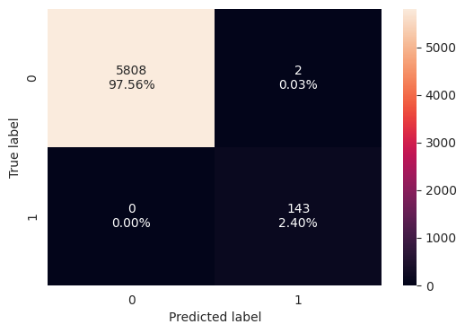
    


    None


                  precision    recall  f1-score   support
    
             0.0       1.00      1.00      1.00      5810
             1.0       1.00      1.00      1.00       143
    
        accuracy                           1.00      5953
       macro avg       1.00      1.00      1.00      5953
    weighted avg       1.00      1.00      1.00      5953
    


  <div id="df-daa582bd-eb99-4c86-b085-c165949ac201" class="colab-df-container">
    <div>
<style scoped>
    .dataframe tbody tr th:only-of-type {
        vertical-align: middle;
    }

    .dataframe tbody tr th {
        vertical-align: top;
    }

    .dataframe thead th {
        text-align: right;
    }
</style>
<table border="1" class="dataframe">
  <thead>
    <tr style="text-align: right;">
      <th></th>
      <th>Accuracy</th>
      <th>Recall</th>
      <th>Precision</th>
      <th>F1</th>
    </tr>
  </thead>
  <tbody>
    <tr>
      <th>0</th>
      <td>0.999664</td>
      <td>1.0</td>
      <td>0.986207</td>
      <td>0.993056</td>
    </tr>
  </tbody>
</table>
</div>
    <div class="colab-df-buttons">

  <div class="colab-df-container">
    <button class="colab-df-convert" onclick="convertToInteractive('df-daa582bd-eb99-4c86-b085-c165949ac201')"
            title="Convert this dataframe to an interactive table."
            style="display:none;">

  <svg xmlns="http://www.w3.org/2000/svg" height="24px" viewBox="0 -960 960 960">
    <path d="M120-120v-720h720v720H120Zm60-500h600v-160H180v160Zm220 220h160v-160H400v160Zm0 220h160v-160H400v160ZM180-400h160v-160H180v160Zm440 0h160v-160H620v160ZM180-180h160v-160H180v160Zm440 0h160v-160H620v160Z"/>
  </svg>
    </button>

  <style>
    .colab-df-container {
      display:flex;
      gap: 12px;
    }

    .colab-df-convert {
      background-color: #E8F0FE;
      border: none;
      border-radius: 50%;
      cursor: pointer;
      display: none;
      fill: #1967D2;
      height: 32px;
      padding: 0 0 0 0;
      width: 32px;
    }

    .colab-df-convert:hover {
      background-color: #E2EBFA;
      box-shadow: 0px 1px 2px rgba(60, 64, 67, 0.3), 0px 1px 3px 1px rgba(60, 64, 67, 0.15);
      fill: #174EA6;
    }

    .colab-df-buttons div {
      margin-bottom: 4px;
    }

    [theme=dark] .colab-df-convert {
      background-color: #3B4455;
      fill: #D2E3FC;
    }

    [theme=dark] .colab-df-convert:hover {
      background-color: #434B5C;
      box-shadow: 0px 1px 3px 1px rgba(0, 0, 0, 0.15);
      filter: drop-shadow(0px 1px 2px rgba(0, 0, 0, 0.3));
      fill: #FFFFFF;
    }
  </style>

    <script>
      const buttonEl =
        document.querySelector('#df-daa582bd-eb99-4c86-b085-c165949ac201 button.colab-df-convert');
      buttonEl.style.display =
        google.colab.kernel.accessAllowed ? 'block' : 'none';

      async function convertToInteractive(key) {
        const element = document.querySelector('#df-daa582bd-eb99-4c86-b085-c165949ac201');
        const dataTable =
          await google.colab.kernel.invokeFunction('convertToInteractive',
                                                    [key], {});
        if (!dataTable) return;

        const docLinkHtml = 'Like what you see? Visit the ' +
          '<a target="_blank" href=https://colab.research.google.com/notebooks/data_table.ipynb>data table notebook</a>'
          + ' to learn more about interactive tables.';
        element.innerHTML = '';
        dataTable['output_type'] = 'display_data';
        await google.colab.output.renderOutput(dataTable, element);
        const docLink = document.createElement('div');
        docLink.innerHTML = docLinkHtml;
        element.appendChild(docLink);
      }
    </script>
  </div>


  <div id="id_b8221077-ec69-4be3-91a6-649a0967c383">
    <style>
      .colab-df-generate {
        background-color: #E8F0FE;
        border: none;
        border-radius: 50%;
        cursor: pointer;
        display: none;
        fill: #1967D2;
        height: 32px;
        padding: 0 0 0 0;
        width: 32px;
      }

      .colab-df-generate:hover {
        background-color: #E2EBFA;
        box-shadow: 0px 1px 2px rgba(60, 64, 67, 0.3), 0px 1px 3px 1px rgba(60, 64, 67, 0.15);
        fill: #174EA6;
      }

      [theme=dark] .colab-df-generate {
        background-color: #3B4455;
        fill: #D2E3FC;
      }

      [theme=dark] .colab-df-generate:hover {
        background-color: #434B5C;
        box-shadow: 0px 1px 3px 1px rgba(0, 0, 0, 0.15);
        filter: drop-shadow(0px 1px 2px rgba(0, 0, 0, 0.3));
        fill: #FFFFFF;
      }
    </style>
    <button class="colab-df-generate" onclick="generateWithVariable('gradient_boost_valid_perf')"
            title="Generate code using this dataframe."
            style="display:none;">

  <svg xmlns="http://www.w3.org/2000/svg" height="24px"viewBox="0 0 24 24"
       width="24px">
    <path d="M7,19H8.4L18.45,9,17,7.55,7,17.6ZM5,21V16.75L18.45,3.32a2,2,0,0,1,2.83,0l1.4,1.43a1.91,1.91,0,0,1,.58,1.4,1.91,1.91,0,0,1-.58,1.4L9.25,21ZM18.45,9,17,7.55Zm-12,3A5.31,5.31,0,0,0,4.9,8.1,5.31,5.31,0,0,0,1,6.5,5.31,5.31,0,0,0,4.9,4.9,5.31,5.31,0,0,0,6.5,1,5.31,5.31,0,0,0,8.1,4.9,5.31,5.31,0,0,0,12,6.5,5.46,5.46,0,0,0,6.5,12Z"/>
  </svg>
    </button>
    <script>
      (() => {
      const buttonEl =
        document.querySelector('#id_b8221077-ec69-4be3-91a6-649a0967c383 button.colab-df-generate');
      buttonEl.style.display =
        google.colab.kernel.accessAllowed ? 'block' : 'none';

      buttonEl.onclick = () => {
        google.colab.notebook.generateWithVariable('gradient_boost_valid_perf');
      }
      })();
    </script>
  </div>

    </div>
  </div>


The classification report indicates perfect classification which I don't believe.

## XGBoost

Perform the following steps to train and evaluate the XGBoost model:

1. Calculate the number of negative and positive samples in the training data.
2. Compute the `scale_pos_weight` value as the ratio of negative samples to positive samples to address class imbalance.
3. Create an XGBoost classifier using the calculated `scale_pos_weight` and the selected random state.
4. Train the model using the training dataset.
5. Evaluate the model on the training dataset by generating a confusion matrix and computing the performance metrics.
6. Evaluate the model on the validation dataset by generating a confusion matrix and computing the performance metrics.
7. Compare the training and validation results to assess how well the model generalizes and identify any signs of overfitting or underfitting.


```python
from sklearn.metrics import classification_report
import xgboost as xgb

# Calculate the number of negative and positive samples
# 3. Initialize the XGBoost Classifier
xgbc = xgb.XGBClassifier(
                       learning_rate = 0.2,
                       max_depth = 4,
                       min_child_weight = 1,
                       n_estimators = 50,
                       objective = 'binary:logistic', # Learning task objective
                       random_state = 42
)

# Do the train set
xgbc.fit(x_train, y_train)
print('Train Analysis')
# 5. Make predictions and evaluate accuracy
y_train_pred = xgbc.predict(x_train)

plot_confusion_matrix(xgbc, x_train, y_train)
print(classification_report(y_train, y_train_pred))
test_accuracy = accuracy_score(y_train, y_train_pred)
print(f"Model Accuracy: {test_accuracy * 100:.2f}%")
xgboost_train_perf = model_performance_classification(xgbc, x_train, y_train)
display(xgboost_train_perf)

# Do the validate set
# Train the classifier
xgbc.fit(x_valid, y_valid)

# 5. Make predictions and evaluate accuracy
y_valid_pred = xgbc.predict(x_valid)
print('Validate Analysis')
plot_confusion_matrix(xgbc, x_valid, y_valid)

print(classification_report(y_valid, y_valid_pred))
valid_accuracy = accuracy_score(y_valid, y_valid_pred)
print(f"Model Accuracy: {valid_accuracy * 100:.2f}%")
xgboost_valid_perf = model_performance_classification(xgbc, x_valid, y_valid)
display(xgboost_valid_perf)

```

    Train Analysis


    

    


    None


                  precision    recall  f1-score   support
    
             0.0       1.00      1.00      1.00     27369
             1.0       0.98      0.98      0.98       413
    
        accuracy                           1.00     27782
       macro avg       0.99      0.99      0.99     27782
    weighted avg       1.00      1.00      1.00     27782
    
    Model Accuracy: 99.95%


  <div id="df-3fa93b71-672d-4d53-9473-993ee9f771ec" class="colab-df-container">
    <div>
<style scoped>
    .dataframe tbody tr th:only-of-type {
        vertical-align: middle;
    }

    .dataframe tbody tr th {
        vertical-align: top;
    }

    .dataframe thead th {
        text-align: right;
    }
</style>
<table border="1" class="dataframe">
  <thead>
    <tr style="text-align: right;">
      <th></th>
      <th>Accuracy</th>
      <th>Recall</th>
      <th>Precision</th>
      <th>F1</th>
    </tr>
  </thead>
  <tbody>
    <tr>
      <th>0</th>
      <td>0.99946</td>
      <td>0.98063</td>
      <td>0.98301</td>
      <td>0.981818</td>
    </tr>
  </tbody>
</table>
</div>
    <div class="colab-df-buttons">

  <div class="colab-df-container">
    <button class="colab-df-convert" onclick="convertToInteractive('df-3fa93b71-672d-4d53-9473-993ee9f771ec')"
            title="Convert this dataframe to an interactive table."
            style="display:none;">

  <svg xmlns="http://www.w3.org/2000/svg" height="24px" viewBox="0 -960 960 960">
    <path d="M120-120v-720h720v720H120Zm60-500h600v-160H180v160Zm220 220h160v-160H400v160Zm0 220h160v-160H400v160ZM180-400h160v-160H180v160Zm440 0h160v-160H620v160ZM180-180h160v-160H180v160Zm440 0h160v-160H620v160Z"/>
  </svg>
    </button>

  <style>
    .colab-df-container {
      display:flex;
      gap: 12px;
    }

    .colab-df-convert {
      background-color: #E8F0FE;
      border: none;
      border-radius: 50%;
      cursor: pointer;
      display: none;
      fill: #1967D2;
      height: 32px;
      padding: 0 0 0 0;
      width: 32px;
    }

    .colab-df-convert:hover {
      background-color: #E2EBFA;
      box-shadow: 0px 1px 2px rgba(60, 64, 67, 0.3), 0px 1px 3px 1px rgba(60, 64, 67, 0.15);
      fill: #174EA6;
    }

    .colab-df-buttons div {
      margin-bottom: 4px;
    }

    [theme=dark] .colab-df-convert {
      background-color: #3B4455;
      fill: #D2E3FC;
    }

    [theme=dark] .colab-df-convert:hover {
      background-color: #434B5C;
      box-shadow: 0px 1px 3px 1px rgba(0, 0, 0, 0.15);
      filter: drop-shadow(0px 1px 2px rgba(0, 0, 0, 0.3));
      fill: #FFFFFF;
    }
  </style>

    <script>
      const buttonEl =
        document.querySelector('#df-3fa93b71-672d-4d53-9473-993ee9f771ec button.colab-df-convert');
      buttonEl.style.display =
        google.colab.kernel.accessAllowed ? 'block' : 'none';

      async function convertToInteractive(key) {
        const element = document.querySelector('#df-3fa93b71-672d-4d53-9473-993ee9f771ec');
        const dataTable =
          await google.colab.kernel.invokeFunction('convertToInteractive',
                                                    [key], {});
        if (!dataTable) return;

        const docLinkHtml = 'Like what you see? Visit the ' +
          '<a target="_blank" href=https://colab.research.google.com/notebooks/data_table.ipynb>data table notebook</a>'
          + ' to learn more about interactive tables.';
        element.innerHTML = '';
        dataTable['output_type'] = 'display_data';
        await google.colab.output.renderOutput(dataTable, element);
        const docLink = document.createElement('div');
        docLink.innerHTML = docLinkHtml;
        element.appendChild(docLink);
      }
    </script>
  </div>


  <div id="id_81820852-f49f-4277-9065-89833847a98a">
    <style>
      .colab-df-generate {
        background-color: #E8F0FE;
        border: none;
        border-radius: 50%;
        cursor: pointer;
        display: none;
        fill: #1967D2;
        height: 32px;
        padding: 0 0 0 0;
        width: 32px;
      }

      .colab-df-generate:hover {
        background-color: #E2EBFA;
        box-shadow: 0px 1px 2px rgba(60, 64, 67, 0.3), 0px 1px 3px 1px rgba(60, 64, 67, 0.15);
        fill: #174EA6;
      }

      [theme=dark] .colab-df-generate {
        background-color: #3B4455;
        fill: #D2E3FC;
      }

      [theme=dark] .colab-df-generate:hover {
        background-color: #434B5C;
        box-shadow: 0px 1px 3px 1px rgba(0, 0, 0, 0.15);
        filter: drop-shadow(0px 1px 2px rgba(0, 0, 0, 0.3));
        fill: #FFFFFF;
      }
    </style>
    <button class="colab-df-generate" onclick="generateWithVariable('xgboost_train_perf')"
            title="Generate code using this dataframe."
            style="display:none;">

  <svg xmlns="http://www.w3.org/2000/svg" height="24px"viewBox="0 0 24 24"
       width="24px">
    <path d="M7,19H8.4L18.45,9,17,7.55,7,17.6ZM5,21V16.75L18.45,3.32a2,2,0,0,1,2.83,0l1.4,1.43a1.91,1.91,0,0,1,.58,1.4,1.91,1.91,0,0,1-.58,1.4L9.25,21ZM18.45,9,17,7.55Zm-12,3A5.31,5.31,0,0,0,4.9,8.1,5.31,5.31,0,0,0,1,6.5,5.31,5.31,0,0,0,4.9,4.9,5.31,5.31,0,0,0,6.5,1,5.31,5.31,0,0,0,8.1,4.9,5.31,5.31,0,0,0,12,6.5,5.46,5.46,0,0,0,6.5,12Z"/>
  </svg>
    </button>
    <script>
      (() => {
      const buttonEl =
        document.querySelector('#id_81820852-f49f-4277-9065-89833847a98a button.colab-df-generate');
      buttonEl.style.display =
        google.colab.kernel.accessAllowed ? 'block' : 'none';

      buttonEl.onclick = () => {
        google.colab.notebook.generateWithVariable('xgboost_train_perf');
      }
      })();
    </script>
  </div>

    </div>
  </div>


    Validate Analysis


    

    


    None


                  precision    recall  f1-score   support
    
             0.0       1.00      1.00      1.00      5810
             1.0       1.00      1.00      1.00       143
    
        accuracy                           1.00      5953
       macro avg       1.00      1.00      1.00      5953
    weighted avg       1.00      1.00      1.00      5953
    
    Model Accuracy: 100.00%


  <div id="df-79a5185f-5514-4fd3-8d42-be5efd769ad7" class="colab-df-container">
    <div>
<style scoped>
    .dataframe tbody tr th:only-of-type {
        vertical-align: middle;
    }

    .dataframe tbody tr th {
        vertical-align: top;
    }

    .dataframe thead th {
        text-align: right;
    }
</style>
<table border="1" class="dataframe">
  <thead>
    <tr style="text-align: right;">
      <th></th>
      <th>Accuracy</th>
      <th>Recall</th>
      <th>Precision</th>
      <th>F1</th>
    </tr>
  </thead>
  <tbody>
    <tr>
      <th>0</th>
      <td>1.0</td>
      <td>1.0</td>
      <td>1.0</td>
      <td>1.0</td>
    </tr>
  </tbody>
</table>
</div>
    <div class="colab-df-buttons">

  <div class="colab-df-container">
    <button class="colab-df-convert" onclick="convertToInteractive('df-79a5185f-5514-4fd3-8d42-be5efd769ad7')"
            title="Convert this dataframe to an interactive table."
            style="display:none;">

  <svg xmlns="http://www.w3.org/2000/svg" height="24px" viewBox="0 -960 960 960">
    <path d="M120-120v-720h720v720H120Zm60-500h600v-160H180v160Zm220 220h160v-160H400v160Zm0 220h160v-160H400v160ZM180-400h160v-160H180v160Zm440 0h160v-160H620v160ZM180-180h160v-160H180v160Zm440 0h160v-160H620v160Z"/>
  </svg>
    </button>

  <style>
    .colab-df-container {
      display:flex;
      gap: 12px;
    }

    .colab-df-convert {
      background-color: #E8F0FE;
      border: none;
      border-radius: 50%;
      cursor: pointer;
      display: none;
      fill: #1967D2;
      height: 32px;
      padding: 0 0 0 0;
      width: 32px;
    }

    .colab-df-convert:hover {
      background-color: #E2EBFA;
      box-shadow: 0px 1px 2px rgba(60, 64, 67, 0.3), 0px 1px 3px 1px rgba(60, 64, 67, 0.15);
      fill: #174EA6;
    }

    .colab-df-buttons div {
      margin-bottom: 4px;
    }

    [theme=dark] .colab-df-convert {
      background-color: #3B4455;
      fill: #D2E3FC;
    }

    [theme=dark] .colab-df-convert:hover {
      background-color: #434B5C;
      box-shadow: 0px 1px 3px 1px rgba(0, 0, 0, 0.15);
      filter: drop-shadow(0px 1px 2px rgba(0, 0, 0, 0.3));
      fill: #FFFFFF;
    }
  </style>

    <script>
      const buttonEl =
        document.querySelector('#df-79a5185f-5514-4fd3-8d42-be5efd769ad7 button.colab-df-convert');
      buttonEl.style.display =
        google.colab.kernel.accessAllowed ? 'block' : 'none';

      async function convertToInteractive(key) {
        const element = document.querySelector('#df-79a5185f-5514-4fd3-8d42-be5efd769ad7');
        const dataTable =
          await google.colab.kernel.invokeFunction('convertToInteractive',
                                                    [key], {});
        if (!dataTable) return;

        const docLinkHtml = 'Like what you see? Visit the ' +
          '<a target="_blank" href=https://colab.research.google.com/notebooks/data_table.ipynb>data table notebook</a>'
          + ' to learn more about interactive tables.';
        element.innerHTML = '';
        dataTable['output_type'] = 'display_data';
        await google.colab.output.renderOutput(dataTable, element);
        const docLink = document.createElement('div');
        docLink.innerHTML = docLinkHtml;
        element.appendChild(docLink);
      }
    </script>
  </div>


  <div id="id_771aae4f-b258-40de-98fb-b1eded3e7235">
    <style>
      .colab-df-generate {
        background-color: #E8F0FE;
        border: none;
        border-radius: 50%;
        cursor: pointer;
        display: none;
        fill: #1967D2;
        height: 32px;
        padding: 0 0 0 0;
        width: 32px;
      }

      .colab-df-generate:hover {
        background-color: #E2EBFA;
        box-shadow: 0px 1px 2px rgba(60, 64, 67, 0.3), 0px 1px 3px 1px rgba(60, 64, 67, 0.15);
        fill: #174EA6;
      }

      [theme=dark] .colab-df-generate {
        background-color: #3B4455;
        fill: #D2E3FC;
      }

      [theme=dark] .colab-df-generate:hover {
        background-color: #434B5C;
        box-shadow: 0px 1px 3px 1px rgba(0, 0, 0, 0.15);
        filter: drop-shadow(0px 1px 2px rgba(0, 0, 0, 0.3));
        fill: #FFFFFF;
      }
    </style>
    <button class="colab-df-generate" onclick="generateWithVariable('xgboost_valid_perf')"
            title="Generate code using this dataframe."
            style="display:none;">

  <svg xmlns="http://www.w3.org/2000/svg" height="24px"viewBox="0 0 24 24"
       width="24px">
    <path d="M7,19H8.4L18.45,9,17,7.55,7,17.6ZM5,21V16.75L18.45,3.32a2,2,0,0,1,2.83,0l1.4,1.43a1.91,1.91,0,0,1,.58,1.4,1.91,1.91,0,0,1-.58,1.4L9.25,21ZM18.45,9,17,7.55Zm-12,3A5.31,5.31,0,0,0,4.9,8.1,5.31,5.31,0,0,0,1,6.5,5.31,5.31,0,0,0,4.9,4.9,5.31,5.31,0,0,0,6.5,1,5.31,5.31,0,0,0,8.1,4.9,5.31,5.31,0,0,0,12,6.5,5.46,5.46,0,0,0,6.5,12Z"/>
  </svg>
    </button>
    <script>
      (() => {
      const buttonEl =
        document.querySelector('#id_771aae4f-b258-40de-98fb-b1eded3e7235 button.colab-df-generate');
      buttonEl.style.display =
        google.colab.kernel.accessAllowed ? 'block' : 'none';

      buttonEl.onclick = () => {
        google.colab.notebook.generateWithVariable('xgboost_valid_perf');
      }
      })();
    </script>
  </div>

    </div>
  </div>


## Neural Networks(ANN)


```python
tf.keras.backend.clear_session()
```

Perform the following steps to standardize the feature values:

1. Create a `StandardScaler` object to standardize the numerical features.
2. Fit the scaler using only the training dataset and transform the training features.
3. Use the same fitted scaler to transform the validation and test datasets.
4. Apply the same scaling parameters across all datasets to ensure a consistent preprocessing strategy and prevent data leakage.


```python
from sklearn.preprocessing import StandardScaler
scaler = StandardScaler()

x_train_scaled = scaler.fit_transform(x_train)
x_valid_scaled = scaler.transform(x_valid)

print(x_train_scaled.shape)
print(x_valid_scaled.shape)

print('Unscaled data\n', x_train)
print('Scaled data\n', x_train_scaled)
```

    (27782, 34)
    (5953, 34)
    Unscaled data
            rated_power_kW  wind_speed_mps  wind_direction_deg  \
    0                1500           2.335             151.993   
    8784             1500          12.335             209.358   
    17568            3600           8.132             174.780   
    26352            3000           4.465             226.115   
    35136            1500           1.193              61.930   
    ...               ...             ...                 ...   
    5806             1500           4.536             160.574   
    14590            1500          13.556              35.468   
    23374            3600           8.686             358.615   
    32158            3000           5.884              85.950   
    5807             1500           9.304             158.403   
    
           turbulence_intensity  air_density_kgm3  ambient_temp_C  humidity_pct  \
    0                     0.149             1.205          21.820        68.717   
    8784                  0.201             1.286           0.000        70.379   
    17568                 0.150             1.257           8.002        56.061   
    26352                 0.223             1.195          20.391        53.238   
    35136                 0.141             1.223          15.858        53.288   
    ...                     ...               ...             ...           ...   
    5806                  0.201             1.274           5.873        56.535   
    14590                 0.204             1.239          13.321        70.953   
    23374                 0.159             1.282           4.172        56.783   
    32158                 0.217             1.238          11.279        68.926   
    5807                  0.197             1.267           5.670        55.714   
    
           power_output_kW  rotor_speed_rpm  generator_speed_rpm  \
    0                0.000            0.000               14.414   
    8784          1530.000           16.084             1440.075   
    17568          683.976           11.403             1027.616   
    26352           15.659            7.271              645.807   
    35136            0.000            0.168               18.732   
    ...                ...              ...                  ...   
    5806            16.918            7.242              653.343   
    14590         1528.801           17.104             1553.622   
    23374          968.045           11.947             1078.524   
    32158           86.963            8.838              794.180   
    5807           539.327           12.967             1167.601   
    
           blade_pitch_angle_deg  yaw_misalignment_deg  gearbox_oil_temp_C  \
    0                     87.761                -5.455              53.728   
    8784                   1.307                -2.466              75.600   
    17568                  0.267                -4.830              53.901   
    26352                  0.098                 3.022              53.313   
    35136                 87.454                 4.764              51.343   
    ...                      ...                   ...                 ...   
    5806                   0.170                -3.470              46.824   
    14590                  5.631                 3.950              79.776   
    23374                  1.343                -4.796              55.351   
    32158                  0.866                -5.188              53.180   
    5807                   1.005                 1.257              57.714   
    
           gearbox_bearing_temp_C  generator_bearing_temp_C  \
    0                      56.728                    57.637   
    8784                   82.680                    80.600   
    17568                  57.661                    58.500   
    26352                  56.334                    57.293   
    35136                  54.343                    55.550   
    ...                       ...                       ...   
    5806                   49.946                    52.839   
    14590                  84.997                    86.262   
    23374                  56.899                    59.417   
    32158                  52.929                    55.866   
    5807                   61.344                    62.917   
    
           generator_winding_temp_C  main_bearing_temp_C  nacelle_temp_C  \
    0                        61.546               48.728          29.820   
    8784                    126.400               68.560          14.120   
    17568                    70.700               48.521          17.142   
    26352                    61.483               48.302          28.422   
    35136                    59.757               46.343          23.858   
    ...                         ...                  ...             ...   
    5806                     61.258               40.667          13.212   
    14590                   127.238               75.479          25.958   
    23374                    70.177               51.646          12.249   
    32158                    60.125               42.405          19.918   
    5807                     84.757               50.022          15.806   
    
           drivetrain_vibration_rms_mmps  tower_vibration_mmps  \
    0                              1.518                 0.974   
    8784                           2.197                 1.302   
    17568                          1.428                 0.967   
    26352                          1.851                 1.102   
    35136                          1.276                 0.933   
    ...                              ...                   ...   
    5806                           1.615                 1.074   
    14590                          2.029                 1.244   
    23374                          1.673                 1.052   
    32158                          1.899                 0.923   
    5807                           1.568                 1.029   
    
           vib_fft_bearing_bpfo  vib_fft_bearing_bpfi  vib_fft_gearmesh  \
    0                     0.455                 0.391             0.455   
    8784                  0.342                 0.393             0.761   
    17568                 0.342                 0.384             0.501   
    26352                 0.383                 0.330             0.577   
    35136                 0.436                 0.489             0.490   
    ...                     ...                   ...               ...   
    5806                  0.411                 0.328             0.555   
    14590                 0.356                 0.382             0.427   
    23374                 0.468                 0.365             0.528   
    32158                 0.340                 0.397             0.557   
    5807                  0.411                 0.328             0.555   
    
           vib_fft_sideband  oil_particle_count  oil_pressure_bar  \
    0                 0.399              55.756             6.032   
    8784              0.332              61.683             5.669   
    17568             0.369              66.520             5.945   
    26352             0.221              54.612             6.167   
    35136             0.268              65.806             5.936   
    ...                 ...                 ...               ...   
    5806              0.237              58.763             5.946   
    14590             0.236              80.839             5.833   
    23374             0.299              60.228             5.784   
    32158             0.293              52.068             5.792   
    5807              0.237              58.763             5.747   
    
           operating_hours_total  cumulative_energy_MWh  load_cycles  \
    0                  19319.612               9587.146        0.000   
    8784               35966.367              19792.025        2.011   
    17568              30928.987              44843.545        1.505   
    26352              41022.925              47109.405        2.229   
    35136              55708.022              28936.375        0.000   
    ...                      ...                    ...          ...   
    5806               20189.945              10080.965     9265.541   
    14590              36809.367              20099.585     8852.498   
    23374              31778.487              45902.931     9031.289   
    32158              41870.091              48021.231     9005.433   
    5807               20190.112              10081.055     9267.510   
    
           hours_since_last_maintenance  prior_fault_count  component_age_days  \
    0                           769.284                0.0            1360.703   
    8784                        134.413                0.0            2169.811   
    17568                      1247.152                0.0            2133.545   
    26352                        78.902                0.0            1609.381   
    35136                       527.738                0.0            1906.679   
    ...                             ...                ...                 ...   
    5806                        197.667                1.0            1401.023   
    14590                      1102.080                3.0            2210.130   
    23374                      2214.819                0.0            2173.864   
    32158                      1046.569                0.0            1649.701   
    5807                        197.833                1.0            1401.030   
    
           dayofweek  hour  
    0              0     0  
    8784           0     0  
    17568          0     0  
    26352          0     0  
    35136          0     0  
    ...          ...   ...  
    5806           5     7  
    14590          5     7  
    23374          5     7  
    32158          5     7  
    5807           5     7  
    
    [27782 rows x 34 columns]
    Scaled data
     [[-0.82801417 -1.26960569 -0.17741647 ... -1.54988073 -1.46165981
      -1.64926056]
     [-0.82801417  1.08491457  0.35377128 ...  1.00123302 -1.46165981
      -1.64926056]
     [ 1.4828065   0.0953097   0.03358632 ...  0.88688649 -1.46165981
      -1.64926056]
     ...
     [ 1.4828065   0.22575013  1.73585948 ...  1.01401211  1.0769644
      -0.6392616 ]
     [ 0.82257202 -0.43398645 -0.78896067 ... -0.63867138  1.0769644
      -0.6392616 ]
     [-0.82801417  0.37125948 -0.11806123 ... -1.42272989  1.0769644
      -0.6392616 ]]


Perform the following steps to build the neural network architecture:

1. Choose the number of neurons for the first hidden layer between **8 and 128**.
   - Fewer neurons (**8–32**) create a simpler model that trains faster and is less likely to overfit.
   - More neurons (**64–128**) enable the model to learn more complex patterns but increase training time and the risk of overfitting.
2. Choose an activation function for the first hidden layer (for example, `relu`, `tanh`, or `sigmoid`) based on the learning behavior you want.
3. Create the output layer with a single neuron and a `sigmoid` activation function to predict the probability of the positive class.


```python
from tensorflow.keras.models import Sequential
from tensorflow.keras.layers import Dense

# Initialize the model
neural_model = Sequential()

input_train_dim = x_train_scaled.shape[1]

# Add the first hidden layer
neural_model.add(Dense(units=64, activation='relu', input_shape=(input_train_dim,)))

# Create the output layer
neural_model.add(Dense(units=1, activation='sigmoid'))
```

Display the neural network architecture. Review the number of layers, the output shape of each layer, and the total number of trainable parameters before training the model.


```python
neural_model.summary()
```


<pre style="white-space:pre;overflow-x:auto;line-height:normal;font-family:Menlo,'DejaVu Sans Mono',consolas,'Courier New',monospace"><span style="font-weight: bold">Model: "sequential"</span>
</pre>


<pre style="white-space:pre;overflow-x:auto;line-height:normal;font-family:Menlo,'DejaVu Sans Mono',consolas,'Courier New',monospace">┏━━━━━━━━━━━━━━━━━━━━━━━━━━━━━━━━━┳━━━━━━━━━━━━━━━━━━━━━━━━┳━━━━━━━━━━━━━━━┓
┃<span style="font-weight: bold"> Layer (type)                    </span>┃<span style="font-weight: bold"> Output Shape           </span>┃<span style="font-weight: bold">       Param # </span>┃
┡━━━━━━━━━━━━━━━━━━━━━━━━━━━━━━━━━╇━━━━━━━━━━━━━━━━━━━━━━━━╇━━━━━━━━━━━━━━━┩
│ dense (<span style="color: #0087ff; text-decoration-color: #0087ff">Dense</span>)                   │ (<span style="color: #00d7ff; text-decoration-color: #00d7ff">None</span>, <span style="color: #00af00; text-decoration-color: #00af00">64</span>)             │         <span style="color: #00af00; text-decoration-color: #00af00">2,240</span> │
├─────────────────────────────────┼────────────────────────┼───────────────┤
│ dense_1 (<span style="color: #0087ff; text-decoration-color: #0087ff">Dense</span>)                 │ (<span style="color: #00d7ff; text-decoration-color: #00d7ff">None</span>, <span style="color: #00af00; text-decoration-color: #00af00">1</span>)              │            <span style="color: #00af00; text-decoration-color: #00af00">65</span> │
└─────────────────────────────────┴────────────────────────┴───────────────┘
</pre>


<pre style="white-space:pre;overflow-x:auto;line-height:normal;font-family:Menlo,'DejaVu Sans Mono',consolas,'Courier New',monospace"><span style="font-weight: bold"> Total params: </span><span style="color: #00af00; text-decoration-color: #00af00">2,305</span> (9.00 KB)
</pre>


<pre style="white-space:pre;overflow-x:auto;line-height:normal;font-family:Menlo,'DejaVu Sans Mono',consolas,'Courier New',monospace"><span style="font-weight: bold"> Trainable params: </span><span style="color: #00af00; text-decoration-color: #00af00">2,305</span> (9.00 KB)
</pre>


<pre style="white-space:pre;overflow-x:auto;line-height:normal;font-family:Menlo,'DejaVu Sans Mono',consolas,'Courier New',monospace"><span style="font-weight: bold"> Non-trainable params: </span><span style="color: #00af00; text-decoration-color: #00af00">0</span> (0.00 B)
</pre>


Perform the following steps to configure the neural network for training:

1. Choose an optimizer (`sgd` or `adam`) based on the desired training behavior.
   - `sgd` updates the model using simple gradient descent and may require more epochs to converge.
   - `adam` automatically adapts the learning rate, often converges faster, and is a common default choice.
2. Use `binary_crossentropy` as the loss function since this is a binary classification problem.
3. Configure the model to track **Recall**, **Precision**, and **Binary Accuracy** during training to evaluate its classification performance.


```python
# Configure the neural model
neural_model.compile(
    optimizer='adam',
    loss='binary_crossentropy',
    metrics=[
        tf.keras.metrics.Recall(name='recall'),
        tf.keras.metrics.Precision(name='precision'),
        tf.keras.metrics.BinaryAccuracy(name='accuracy')
    ]
)
```

Perform the following steps to configure the training process:

1. Choose the number of training epochs between **10 and 100** based on the desired training duration and model performance.
2. Select a batch size between **16 and 128** based on the available computational resources and training behavior.
3. Use the selected values to control how long the model trains and how many samples are processed in each weight update.


```python

start = time.time()
batch_size = 32
epochs = 50

# Set early stopping to prevent overfitting
early_stopping = tf.keras.callbacks.EarlyStopping(
    monitor='val_loss',     # Watch the validation loss
    patience=5,             # Number of epochs to wait for improvement before stopping
    restore_best_weights=True # Revert to the best weights once stopped
)

history = neural_model.fit(
    x_train_scaled,
    y_train,
    epochs=50,
    batch_size=32,
    validation_data=(x_valid_scaled, y_valid),
    verbose=1,
    callbacks=[early_stopping]
)
end = time.time()

start2 = time.time()
history = neural_model.fit(
    x_valid_scaled,
    y_valid,
    epochs=50,
    batch_size=32,
    validation_data=(x_valid_scaled, y_valid),
    verbose=1,
    callbacks=[early_stopping]
)
end2 = time.time()
```

    Epoch 1/50
    869/869 ━━━━━━━━━━━━━━━━━━━━ 6s 4ms/step - accuracy: 0.9748 - loss: 0.0755 - precision: 0.2174 - recall: 0.2663 - val_accuracy: 0.9760 - val_loss: 0.4071 - val_precision: 0.0000e+00 - val_recall: 0.0000e+00
    Epoch 2/50
    869/869 ━━━━━━━━━━━━━━━━━━━━ 3s 3ms/step - accuracy: 0.9928 - loss: 0.0186 - precision: 0.7928 - recall: 0.6949 - val_accuracy: 0.9760 - val_loss: 0.3361 - val_precision: 0.0000e+00 - val_recall: 0.0000e+00
    Epoch 3/50
    869/869 ━━━━━━━━━━━━━━━━━━━━ 3s 3ms/step - accuracy: 0.9947 - loss: 0.0139 - precision: 0.8296 - recall: 0.8136 - val_accuracy: 0.9760 - val_loss: 0.3273 - val_precision: 0.0000e+00 - val_recall: 0.0000e+00
    Epoch 4/50
    869/869 ━━━━━━━━━━━━━━━━━━━━ 4s 5ms/step - accuracy: 0.9953 - loss: 0.0115 - precision: 0.8443 - recall: 0.8402 - val_accuracy: 0.9760 - val_loss: 0.3257 - val_precision: 0.0000e+00 - val_recall: 0.0000e+00
    Epoch 5/50
    869/869 ━━━━━━━━━━━━━━━━━━━━ 4s 3ms/step - accuracy: 0.9954 - loss: 0.0106 - precision: 0.8421 - recall: 0.8523 - val_accuracy: 0.9756 - val_loss: 0.3201 - val_precision: 0.0000e+00 - val_recall: 0.0000e+00
    Epoch 6/50
    869/869 ━━━━━━━━━━━━━━━━━━━━ 3s 3ms/step - accuracy: 0.9961 - loss: 0.0098 - precision: 0.8671 - recall: 0.8692 - val_accuracy: 0.9756 - val_loss: 0.3506 - val_precision: 0.0000e+00 - val_recall: 0.0000e+00
    Epoch 7/50
    869/869 ━━━━━━━━━━━━━━━━━━━━ 3s 3ms/step - accuracy: 0.9963 - loss: 0.0091 - precision: 0.8656 - recall: 0.8886 - val_accuracy: 0.9755 - val_loss: 0.2658 - val_precision: 0.0000e+00 - val_recall: 0.0000e+00
    Epoch 8/50
    869/869 ━━━━━━━━━━━━━━━━━━━━ 3s 4ms/step - accuracy: 0.9960 - loss: 0.0088 - precision: 0.8651 - recall: 0.8692 - val_accuracy: 0.9755 - val_loss: 0.2914 - val_precision: 0.0000e+00 - val_recall: 0.0000e+00
    Epoch 9/50
    869/869 ━━━━━━━━━━━━━━━━━━━━ 3s 4ms/step - accuracy: 0.9962 - loss: 0.0084 - precision: 0.8717 - recall: 0.8717 - val_accuracy: 0.9760 - val_loss: 0.3850 - val_precision: 0.0000e+00 - val_recall: 0.0000e+00
    Epoch 10/50
    869/869 ━━━━━━━━━━━━━━━━━━━━ 3s 3ms/step - accuracy: 0.9965 - loss: 0.0086 - precision: 0.8814 - recall: 0.8814 - val_accuracy: 0.9756 - val_loss: 0.3592 - val_precision: 0.0000e+00 - val_recall: 0.0000e+00
    Epoch 11/50
    869/869 ━━━━━━━━━━━━━━━━━━━━ 3s 3ms/step - accuracy: 0.9965 - loss: 0.0084 - precision: 0.8816 - recall: 0.8838 - val_accuracy: 0.9751 - val_loss: 0.2588 - val_precision: 0.0000e+00 - val_recall: 0.0000e+00
    Epoch 12/50
    869/869 ━━━━━━━━━━━━━━━━━━━━ 6s 4ms/step - accuracy: 0.9963 - loss: 0.0079 - precision: 0.8690 - recall: 0.8838 - val_accuracy: 0.9756 - val_loss: 0.3541 - val_precision: 0.0000e+00 - val_recall: 0.0000e+00
    Epoch 13/50
    869/869 ━━━━━━━━━━━━━━━━━━━━ 3s 4ms/step - accuracy: 0.9966 - loss: 0.0080 - precision: 0.8786 - recall: 0.8935 - val_accuracy: 0.9751 - val_loss: 0.2952 - val_precision: 0.0000e+00 - val_recall: 0.0000e+00
    Epoch 14/50
    869/869 ━━━━━━━━━━━━━━━━━━━━ 3s 3ms/step - accuracy: 0.9963 - loss: 0.0080 - precision: 0.8780 - recall: 0.8717 - val_accuracy: 0.9751 - val_loss: 0.3269 - val_precision: 0.0000e+00 - val_recall: 0.0000e+00
    Epoch 15/50
    869/869 ━━━━━━━━━━━━━━━━━━━━ 3s 3ms/step - accuracy: 0.9964 - loss: 0.0079 - precision: 0.8786 - recall: 0.8765 - val_accuracy: 0.9730 - val_loss: 0.2567 - val_precision: 0.0000e+00 - val_recall: 0.0000e+00
    Epoch 16/50
    869/869 ━━━━━━━━━━━━━━━━━━━━ 3s 3ms/step - accuracy: 0.9966 - loss: 0.0078 - precision: 0.8771 - recall: 0.8983 - val_accuracy: 0.9730 - val_loss: 0.2751 - val_precision: 0.0000e+00 - val_recall: 0.0000e+00
    Epoch 17/50
    869/869 ━━━━━━━━━━━━━━━━━━━━ 4s 5ms/step - accuracy: 0.9971 - loss: 0.0074 - precision: 0.8955 - recall: 0.9128 - val_accuracy: 0.9740 - val_loss: 0.3045 - val_precision: 0.0000e+00 - val_recall: 0.0000e+00
    Epoch 18/50
    869/869 ━━━━━━━━━━━━━━━━━━━━ 3s 4ms/step - accuracy: 0.9965 - loss: 0.0076 - precision: 0.8801 - recall: 0.8886 - val_accuracy: 0.9726 - val_loss: 0.2813 - val_precision: 0.0000e+00 - val_recall: 0.0000e+00
    Epoch 19/50
    869/869 ━━━━━━━━━━━━━━━━━━━━ 3s 3ms/step - accuracy: 0.9969 - loss: 0.0075 - precision: 0.8981 - recall: 0.8959 - val_accuracy: 0.9731 - val_loss: 0.3171 - val_precision: 0.0000e+00 - val_recall: 0.0000e+00
    Epoch 20/50
    869/869 ━━━━━━━━━━━━━━━━━━━━ 3s 3ms/step - accuracy: 0.9964 - loss: 0.0075 - precision: 0.8774 - recall: 0.8838 - val_accuracy: 0.9748 - val_loss: 0.3360 - val_precision: 0.0000e+00 - val_recall: 0.0000e+00
    Epoch 1/50
    187/187 ━━━━━━━━━━━━━━━━━━━━ 1s 7ms/step - accuracy: 0.9856 - loss: 0.0403 - precision: 0.6939 - recall: 0.7133 - val_accuracy: 0.9933 - val_loss: 0.0205 - val_precision: 0.8705 - val_recall: 0.8462
    Epoch 2/50
    187/187 ━━━━━━━━━━━━━━━━━━━━ 2s 10ms/step - accuracy: 0.9923 - loss: 0.0227 - precision: 0.8392 - recall: 0.8392 - val_accuracy: 0.9889 - val_loss: 0.0269 - val_precision: 0.6974 - val_recall: 0.9510
    Epoch 3/50
    187/187 ━━━━━━━━━━━━━━━━━━━━ 2s 11ms/step - accuracy: 0.9906 - loss: 0.0247 - precision: 0.7959 - recall: 0.8182 - val_accuracy: 0.9934 - val_loss: 0.0183 - val_precision: 0.8562 - val_recall: 0.8741
    Epoch 4/50
    187/187 ━━━━━━━━━━━━━━━━━━━━ 1s 5ms/step - accuracy: 0.9923 - loss: 0.0210 - precision: 0.8440 - recall: 0.8322 - val_accuracy: 0.9948 - val_loss: 0.0180 - val_precision: 0.9308 - val_recall: 0.8462
    Epoch 5/50
    187/187 ━━━━━━━━━━━━━━━━━━━━ 1s 5ms/step - accuracy: 0.9929 - loss: 0.0198 - precision: 0.8483 - recall: 0.8601 - val_accuracy: 0.9945 - val_loss: 0.0174 - val_precision: 0.9104 - val_recall: 0.8531
    Epoch 6/50
    187/187 ━━━━━━━━━━━━━━━━━━━━ 1s 5ms/step - accuracy: 0.9921 - loss: 0.0194 - precision: 0.8380 - recall: 0.8322 - val_accuracy: 0.9951 - val_loss: 0.0164 - val_precision: 0.8800 - val_recall: 0.9231
    Epoch 7/50
    187/187 ━━━━━━━━━━━━━━━━━━━━ 1s 5ms/step - accuracy: 0.9941 - loss: 0.0180 - precision: 0.8750 - recall: 0.8811 - val_accuracy: 0.9938 - val_loss: 0.0178 - val_precision: 0.9274 - val_recall: 0.8042
    Epoch 8/50
    187/187 ━━━━━━━━━━━━━━━━━━━━ 1s 5ms/step - accuracy: 0.9926 - loss: 0.0185 - precision: 0.8462 - recall: 0.8462 - val_accuracy: 0.9913 - val_loss: 0.0215 - val_precision: 0.7514 - val_recall: 0.9510
    Epoch 9/50
    187/187 ━━━━━━━━━━━━━━━━━━━━ 1s 5ms/step - accuracy: 0.9923 - loss: 0.0209 - precision: 0.8299 - recall: 0.8531 - val_accuracy: 0.9951 - val_loss: 0.0165 - val_precision: 0.9385 - val_recall: 0.8531
    Epoch 10/50
    187/187 ━━━━━━━━━━━━━━━━━━━━ 1s 5ms/step - accuracy: 0.9943 - loss: 0.0179 - precision: 0.8811 - recall: 0.8811 - val_accuracy: 0.9956 - val_loss: 0.0149 - val_precision: 0.8980 - val_recall: 0.9231
    Epoch 11/50
    187/187 ━━━━━━━━━━━━━━━━━━━━ 1s 5ms/step - accuracy: 0.9938 - loss: 0.0185 - precision: 0.8786 - recall: 0.8601 - val_accuracy: 0.9956 - val_loss: 0.0147 - val_precision: 0.9091 - val_recall: 0.9091
    Epoch 12/50
    187/187 ━━━━━━━━━━━━━━━━━━━━ 1s 5ms/step - accuracy: 0.9940 - loss: 0.0171 - precision: 0.8905 - recall: 0.8531 - val_accuracy: 0.9951 - val_loss: 0.0152 - val_precision: 0.9318 - val_recall: 0.8601
    Epoch 13/50
    187/187 ━━━━━━━━━━━━━━━━━━━━ 1s 6ms/step - accuracy: 0.9943 - loss: 0.0170 - precision: 0.8811 - recall: 0.8811 - val_accuracy: 0.9958 - val_loss: 0.0145 - val_precision: 0.9155 - val_recall: 0.9091
    Epoch 14/50
    187/187 ━━━━━━━━━━━━━━━━━━━━ 2s 8ms/step - accuracy: 0.9945 - loss: 0.0166 - precision: 0.8767 - recall: 0.8951 - val_accuracy: 0.9934 - val_loss: 0.0177 - val_precision: 0.9561 - val_recall: 0.7622
    Epoch 15/50
    187/187 ━━━━━━━━━━━━━━━━━━━━ 2s 5ms/step - accuracy: 0.9934 - loss: 0.0169 - precision: 0.8714 - recall: 0.8531 - val_accuracy: 0.9950 - val_loss: 0.0150 - val_precision: 0.8693 - val_recall: 0.9301
    Epoch 16/50
    187/187 ━━━━━━━━━━━━━━━━━━━━ 1s 5ms/step - accuracy: 0.9940 - loss: 0.0164 - precision: 0.8690 - recall: 0.8811 - val_accuracy: 0.9958 - val_loss: 0.0137 - val_precision: 0.8986 - val_recall: 0.9301
    Epoch 17/50
    187/187 ━━━━━━━━━━━━━━━━━━━━ 1s 5ms/step - accuracy: 0.9945 - loss: 0.0165 - precision: 0.8873 - recall: 0.8811 - val_accuracy: 0.9934 - val_loss: 0.0173 - val_precision: 0.8095 - val_recall: 0.9510
    Epoch 18/50
    187/187 ━━━━━━━━━━━━━━━━━━━━ 1s 5ms/step - accuracy: 0.9928 - loss: 0.0166 - precision: 0.8571 - recall: 0.8392 - val_accuracy: 0.9958 - val_loss: 0.0137 - val_precision: 0.9097 - val_recall: 0.9161
    Epoch 19/50
    187/187 ━━━━━━━━━━━━━━━━━━━━ 1s 5ms/step - accuracy: 0.9945 - loss: 0.0161 - precision: 0.8819 - recall: 0.8881 - val_accuracy: 0.9943 - val_loss: 0.0149 - val_precision: 0.9360 - val_recall: 0.8182
    Epoch 20/50
    187/187 ━━━━━━━━━━━━━━━━━━━━ 1s 5ms/step - accuracy: 0.9945 - loss: 0.0155 - precision: 0.8929 - recall: 0.8741 - val_accuracy: 0.9961 - val_loss: 0.0132 - val_precision: 0.9054 - val_recall: 0.9371
    Epoch 21/50
    187/187 ━━━━━━━━━━━━━━━━━━━━ 1s 8ms/step - accuracy: 0.9941 - loss: 0.0150 - precision: 0.8803 - recall: 0.8741 - val_accuracy: 0.9948 - val_loss: 0.0144 - val_precision: 0.9308 - val_recall: 0.8462
    Epoch 22/50
    187/187 ━━━━━━━━━━━━━━━━━━━━ 2s 5ms/step - accuracy: 0.9950 - loss: 0.0153 - precision: 0.9007 - recall: 0.8881 - val_accuracy: 0.9955 - val_loss: 0.0131 - val_precision: 0.9203 - val_recall: 0.8881
    Epoch 23/50
    187/187 ━━━━━━━━━━━━━━━━━━━━ 1s 6ms/step - accuracy: 0.9938 - loss: 0.0153 - precision: 0.8786 - recall: 0.8601 - val_accuracy: 0.9955 - val_loss: 0.0133 - val_precision: 0.9328 - val_recall: 0.8741
    Epoch 24/50
    187/187 ━━━━━━━━━━━━━━━━━━━━ 2s 11ms/step - accuracy: 0.9941 - loss: 0.0155 - precision: 0.8699 - recall: 0.8881 - val_accuracy: 0.9955 - val_loss: 0.0134 - val_precision: 0.8867 - val_recall: 0.9301
    Epoch 25/50
    187/187 ━━━━━━━━━━━━━━━━━━━━ 1s 7ms/step - accuracy: 0.9951 - loss: 0.0143 - precision: 0.8958 - recall: 0.9021 - val_accuracy: 0.9960 - val_loss: 0.0127 - val_precision: 0.9281 - val_recall: 0.9021
    Epoch 26/50
    187/187 ━━━━━━━━━━━━━━━━━━━━ 1s 5ms/step - accuracy: 0.9934 - loss: 0.0162 - precision: 0.8662 - recall: 0.8601 - val_accuracy: 0.9960 - val_loss: 0.0123 - val_precision: 0.9343 - val_recall: 0.8951
    Epoch 27/50
    187/187 ━━━━━━━━━━━━━━━━━━━━ 1s 5ms/step - accuracy: 0.9943 - loss: 0.0147 - precision: 0.8865 - recall: 0.8741 - val_accuracy: 0.9923 - val_loss: 0.0178 - val_precision: 0.7771 - val_recall: 0.9510
    Epoch 28/50
    187/187 ━━━━━━━━━━━━━━━━━━━━ 1s 5ms/step - accuracy: 0.9929 - loss: 0.0218 - precision: 0.8258 - recall: 0.8951 - val_accuracy: 0.9951 - val_loss: 0.0150 - val_precision: 0.9597 - val_recall: 0.8322
    Epoch 29/50
    187/187 ━━━━━━━━━━━━━━━━━━━━ 1s 6ms/step - accuracy: 0.9951 - loss: 0.0144 - precision: 0.9014 - recall: 0.8951 - val_accuracy: 0.9960 - val_loss: 0.0130 - val_precision: 0.9407 - val_recall: 0.8881
    Epoch 30/50
    187/187 ━━━━━━━━━━━━━━━━━━━━ 1s 6ms/step - accuracy: 0.9934 - loss: 0.0155 - precision: 0.8467 - recall: 0.8881 - val_accuracy: 0.9926 - val_loss: 0.0189 - val_precision: 0.9806 - val_recall: 0.7063
    Epoch 31/50
    187/187 ━━━━━━━━━━━━━━━━━━━━ 1s 5ms/step - accuracy: 0.9951 - loss: 0.0142 - precision: 0.8904 - recall: 0.9091 - val_accuracy: 0.9961 - val_loss: 0.0122 - val_precision: 0.9348 - val_recall: 0.9021
    Epoch 32/50
    187/187 ━━━━━━━━━━━━━━━━━━━━ 1s 5ms/step - accuracy: 0.9955 - loss: 0.0142 - precision: 0.9028 - recall: 0.9091 - val_accuracy: 0.9961 - val_loss: 0.0118 - val_precision: 0.9348 - val_recall: 0.9021
    Epoch 33/50
    187/187 ━━━━━━━━━━━━━━━━━━━━ 1s 5ms/step - accuracy: 0.9955 - loss: 0.0133 - precision: 0.8973 - recall: 0.9161 - val_accuracy: 0.9958 - val_loss: 0.0127 - val_precision: 0.9538 - val_recall: 0.8671
    Epoch 34/50
    187/187 ━━━━━━━━━━━━━━━━━━━━ 1s 5ms/step - accuracy: 0.9948 - loss: 0.0130 - precision: 0.9058 - recall: 0.8741 - val_accuracy: 0.9945 - val_loss: 0.0147 - val_precision: 0.8438 - val_recall: 0.9441
    Epoch 35/50
    187/187 ━━━━━━━━━━━━━━━━━━━━ 2s 9ms/step - accuracy: 0.9953 - loss: 0.0132 - precision: 0.9078 - recall: 0.8951 - val_accuracy: 0.9963 - val_loss: 0.0115 - val_precision: 0.9291 - val_recall: 0.9161
    Epoch 36/50
    187/187 ━━━━━━━━━━━━━━━━━━━━ 2s 8ms/step - accuracy: 0.9955 - loss: 0.0136 - precision: 0.9028 - recall: 0.9091 - val_accuracy: 0.9960 - val_loss: 0.0117 - val_precision: 0.8940 - val_recall: 0.9441
    Epoch 37/50
    187/187 ━━━━━━━━━━━━━━━━━━━━ 1s 7ms/step - accuracy: 0.9948 - loss: 0.0127 - precision: 0.8944 - recall: 0.8881 - val_accuracy: 0.9931 - val_loss: 0.0167 - val_precision: 0.9811 - val_recall: 0.7273
    Epoch 38/50
    187/187 ━━━━━━━━━━━━━━━━━━━━ 1s 5ms/step - accuracy: 0.9938 - loss: 0.0142 - precision: 0.8786 - recall: 0.8601 - val_accuracy: 0.9960 - val_loss: 0.0120 - val_precision: 0.9161 - val_recall: 0.9161
    Epoch 39/50
    187/187 ━━━━━━━━━━━━━━━━━━━━ 1s 5ms/step - accuracy: 0.9956 - loss: 0.0128 - precision: 0.9149 - recall: 0.9021 - val_accuracy: 0.9956 - val_loss: 0.0123 - val_precision: 0.8874 - val_recall: 0.9371
    Epoch 40/50
    187/187 ━━━━━━━━━━━━━━━━━━━━ 1s 5ms/step - accuracy: 0.9958 - loss: 0.0135 - precision: 0.9097 - recall: 0.9161 - val_accuracy: 0.9956 - val_loss: 0.0140 - val_precision: 0.9756 - val_recall: 0.8392


```python
y_train_clean = np.array(y_train).astype(int)
weights = compute_class_weight('balanced', classes=np.unique(y_train_clean), y=y_train_clean)
class_weight_dict = {i: weights[i] for i in range(len(weights))}
display(class_weight_dict)
```


    {0: np.float64(0.5075450327012313), 1: np.float64(33.634382566585955)}


```python
print("Train time taken in seconds ",end-start)
```

    Train time taken in seconds  65.35790157318115


```python
y_valid_clean = np.array(y_valid).astype(int)
weights = compute_class_weight('balanced', classes=np.unique(y_valid_clean), y=y_valid_clean)
class_weight_dict = {i: weights[i] for i in range(len(weights))}
display(class_weight_dict)
```


    {0: np.float64(0.5123063683304647), 1: np.float64(20.814685314685313)}


```python
print("Valid time taken in seconds ",end2-start2)
```

    Valid time taken in seconds  49.338138818740845


Perform the following steps to evaluate the neural network model:

1. Evaluate the model on the training dataset by generating a confusion matrix and computing the performance metrics.
2. Evaluate the model on the validation dataset by generating a confusion matrix and computing the performance metrics.
3. Compare the training and validation results to assess how well the model generalizes and identify any signs of overfitting or underfitting.


```python
print("Training Performance\n")
#print(f"Train Model Accuracy: {train_accuracy * 100:.2f}%")

plot_confusion_matrix(neural_model, x_train_scaled, y_train)
print("Train perf classification")
neural_train_perf = model_performance_classification(neural_model, x_train_scaled, y_train)
display(neural_train_perf)

print("Validation Performance\n")
plot_confusion_matrix(neural_model, x_valid_scaled, y_valid)
print("Validate perf classification")
neural_valid_perf = model_performance_classification(neural_model, x_valid_scaled, y_valid)
display(neural_valid_perf)

```

    Training Performance
    
    869/869 ━━━━━━━━━━━━━━━━━━━━ 2s 2ms/step


    

    


    None


    Train perf classification
    869/869 ━━━━━━━━━━━━━━━━━━━━ 1s 1ms/step


  <div id="df-60b33828-2084-4210-877c-5daee270409a" class="colab-df-container">
    <div>
<style scoped>
    .dataframe tbody tr th:only-of-type {
        vertical-align: middle;
    }

    .dataframe tbody tr th {
        vertical-align: top;
    }

    .dataframe thead th {
        text-align: right;
    }
</style>
<table border="1" class="dataframe">
  <thead>
    <tr style="text-align: right;">
      <th></th>
      <th>Accuracy</th>
      <th>Recall</th>
      <th>Precision</th>
      <th>F1</th>
    </tr>
  </thead>
  <tbody>
    <tr>
      <th>0</th>
      <td>0.989634</td>
      <td>0.501211</td>
      <td>0.716263</td>
      <td>0.589744</td>
    </tr>
  </tbody>
</table>
</div>
    <div class="colab-df-buttons">

  <div class="colab-df-container">
    <button class="colab-df-convert" onclick="convertToInteractive('df-60b33828-2084-4210-877c-5daee270409a')"
            title="Convert this dataframe to an interactive table."
            style="display:none;">

  <svg xmlns="http://www.w3.org/2000/svg" height="24px" viewBox="0 -960 960 960">
    <path d="M120-120v-720h720v720H120Zm60-500h600v-160H180v160Zm220 220h160v-160H400v160Zm0 220h160v-160H400v160ZM180-400h160v-160H180v160Zm440 0h160v-160H620v160ZM180-180h160v-160H180v160Zm440 0h160v-160H620v160Z"/>
  </svg>
    </button>

  <style>
    .colab-df-container {
      display:flex;
      gap: 12px;
    }

    .colab-df-convert {
      background-color: #E8F0FE;
      border: none;
      border-radius: 50%;
      cursor: pointer;
      display: none;
      fill: #1967D2;
      height: 32px;
      padding: 0 0 0 0;
      width: 32px;
    }

    .colab-df-convert:hover {
      background-color: #E2EBFA;
      box-shadow: 0px 1px 2px rgba(60, 64, 67, 0.3), 0px 1px 3px 1px rgba(60, 64, 67, 0.15);
      fill: #174EA6;
    }

    .colab-df-buttons div {
      margin-bottom: 4px;
    }

    [theme=dark] .colab-df-convert {
      background-color: #3B4455;
      fill: #D2E3FC;
    }

    [theme=dark] .colab-df-convert:hover {
      background-color: #434B5C;
      box-shadow: 0px 1px 3px 1px rgba(0, 0, 0, 0.15);
      filter: drop-shadow(0px 1px 2px rgba(0, 0, 0, 0.3));
      fill: #FFFFFF;
    }
  </style>

    <script>
      const buttonEl =
        document.querySelector('#df-60b33828-2084-4210-877c-5daee270409a button.colab-df-convert');
      buttonEl.style.display =
        google.colab.kernel.accessAllowed ? 'block' : 'none';

      async function convertToInteractive(key) {
        const element = document.querySelector('#df-60b33828-2084-4210-877c-5daee270409a');
        const dataTable =
          await google.colab.kernel.invokeFunction('convertToInteractive',
                                                    [key], {});
        if (!dataTable) return;

        const docLinkHtml = 'Like what you see? Visit the ' +
          '<a target="_blank" href=https://colab.research.google.com/notebooks/data_table.ipynb>data table notebook</a>'
          + ' to learn more about interactive tables.';
        element.innerHTML = '';
        dataTable['output_type'] = 'display_data';
        await google.colab.output.renderOutput(dataTable, element);
        const docLink = document.createElement('div');
        docLink.innerHTML = docLinkHtml;
        element.appendChild(docLink);
      }
    </script>
  </div>


  <div id="id_6399bec6-3e96-4312-aa3d-52ec55bb0d15">
    <style>
      .colab-df-generate {
        background-color: #E8F0FE;
        border: none;
        border-radius: 50%;
        cursor: pointer;
        display: none;
        fill: #1967D2;
        height: 32px;
        padding: 0 0 0 0;
        width: 32px;
      }

      .colab-df-generate:hover {
        background-color: #E2EBFA;
        box-shadow: 0px 1px 2px rgba(60, 64, 67, 0.3), 0px 1px 3px 1px rgba(60, 64, 67, 0.15);
        fill: #174EA6;
      }

      [theme=dark] .colab-df-generate {
        background-color: #3B4455;
        fill: #D2E3FC;
      }

      [theme=dark] .colab-df-generate:hover {
        background-color: #434B5C;
        box-shadow: 0px 1px 3px 1px rgba(0, 0, 0, 0.15);
        filter: drop-shadow(0px 1px 2px rgba(0, 0, 0, 0.3));
        fill: #FFFFFF;
      }
    </style>
    <button class="colab-df-generate" onclick="generateWithVariable('neural_train_perf')"
            title="Generate code using this dataframe."
            style="display:none;">

  <svg xmlns="http://www.w3.org/2000/svg" height="24px"viewBox="0 0 24 24"
       width="24px">
    <path d="M7,19H8.4L18.45,9,17,7.55,7,17.6ZM5,21V16.75L18.45,3.32a2,2,0,0,1,2.83,0l1.4,1.43a1.91,1.91,0,0,1,.58,1.4,1.91,1.91,0,0,1-.58,1.4L9.25,21ZM18.45,9,17,7.55Zm-12,3A5.31,5.31,0,0,0,4.9,8.1,5.31,5.31,0,0,0,1,6.5,5.31,5.31,0,0,0,4.9,4.9,5.31,5.31,0,0,0,6.5,1,5.31,5.31,0,0,0,8.1,4.9,5.31,5.31,0,0,0,12,6.5,5.46,5.46,0,0,0,6.5,12Z"/>
  </svg>
    </button>
    <script>
      (() => {
      const buttonEl =
        document.querySelector('#id_6399bec6-3e96-4312-aa3d-52ec55bb0d15 button.colab-df-generate');
      buttonEl.style.display =
        google.colab.kernel.accessAllowed ? 'block' : 'none';

      buttonEl.onclick = () => {
        google.colab.notebook.generateWithVariable('neural_train_perf');
      }
      })();
    </script>
  </div>

    </div>
  </div>


    Validation Performance
    
    187/187 ━━━━━━━━━━━━━━━━━━━━ 0s 2ms/step


    

    


    None


    Validate perf classification
    187/187 ━━━━━━━━━━━━━━━━━━━━ 0s 1ms/step


  <div id="df-cbe016b6-4d35-4449-9e05-6019c731fd6f" class="colab-df-container">
    <div>
<style scoped>
    .dataframe tbody tr th:only-of-type {
        vertical-align: middle;
    }

    .dataframe tbody tr th {
        vertical-align: top;
    }

    .dataframe thead th {
        text-align: right;
    }
</style>
<table border="1" class="dataframe">
  <thead>
    <tr style="text-align: right;">
      <th></th>
      <th>Accuracy</th>
      <th>Recall</th>
      <th>Precision</th>
      <th>F1</th>
    </tr>
  </thead>
  <tbody>
    <tr>
      <th>0</th>
      <td>0.996304</td>
      <td>0.916084</td>
      <td>0.929078</td>
      <td>0.922535</td>
    </tr>
  </tbody>
</table>
</div>
    <div class="colab-df-buttons">

  <div class="colab-df-container">
    <button class="colab-df-convert" onclick="convertToInteractive('df-cbe016b6-4d35-4449-9e05-6019c731fd6f')"
            title="Convert this dataframe to an interactive table."
            style="display:none;">

  <svg xmlns="http://www.w3.org/2000/svg" height="24px" viewBox="0 -960 960 960">
    <path d="M120-120v-720h720v720H120Zm60-500h600v-160H180v160Zm220 220h160v-160H400v160Zm0 220h160v-160H400v160ZM180-400h160v-160H180v160Zm440 0h160v-160H620v160ZM180-180h160v-160H180v160Zm440 0h160v-160H620v160Z"/>
  </svg>
    </button>

  <style>
    .colab-df-container {
      display:flex;
      gap: 12px;
    }

    .colab-df-convert {
      background-color: #E8F0FE;
      border: none;
      border-radius: 50%;
      cursor: pointer;
      display: none;
      fill: #1967D2;
      height: 32px;
      padding: 0 0 0 0;
      width: 32px;
    }

    .colab-df-convert:hover {
      background-color: #E2EBFA;
      box-shadow: 0px 1px 2px rgba(60, 64, 67, 0.3), 0px 1px 3px 1px rgba(60, 64, 67, 0.15);
      fill: #174EA6;
    }

    .colab-df-buttons div {
      margin-bottom: 4px;
    }

    [theme=dark] .colab-df-convert {
      background-color: #3B4455;
      fill: #D2E3FC;
    }

    [theme=dark] .colab-df-convert:hover {
      background-color: #434B5C;
      box-shadow: 0px 1px 3px 1px rgba(0, 0, 0, 0.15);
      filter: drop-shadow(0px 1px 2px rgba(0, 0, 0, 0.3));
      fill: #FFFFFF;
    }
  </style>

    <script>
      const buttonEl =
        document.querySelector('#df-cbe016b6-4d35-4449-9e05-6019c731fd6f button.colab-df-convert');
      buttonEl.style.display =
        google.colab.kernel.accessAllowed ? 'block' : 'none';

      async function convertToInteractive(key) {
        const element = document.querySelector('#df-cbe016b6-4d35-4449-9e05-6019c731fd6f');
        const dataTable =
          await google.colab.kernel.invokeFunction('convertToInteractive',
                                                    [key], {});
        if (!dataTable) return;

        const docLinkHtml = 'Like what you see? Visit the ' +
          '<a target="_blank" href=https://colab.research.google.com/notebooks/data_table.ipynb>data table notebook</a>'
          + ' to learn more about interactive tables.';
        element.innerHTML = '';
        dataTable['output_type'] = 'display_data';
        await google.colab.output.renderOutput(dataTable, element);
        const docLink = document.createElement('div');
        docLink.innerHTML = docLinkHtml;
        element.appendChild(docLink);
      }
    </script>
  </div>


  <div id="id_4f96ba98-e54c-47fa-96fe-cae788983d3b">
    <style>
      .colab-df-generate {
        background-color: #E8F0FE;
        border: none;
        border-radius: 50%;
        cursor: pointer;
        display: none;
        fill: #1967D2;
        height: 32px;
        padding: 0 0 0 0;
        width: 32px;
      }

      .colab-df-generate:hover {
        background-color: #E2EBFA;
        box-shadow: 0px 1px 2px rgba(60, 64, 67, 0.3), 0px 1px 3px 1px rgba(60, 64, 67, 0.15);
        fill: #174EA6;
      }

      [theme=dark] .colab-df-generate {
        background-color: #3B4455;
        fill: #D2E3FC;
      }

      [theme=dark] .colab-df-generate:hover {
        background-color: #434B5C;
        box-shadow: 0px 1px 3px 1px rgba(0, 0, 0, 0.15);
        filter: drop-shadow(0px 1px 2px rgba(0, 0, 0, 0.3));
        fill: #FFFFFF;
      }
    </style>
    <button class="colab-df-generate" onclick="generateWithVariable('neural_valid_perf')"
            title="Generate code using this dataframe."
            style="display:none;">

  <svg xmlns="http://www.w3.org/2000/svg" height="24px"viewBox="0 0 24 24"
       width="24px">
    <path d="M7,19H8.4L18.45,9,17,7.55,7,17.6ZM5,21V16.75L18.45,3.32a2,2,0,0,1,2.83,0l1.4,1.43a1.91,1.91,0,0,1,.58,1.4,1.91,1.91,0,0,1-.58,1.4L9.25,21ZM18.45,9,17,7.55Zm-12,3A5.31,5.31,0,0,0,4.9,8.1,5.31,5.31,0,0,0,1,6.5,5.31,5.31,0,0,0,4.9,4.9,5.31,5.31,0,0,0,6.5,1,5.31,5.31,0,0,0,8.1,4.9,5.31,5.31,0,0,0,12,6.5,5.46,5.46,0,0,0,6.5,12Z"/>
  </svg>
    </button>
    <script>
      (() => {
      const buttonEl =
        document.querySelector('#id_4f96ba98-e54c-47fa-96fe-cae788983d3b button.colab-df-generate');
      buttonEl.style.display =
        google.colab.kernel.accessAllowed ? 'block' : 'none';

      buttonEl.onclick = () => {
        google.colab.notebook.generateWithVariable('neural_valid_perf');
      }
      })();
    </script>
  </div>

    </div>
  </div>


## **Baseline Model Performance Comparison**

### Training performance comparison

Perform the following steps to compare the training performance of all baseline models:

1. Combine the training performance metrics of all baseline models into a single comparison table.
2. Display the consolidated table to compare the performance of each model across the selected evaluation metrics.
3. Use the comparison to identify the best-performing models for hyperparameter tuning.


```python
print("Training performance baseline comparison:")

perf_models_train_compare_data = pd.concat([
    decision_tree_train_perf.T.rename(columns={0: 'Decision Tree'}),
    random_forest_train_perf.T.rename(columns={0: 'Random Forest'}),
    gradient_boost_train_perf.T.rename(columns={0: 'Gradient Boosting'}),
    xgboost_train_perf.T.rename(columns={0: 'XGBoost'}),
    neural_train_perf.T.rename(columns={0: 'Neural Network'})
], axis=1)
display(perf_models_train_compare_data)
```

    Training performance baseline comparison:


  <div id="df-2f2fd8cf-d2b6-452f-8d88-4516e96addbf" class="colab-df-container">
    <div>
<style scoped>
    .dataframe tbody tr th:only-of-type {
        vertical-align: middle;
    }

    .dataframe tbody tr th {
        vertical-align: top;
    }

    .dataframe thead th {
        text-align: right;
    }
</style>
<table border="1" class="dataframe">
  <thead>
    <tr style="text-align: right;">
      <th></th>
      <th>Decision Tree</th>
      <th>Random Forest</th>
      <th>Gradient Boosting</th>
      <th>XGBoost</th>
      <th>Neural Network</th>
    </tr>
  </thead>
  <tbody>
    <tr>
      <th>Accuracy</th>
      <td>1.0</td>
      <td>1.0</td>
      <td>0.997840</td>
      <td>0.999460</td>
      <td>0.989634</td>
    </tr>
    <tr>
      <th>Recall</th>
      <td>1.0</td>
      <td>1.0</td>
      <td>0.903148</td>
      <td>0.980630</td>
      <td>0.501211</td>
    </tr>
    <tr>
      <th>Precision</th>
      <td>1.0</td>
      <td>1.0</td>
      <td>0.949109</td>
      <td>0.983010</td>
      <td>0.716263</td>
    </tr>
    <tr>
      <th>F1</th>
      <td>1.0</td>
      <td>1.0</td>
      <td>0.925558</td>
      <td>0.981818</td>
      <td>0.589744</td>
    </tr>
  </tbody>
</table>
</div>
    <div class="colab-df-buttons">

  <div class="colab-df-container">
    <button class="colab-df-convert" onclick="convertToInteractive('df-2f2fd8cf-d2b6-452f-8d88-4516e96addbf')"
            title="Convert this dataframe to an interactive table."
            style="display:none;">

  <svg xmlns="http://www.w3.org/2000/svg" height="24px" viewBox="0 -960 960 960">
    <path d="M120-120v-720h720v720H120Zm60-500h600v-160H180v160Zm220 220h160v-160H400v160Zm0 220h160v-160H400v160ZM180-400h160v-160H180v160Zm440 0h160v-160H620v160ZM180-180h160v-160H180v160Zm440 0h160v-160H620v160Z"/>
  </svg>
    </button>

  <style>
    .colab-df-container {
      display:flex;
      gap: 12px;
    }

    .colab-df-convert {
      background-color: #E8F0FE;
      border: none;
      border-radius: 50%;
      cursor: pointer;
      display: none;
      fill: #1967D2;
      height: 32px;
      padding: 0 0 0 0;
      width: 32px;
    }

    .colab-df-convert:hover {
      background-color: #E2EBFA;
      box-shadow: 0px 1px 2px rgba(60, 64, 67, 0.3), 0px 1px 3px 1px rgba(60, 64, 67, 0.15);
      fill: #174EA6;
    }

    .colab-df-buttons div {
      margin-bottom: 4px;
    }

    [theme=dark] .colab-df-convert {
      background-color: #3B4455;
      fill: #D2E3FC;
    }

    [theme=dark] .colab-df-convert:hover {
      background-color: #434B5C;
      box-shadow: 0px 1px 3px 1px rgba(0, 0, 0, 0.15);
      filter: drop-shadow(0px 1px 2px rgba(0, 0, 0, 0.3));
      fill: #FFFFFF;
    }
  </style>

    <script>
      const buttonEl =
        document.querySelector('#df-2f2fd8cf-d2b6-452f-8d88-4516e96addbf button.colab-df-convert');
      buttonEl.style.display =
        google.colab.kernel.accessAllowed ? 'block' : 'none';

      async function convertToInteractive(key) {
        const element = document.querySelector('#df-2f2fd8cf-d2b6-452f-8d88-4516e96addbf');
        const dataTable =
          await google.colab.kernel.invokeFunction('convertToInteractive',
                                                    [key], {});
        if (!dataTable) return;

        const docLinkHtml = 'Like what you see? Visit the ' +
          '<a target="_blank" href=https://colab.research.google.com/notebooks/data_table.ipynb>data table notebook</a>'
          + ' to learn more about interactive tables.';
        element.innerHTML = '';
        dataTable['output_type'] = 'display_data';
        await google.colab.output.renderOutput(dataTable, element);
        const docLink = document.createElement('div');
        docLink.innerHTML = docLinkHtml;
        element.appendChild(docLink);
      }
    </script>
  </div>


  <div id="id_dd47cf01-3513-4b44-a7b4-483807edd685">
    <style>
      .colab-df-generate {
        background-color: #E8F0FE;
        border: none;
        border-radius: 50%;
        cursor: pointer;
        display: none;
        fill: #1967D2;
        height: 32px;
        padding: 0 0 0 0;
        width: 32px;
      }

      .colab-df-generate:hover {
        background-color: #E2EBFA;
        box-shadow: 0px 1px 2px rgba(60, 64, 67, 0.3), 0px 1px 3px 1px rgba(60, 64, 67, 0.15);
        fill: #174EA6;
      }

      [theme=dark] .colab-df-generate {
        background-color: #3B4455;
        fill: #D2E3FC;
      }

      [theme=dark] .colab-df-generate:hover {
        background-color: #434B5C;
        box-shadow: 0px 1px 3px 1px rgba(0, 0, 0, 0.15);
        filter: drop-shadow(0px 1px 2px rgba(0, 0, 0, 0.3));
        fill: #FFFFFF;
      }
    </style>
    <button class="colab-df-generate" onclick="generateWithVariable('perf_models_train_compare_data')"
            title="Generate code using this dataframe."
            style="display:none;">

  <svg xmlns="http://www.w3.org/2000/svg" height="24px"viewBox="0 0 24 24"
       width="24px">
    <path d="M7,19H8.4L18.45,9,17,7.55,7,17.6ZM5,21V16.75L18.45,3.32a2,2,0,0,1,2.83,0l1.4,1.43a1.91,1.91,0,0,1,.58,1.4,1.91,1.91,0,0,1-.58,1.4L9.25,21ZM18.45,9,17,7.55Zm-12,3A5.31,5.31,0,0,0,4.9,8.1,5.31,5.31,0,0,0,1,6.5,5.31,5.31,0,0,0,4.9,4.9,5.31,5.31,0,0,0,6.5,1,5.31,5.31,0,0,0,8.1,4.9,5.31,5.31,0,0,0,12,6.5,5.46,5.46,0,0,0,6.5,12Z"/>
  </svg>
    </button>
    <script>
      (() => {
      const buttonEl =
        document.querySelector('#id_dd47cf01-3513-4b44-a7b4-483807edd685 button.colab-df-generate');
      buttonEl.style.display =
        google.colab.kernel.accessAllowed ? 'block' : 'none';

      buttonEl.onclick = () => {
        google.colab.notebook.generateWithVariable('perf_models_train_compare_data');
      }
      })();
    </script>
  </div>

    </div>
  </div>


### Validation performance comparison

Perform the following steps to compare the validation performance of all baseline models:

1. Combine the validation performance metrics of all baseline models into a single comparison table.
2. Display the consolidated table to compare the performance of each model across the selected evaluation metrics.
3. Use the comparison to identify the best-performing models for hyperparameter tuning based on their validation performance.


```python
print("Validation performance baseline comparison:")

perf_models_validation_compare_data = pd.concat([
    decision_tree_valid_perf.T.rename(columns={0: 'Decision Tree'}),
    random_forest_valid_perf.T.rename(columns={0: 'Random Forest'}),
    gradient_boost_valid_perf.T.rename(columns={0: 'Gradient Boosting'}),
    xgboost_valid_perf.T.rename(columns={0: 'XGBoost'}),
    neural_valid_perf.T.rename(columns={0: 'Neural Network'})
], axis=1)
display(perf_models_train_compare_data)
```

    Validation performance baseline comparison:


  <div id="df-e0182638-3b8d-431e-985a-a6b660f933f1" class="colab-df-container">
    <div>
<style scoped>
    .dataframe tbody tr th:only-of-type {
        vertical-align: middle;
    }

    .dataframe tbody tr th {
        vertical-align: top;
    }

    .dataframe thead th {
        text-align: right;
    }
</style>
<table border="1" class="dataframe">
  <thead>
    <tr style="text-align: right;">
      <th></th>
      <th>Decision Tree</th>
      <th>Random Forest</th>
      <th>Gradient Boosting</th>
      <th>XGBoost</th>
      <th>Neural Network</th>
    </tr>
  </thead>
  <tbody>
    <tr>
      <th>Accuracy</th>
      <td>1.0</td>
      <td>1.0</td>
      <td>0.997840</td>
      <td>0.999460</td>
      <td>0.989634</td>
    </tr>
    <tr>
      <th>Recall</th>
      <td>1.0</td>
      <td>1.0</td>
      <td>0.903148</td>
      <td>0.980630</td>
      <td>0.501211</td>
    </tr>
    <tr>
      <th>Precision</th>
      <td>1.0</td>
      <td>1.0</td>
      <td>0.949109</td>
      <td>0.983010</td>
      <td>0.716263</td>
    </tr>
    <tr>
      <th>F1</th>
      <td>1.0</td>
      <td>1.0</td>
      <td>0.925558</td>
      <td>0.981818</td>
      <td>0.589744</td>
    </tr>
  </tbody>
</table>
</div>
    <div class="colab-df-buttons">

  <div class="colab-df-container">
    <button class="colab-df-convert" onclick="convertToInteractive('df-e0182638-3b8d-431e-985a-a6b660f933f1')"
            title="Convert this dataframe to an interactive table."
            style="display:none;">

  <svg xmlns="http://www.w3.org/2000/svg" height="24px" viewBox="0 -960 960 960">
    <path d="M120-120v-720h720v720H120Zm60-500h600v-160H180v160Zm220 220h160v-160H400v160Zm0 220h160v-160H400v160ZM180-400h160v-160H180v160Zm440 0h160v-160H620v160ZM180-180h160v-160H180v160Zm440 0h160v-160H620v160Z"/>
  </svg>
    </button>

  <style>
    .colab-df-container {
      display:flex;
      gap: 12px;
    }

    .colab-df-convert {
      background-color: #E8F0FE;
      border: none;
      border-radius: 50%;
      cursor: pointer;
      display: none;
      fill: #1967D2;
      height: 32px;
      padding: 0 0 0 0;
      width: 32px;
    }

    .colab-df-convert:hover {
      background-color: #E2EBFA;
      box-shadow: 0px 1px 2px rgba(60, 64, 67, 0.3), 0px 1px 3px 1px rgba(60, 64, 67, 0.15);
      fill: #174EA6;
    }

    .colab-df-buttons div {
      margin-bottom: 4px;
    }

    [theme=dark] .colab-df-convert {
      background-color: #3B4455;
      fill: #D2E3FC;
    }

    [theme=dark] .colab-df-convert:hover {
      background-color: #434B5C;
      box-shadow: 0px 1px 3px 1px rgba(0, 0, 0, 0.15);
      filter: drop-shadow(0px 1px 2px rgba(0, 0, 0, 0.3));
      fill: #FFFFFF;
    }
  </style>

    <script>
      const buttonEl =
        document.querySelector('#df-e0182638-3b8d-431e-985a-a6b660f933f1 button.colab-df-convert');
      buttonEl.style.display =
        google.colab.kernel.accessAllowed ? 'block' : 'none';

      async function convertToInteractive(key) {
        const element = document.querySelector('#df-e0182638-3b8d-431e-985a-a6b660f933f1');
        const dataTable =
          await google.colab.kernel.invokeFunction('convertToInteractive',
                                                    [key], {});
        if (!dataTable) return;

        const docLinkHtml = 'Like what you see? Visit the ' +
          '<a target="_blank" href=https://colab.research.google.com/notebooks/data_table.ipynb>data table notebook</a>'
          + ' to learn more about interactive tables.';
        element.innerHTML = '';
        dataTable['output_type'] = 'display_data';
        await google.colab.output.renderOutput(dataTable, element);
        const docLink = document.createElement('div');
        docLink.innerHTML = docLinkHtml;
        element.appendChild(docLink);
      }
    </script>
  </div>


  <div id="id_a7e7fce7-8c8c-4f72-a672-4759b22ff45a">
    <style>
      .colab-df-generate {
        background-color: #E8F0FE;
        border: none;
        border-radius: 50%;
        cursor: pointer;
        display: none;
        fill: #1967D2;
        height: 32px;
        padding: 0 0 0 0;
        width: 32px;
      }

      .colab-df-generate:hover {
        background-color: #E2EBFA;
        box-shadow: 0px 1px 2px rgba(60, 64, 67, 0.3), 0px 1px 3px 1px rgba(60, 64, 67, 0.15);
        fill: #174EA6;
      }

      [theme=dark] .colab-df-generate {
        background-color: #3B4455;
        fill: #D2E3FC;
      }

      [theme=dark] .colab-df-generate:hover {
        background-color: #434B5C;
        box-shadow: 0px 1px 3px 1px rgba(0, 0, 0, 0.15);
        filter: drop-shadow(0px 1px 2px rgba(0, 0, 0, 0.3));
        fill: #FFFFFF;
      }
    </style>
    <button class="colab-df-generate" onclick="generateWithVariable('perf_models_train_compare_data')"
            title="Generate code using this dataframe."
            style="display:none;">

  <svg xmlns="http://www.w3.org/2000/svg" height="24px"viewBox="0 0 24 24"
       width="24px">
    <path d="M7,19H8.4L18.45,9,17,7.55,7,17.6ZM5,21V16.75L18.45,3.32a2,2,0,0,1,2.83,0l1.4,1.43a1.91,1.91,0,0,1,.58,1.4,1.91,1.91,0,0,1-.58,1.4L9.25,21ZM18.45,9,17,7.55Zm-12,3A5.31,5.31,0,0,0,4.9,8.1,5.31,5.31,0,0,0,1,6.5,5.31,5.31,0,0,0,4.9,4.9,5.31,5.31,0,0,0,6.5,1,5.31,5.31,0,0,0,8.1,4.9,5.31,5.31,0,0,0,12,6.5,5.46,5.46,0,0,0,6.5,12Z"/>
  </svg>
    </button>
    <script>
      (() => {
      const buttonEl =
        document.querySelector('#id_a7e7fce7-8c8c-4f72-a672-4759b22ff45a button.colab-df-generate');
      buttonEl.style.display =
        google.colab.kernel.accessAllowed ? 'block' : 'none';

      buttonEl.onclick = () => {
        google.colab.notebook.generateWithVariable('perf_models_train_compare_data');
      }
      })();
    </script>
  </div>

    </div>
  </div>


Test results are fairly similer with most of the models.  ANN is overrall it appears to be a weaker model.

# **Hyperparameter Tuning**

**Note:** Choose at least two best-performing baseline models across the train and validation sets to proceed with tuning.

## XGBoost

Perform the following steps to define the hyperparameter search space for the XGBoost model:

1. Choose values for **`n_estimators`**, which controls the number of trees in the model. More trees can improve learning but increase training time.
2. Choose values for **`learning_rate`**, which controls how quickly the model learns. Smaller values require more trees, while larger values learn faster but may overshoot.
3. Choose values for **`max_depth`**, which controls the maximum depth of each tree. Deeper trees capture more complex patterns but are more likely to overfit.
4. Choose values for **`min_child_weight`**, which controls the minimum weight required to create a new split. Larger values produce more conservative trees.
5. Choose values for **`gamma`**, which specifies the minimum loss reduction required before making a split. Larger values reduce unnecessary splits.
6. Choose values for **`subsample`**, which determines the fraction of training samples used to build each tree. Lower values improve generalization, while higher values use more data.
7. Choose values for **`colsample_bytree`**, which specifies the fraction of features used to build each tree. Lower values increase diversity among trees.
8. Choose values for **`reg_alpha`** and **`reg_lambda`**, which apply L1 and L2 regularization to reduce overfitting.
9. Use the selected values to create the parameter grid for hyperparameter tuning and identify the best-performing model configuration.

Perform the following steps to tune the XGBoost model using randomized search:

1. Perform randomized search with **5-fold cross-validation** using the selected evaluation metric.
2. Train the model on each sampled hyperparameter combination and evaluate its cross-validation performance.
3. Display the best hyperparameter combination and its corresponding cross-validation score.


```python
def xgboost_hyperparams(param_grid: dict, x_tree, y_tree):
  from sklearn.model_selection import RandomizedSearchCV
  import xgboost as xgb
  from sklearn.model_selection import RandomizedSearchCV
  from sklearn.datasets import make_classification

  # # Create sample data
  # x_tree, y_train = make_classification(n_samples=1000, n_features=20, random_state=42)

  # Initialize the base XGBoost classifier
  xgb_model = xgb.XGBClassifier(eval_metric='logloss', random_state=42)

  # Set up Randomized Search with 5-fold CV
  random_search = RandomizedSearchCV(
      estimator=xgb_model,
      param_distributions=param_grid,
      n_iter=10,             # Number of parameter settings sampled
      scoring='accuracy',
      cv=5,                  # 5-fold cross-validation
      random_state=42,
      n_jobs=-1
  )

  # Fit the random search to the data
  random_search.fit(x_tree, y_tree)
  ("\n--- Final Model ---")
  best_model = random_search.best_estimator_
  print(f"Best Model: {best_model}")
  accuracy = random_search.best_score_
  print(f"Best Accuracy: {accuracy * 100:.2f}%")

  # Display the best combination and score
  print("Best Hyperparameters:", random_search.best_params_)
  print("Best Cross-Validation Score:", random_search.best_score_)

  return random_search
```

1. Retrieve the best-performing XGBoost model identified during the randomized search.
2. Retrain the selected model using the complete training dataset.
3. Use the retrained model for subsequent evaluation on the training, validation, and test datasets.


```python
def xgboost_classify(best_params: dict, x_tree, y_tree):
  from sklearn.metrics import classification_report
  import xgboost as xgb

  param_grid = {'colsample_bytree': best_params['colsample_bytree'],
                        'eval_metric': 'logloss',
                        'gamma': best_params['gamma'],
                        'learning_rate': best_params['learning_rate'], #0.2,
                        'max_depth': best_params['max_depth'],#4,
                        'min_child_weight': best_params['min_child_weight'],#1,
                        'n_estimators': best_params['n_estimators'],#109,
                        'reg_alpha': best_params['reg_alpha'],
                        'reg_lambda': best_params['reg_lambda'], #2.0,
                        'subsample': best_params['subsample'], #1.0,
                        'objective': 'binary:logistic', # Learning task objective
                        'random_state': 42
                        }

  # Initialize the XGBoost Classifier
  xgbc = xgb.XGBClassifier(
      param_distributions = param_grid
  )

  # Do the train set
  xgbc.fit(x_tree, y_tree)

  # Make predictions and evaluate accuracy
  y_tree_pred = xgbc.predict(x_tree)

  print('Tree Perf')
  plot_confusion_matrix(xgbc, x_tree, y_tree)
  print(classification_report(y_tree, y_tree_pred))
  accuracy = accuracy_score(y_tree, y_tree_pred)
  print(f"Model Accuracy: {accuracy * 100:.2f}%")
  xgboost_tree_perf = model_performance_classification(xgbc, x_tree, y_tree)
  display(xgboost_tree_perf)
  return xgboost_tree_perf
```

Tuned XGBoost Train set


```python
from scipy.stats import randint

param_grid_xgboost = {
    'n_estimators': randint(50, 200),
    'max_depth': randint(3, 10),
    'learning_rate': [0.01, 0.1, 0.2],
    'min_child_weight': [1, 3, 5],
    "gamma": [0, 0.1, 0.2],
    "subsample": [0.8, 1.0],
    "colsample_bytree": [0.8, 1.0],
    "reg_alpha": [0, 0.1, 1.0],
    "reg_lambda": [1.0, 2.0],
}

xgboost_search_train = xgboost_hyperparams(param_grid_xgboost, x_train, y_train)
xgboost_tuned_train_perf = xgboost_classify(xgboost_search_train.best_params_, x_train, y_train)
```

    Best Model: XGBClassifier(base_score=None, booster=None, callbacks=None,
                  colsample_bylevel=None, colsample_bynode=None,
                  colsample_bytree=0.8, device=None, early_stopping_rounds=None,
                  enable_categorical=True, eval_metric='logloss',
                  feature_types=None, feature_weights=None, gamma=0.1,
                  grow_policy=None, importance_type=None,
                  interaction_constraints=None, learning_rate=0.01, max_bin=None,
                  max_cat_threshold=None, max_cat_to_onehot=None,
                  max_delta_step=None, max_depth=4, max_leaves=None,
                  min_child_weight=5, missing=nan, monotone_constraints=None,
                  multi_strategy=None, n_estimators=57, n_jobs=None,
                  num_parallel_tree=None, ...)
    Best Accuracy: 98.51%
    Best Hyperparameters: {'colsample_bytree': 0.8, 'gamma': 0.1, 'learning_rate': 0.01, 'max_depth': 4, 'min_child_weight': 5, 'n_estimators': 57, 'reg_alpha': 1.0, 'reg_lambda': 1.0, 'subsample': 1.0}
    Best Cross-Validation Score: 0.9851342646592232
    Tree Perf


    

    


    None


                  precision    recall  f1-score   support
    
             0.0       1.00      1.00      1.00     27369
             1.0       1.00      1.00      1.00       413
    
        accuracy                           1.00     27782
       macro avg       1.00      1.00      1.00     27782
    weighted avg       1.00      1.00      1.00     27782
    
    Model Accuracy: 100.00%


  <div id="df-ef40d094-4439-430f-ab7c-b3368635b321" class="colab-df-container">
    <div>
<style scoped>
    .dataframe tbody tr th:only-of-type {
        vertical-align: middle;
    }

    .dataframe tbody tr th {
        vertical-align: top;
    }

    .dataframe thead th {
        text-align: right;
    }
</style>
<table border="1" class="dataframe">
  <thead>
    <tr style="text-align: right;">
      <th></th>
      <th>Accuracy</th>
      <th>Recall</th>
      <th>Precision</th>
      <th>F1</th>
    </tr>
  </thead>
  <tbody>
    <tr>
      <th>0</th>
      <td>1.0</td>
      <td>1.0</td>
      <td>1.0</td>
      <td>1.0</td>
    </tr>
  </tbody>
</table>
</div>
    <div class="colab-df-buttons">

  <div class="colab-df-container">
    <button class="colab-df-convert" onclick="convertToInteractive('df-ef40d094-4439-430f-ab7c-b3368635b321')"
            title="Convert this dataframe to an interactive table."
            style="display:none;">

  <svg xmlns="http://www.w3.org/2000/svg" height="24px" viewBox="0 -960 960 960">
    <path d="M120-120v-720h720v720H120Zm60-500h600v-160H180v160Zm220 220h160v-160H400v160Zm0 220h160v-160H400v160ZM180-400h160v-160H180v160Zm440 0h160v-160H620v160ZM180-180h160v-160H180v160Zm440 0h160v-160H620v160Z"/>
  </svg>
    </button>

  <style>
    .colab-df-container {
      display:flex;
      gap: 12px;
    }

    .colab-df-convert {
      background-color: #E8F0FE;
      border: none;
      border-radius: 50%;
      cursor: pointer;
      display: none;
      fill: #1967D2;
      height: 32px;
      padding: 0 0 0 0;
      width: 32px;
    }

    .colab-df-convert:hover {
      background-color: #E2EBFA;
      box-shadow: 0px 1px 2px rgba(60, 64, 67, 0.3), 0px 1px 3px 1px rgba(60, 64, 67, 0.15);
      fill: #174EA6;
    }

    .colab-df-buttons div {
      margin-bottom: 4px;
    }

    [theme=dark] .colab-df-convert {
      background-color: #3B4455;
      fill: #D2E3FC;
    }

    [theme=dark] .colab-df-convert:hover {
      background-color: #434B5C;
      box-shadow: 0px 1px 3px 1px rgba(0, 0, 0, 0.15);
      filter: drop-shadow(0px 1px 2px rgba(0, 0, 0, 0.3));
      fill: #FFFFFF;
    }
  </style>

    <script>
      const buttonEl =
        document.querySelector('#df-ef40d094-4439-430f-ab7c-b3368635b321 button.colab-df-convert');
      buttonEl.style.display =
        google.colab.kernel.accessAllowed ? 'block' : 'none';

      async function convertToInteractive(key) {
        const element = document.querySelector('#df-ef40d094-4439-430f-ab7c-b3368635b321');
        const dataTable =
          await google.colab.kernel.invokeFunction('convertToInteractive',
                                                    [key], {});
        if (!dataTable) return;

        const docLinkHtml = 'Like what you see? Visit the ' +
          '<a target="_blank" href=https://colab.research.google.com/notebooks/data_table.ipynb>data table notebook</a>'
          + ' to learn more about interactive tables.';
        element.innerHTML = '';
        dataTable['output_type'] = 'display_data';
        await google.colab.output.renderOutput(dataTable, element);
        const docLink = document.createElement('div');
        docLink.innerHTML = docLinkHtml;
        element.appendChild(docLink);
      }
    </script>
  </div>


    </div>
  </div>


Tuned Valid XGBoost Set


```python
from scipy.stats import randint

param_grid_xgboost = {
    'n_estimators': randint(50, 200),
    'max_depth': randint(3, 10),
    'learning_rate': [0.01, 0.1, 0.2],
    'min_child_weight': [1, 3, 5],
    "gamma": [0, 0.1, 0.2],
    "subsample": [0.8, 1.0],
    "colsample_bytree": [0.8, 1.0],
    "reg_alpha": [0, 0.1, 1.0],
    "reg_lambda": [1.0, 2.0],
}

xgboost_search_valid = xgboost_hyperparams(param_grid_xgboost, x_valid, y_valid)
xgboost_tuned_valid_perf = xgboost_classify(xgboost_search_valid.best_params_, x_valid, y_valid)
```

    Best Model: XGBClassifier(base_score=None, booster=None, callbacks=None,
                  colsample_bylevel=None, colsample_bynode=None,
                  colsample_bytree=0.8, device=None, early_stopping_rounds=None,
                  enable_categorical=True, eval_metric='logloss',
                  feature_types=None, feature_weights=None, gamma=0.2,
                  grow_policy=None, importance_type=None,
                  interaction_constraints=None, learning_rate=0.1, max_bin=None,
                  max_cat_threshold=None, max_cat_to_onehot=None,
                  max_delta_step=None, max_depth=4, max_leaves=None,
                  min_child_weight=3, missing=nan, monotone_constraints=None,
                  multi_strategy=None, n_estimators=63, n_jobs=None,
                  num_parallel_tree=None, ...)
    Best Accuracy: 97.77%
    Best Hyperparameters: {'colsample_bytree': 0.8, 'gamma': 0.2, 'learning_rate': 0.1, 'max_depth': 4, 'min_child_weight': 3, 'n_estimators': 63, 'reg_alpha': 1.0, 'reg_lambda': 2.0, 'subsample': 0.8}
    Best Cross-Validation Score: 0.9776522800555991
    Tree Perf


    

    


    None


                  precision    recall  f1-score   support
    
             0.0       1.00      1.00      1.00      5810
             1.0       1.00      1.00      1.00       143
    
        accuracy                           1.00      5953
       macro avg       1.00      1.00      1.00      5953
    weighted avg       1.00      1.00      1.00      5953
    
    Model Accuracy: 100.00%


  <div id="df-e05ca33f-ff0c-43f7-98fb-724d185be87d" class="colab-df-container">
    <div>
<style scoped>
    .dataframe tbody tr th:only-of-type {
        vertical-align: middle;
    }

    .dataframe tbody tr th {
        vertical-align: top;
    }

    .dataframe thead th {
        text-align: right;
    }
</style>
<table border="1" class="dataframe">
  <thead>
    <tr style="text-align: right;">
      <th></th>
      <th>Accuracy</th>
      <th>Recall</th>
      <th>Precision</th>
      <th>F1</th>
    </tr>
  </thead>
  <tbody>
    <tr>
      <th>0</th>
      <td>1.0</td>
      <td>1.0</td>
      <td>1.0</td>
      <td>1.0</td>
    </tr>
  </tbody>
</table>
</div>
    <div class="colab-df-buttons">

  <div class="colab-df-container">
    <button class="colab-df-convert" onclick="convertToInteractive('df-e05ca33f-ff0c-43f7-98fb-724d185be87d')"
            title="Convert this dataframe to an interactive table."
            style="display:none;">

  <svg xmlns="http://www.w3.org/2000/svg" height="24px" viewBox="0 -960 960 960">
    <path d="M120-120v-720h720v720H120Zm60-500h600v-160H180v160Zm220 220h160v-160H400v160Zm0 220h160v-160H400v160ZM180-400h160v-160H180v160Zm440 0h160v-160H620v160ZM180-180h160v-160H180v160Zm440 0h160v-160H620v160Z"/>
  </svg>
    </button>

  <style>
    .colab-df-container {
      display:flex;
      gap: 12px;
    }

    .colab-df-convert {
      background-color: #E8F0FE;
      border: none;
      border-radius: 50%;
      cursor: pointer;
      display: none;
      fill: #1967D2;
      height: 32px;
      padding: 0 0 0 0;
      width: 32px;
    }

    .colab-df-convert:hover {
      background-color: #E2EBFA;
      box-shadow: 0px 1px 2px rgba(60, 64, 67, 0.3), 0px 1px 3px 1px rgba(60, 64, 67, 0.15);
      fill: #174EA6;
    }

    .colab-df-buttons div {
      margin-bottom: 4px;
    }

    [theme=dark] .colab-df-convert {
      background-color: #3B4455;
      fill: #D2E3FC;
    }

    [theme=dark] .colab-df-convert:hover {
      background-color: #434B5C;
      box-shadow: 0px 1px 3px 1px rgba(0, 0, 0, 0.15);
      filter: drop-shadow(0px 1px 2px rgba(0, 0, 0, 0.3));
      fill: #FFFFFF;
    }
  </style>

    <script>
      const buttonEl =
        document.querySelector('#df-e05ca33f-ff0c-43f7-98fb-724d185be87d button.colab-df-convert');
      buttonEl.style.display =
        google.colab.kernel.accessAllowed ? 'block' : 'none';

      async function convertToInteractive(key) {
        const element = document.querySelector('#df-e05ca33f-ff0c-43f7-98fb-724d185be87d');
        const dataTable =
          await google.colab.kernel.invokeFunction('convertToInteractive',
                                                    [key], {});
        if (!dataTable) return;

        const docLinkHtml = 'Like what you see? Visit the ' +
          '<a target="_blank" href=https://colab.research.google.com/notebooks/data_table.ipynb>data table notebook</a>'
          + ' to learn more about interactive tables.';
        element.innerHTML = '';
        dataTable['output_type'] = 'display_data';
        await google.colab.output.renderOutput(dataTable, element);
        const docLink = document.createElement('div');
        docLink.innerHTML = docLinkHtml;
        element.appendChild(docLink);
      }
    </script>
  </div>


    </div>
  </div>


```python
print("Train and Valid comparison:")

xgboost_perf_models_test_compare_data = pd.concat([
    xgboost_tuned_train_perf.T.rename(columns={0: 'Train XGBoost Tree'}),
    xgboost_tuned_valid_perf.T.rename(columns={0: 'Valid XGBoost Tree'}),
    #xgboost_tuned_test_perf.T.rename(columns={0: 'Test XGBoost Tree'})
], axis=1)

display(xgboost_perf_models_test_compare_data)
```

    Train and Valid comparison:


  <div id="df-f5c1cb68-2c45-422a-8e75-532f82a8793e" class="colab-df-container">
    <div>
<style scoped>
    .dataframe tbody tr th:only-of-type {
        vertical-align: middle;
    }

    .dataframe tbody tr th {
        vertical-align: top;
    }

    .dataframe thead th {
        text-align: right;
    }
</style>
<table border="1" class="dataframe">
  <thead>
    <tr style="text-align: right;">
      <th></th>
      <th>Train XGBoost Tree</th>
      <th>Valid XGBoost Tree</th>
    </tr>
  </thead>
  <tbody>
    <tr>
      <th>Accuracy</th>
      <td>1.0</td>
      <td>1.0</td>
    </tr>
    <tr>
      <th>Recall</th>
      <td>1.0</td>
      <td>1.0</td>
    </tr>
    <tr>
      <th>Precision</th>
      <td>1.0</td>
      <td>1.0</td>
    </tr>
    <tr>
      <th>F1</th>
      <td>1.0</td>
      <td>1.0</td>
    </tr>
  </tbody>
</table>
</div>
    <div class="colab-df-buttons">

  <div class="colab-df-container">
    <button class="colab-df-convert" onclick="convertToInteractive('df-f5c1cb68-2c45-422a-8e75-532f82a8793e')"
            title="Convert this dataframe to an interactive table."
            style="display:none;">

  <svg xmlns="http://www.w3.org/2000/svg" height="24px" viewBox="0 -960 960 960">
    <path d="M120-120v-720h720v720H120Zm60-500h600v-160H180v160Zm220 220h160v-160H400v160Zm0 220h160v-160H400v160ZM180-400h160v-160H180v160Zm440 0h160v-160H620v160ZM180-180h160v-160H180v160Zm440 0h160v-160H620v160Z"/>
  </svg>
    </button>

  <style>
    .colab-df-container {
      display:flex;
      gap: 12px;
    }

    .colab-df-convert {
      background-color: #E8F0FE;
      border: none;
      border-radius: 50%;
      cursor: pointer;
      display: none;
      fill: #1967D2;
      height: 32px;
      padding: 0 0 0 0;
      width: 32px;
    }

    .colab-df-convert:hover {
      background-color: #E2EBFA;
      box-shadow: 0px 1px 2px rgba(60, 64, 67, 0.3), 0px 1px 3px 1px rgba(60, 64, 67, 0.15);
      fill: #174EA6;
    }

    .colab-df-buttons div {
      margin-bottom: 4px;
    }

    [theme=dark] .colab-df-convert {
      background-color: #3B4455;
      fill: #D2E3FC;
    }

    [theme=dark] .colab-df-convert:hover {
      background-color: #434B5C;
      box-shadow: 0px 1px 3px 1px rgba(0, 0, 0, 0.15);
      filter: drop-shadow(0px 1px 2px rgba(0, 0, 0, 0.3));
      fill: #FFFFFF;
    }
  </style>

    <script>
      const buttonEl =
        document.querySelector('#df-f5c1cb68-2c45-422a-8e75-532f82a8793e button.colab-df-convert');
      buttonEl.style.display =
        google.colab.kernel.accessAllowed ? 'block' : 'none';

      async function convertToInteractive(key) {
        const element = document.querySelector('#df-f5c1cb68-2c45-422a-8e75-532f82a8793e');
        const dataTable =
          await google.colab.kernel.invokeFunction('convertToInteractive',
                                                    [key], {});
        if (!dataTable) return;

        const docLinkHtml = 'Like what you see? Visit the ' +
          '<a target="_blank" href=https://colab.research.google.com/notebooks/data_table.ipynb>data table notebook</a>'
          + ' to learn more about interactive tables.';
        element.innerHTML = '';
        dataTable['output_type'] = 'display_data';
        await google.colab.output.renderOutput(dataTable, element);
        const docLink = document.createElement('div');
        docLink.innerHTML = docLinkHtml;
        element.appendChild(docLink);
      }
    </script>
  </div>


  <div id="id_99c4e283-dbcd-445e-be9c-e22586ac3d7d">
    <style>
      .colab-df-generate {
        background-color: #E8F0FE;
        border: none;
        border-radius: 50%;
        cursor: pointer;
        display: none;
        fill: #1967D2;
        height: 32px;
        padding: 0 0 0 0;
        width: 32px;
      }

      .colab-df-generate:hover {
        background-color: #E2EBFA;
        box-shadow: 0px 1px 2px rgba(60, 64, 67, 0.3), 0px 1px 3px 1px rgba(60, 64, 67, 0.15);
        fill: #174EA6;
      }

      [theme=dark] .colab-df-generate {
        background-color: #3B4455;
        fill: #D2E3FC;
      }

      [theme=dark] .colab-df-generate:hover {
        background-color: #434B5C;
        box-shadow: 0px 1px 3px 1px rgba(0, 0, 0, 0.15);
        filter: drop-shadow(0px 1px 2px rgba(0, 0, 0, 0.3));
        fill: #FFFFFF;
      }
    </style>
    <button class="colab-df-generate" onclick="generateWithVariable('xgboost_perf_models_test_compare_data')"
            title="Generate code using this dataframe."
            style="display:none;">

  <svg xmlns="http://www.w3.org/2000/svg" height="24px"viewBox="0 0 24 24"
       width="24px">
    <path d="M7,19H8.4L18.45,9,17,7.55,7,17.6ZM5,21V16.75L18.45,3.32a2,2,0,0,1,2.83,0l1.4,1.43a1.91,1.91,0,0,1,.58,1.4,1.91,1.91,0,0,1-.58,1.4L9.25,21ZM18.45,9,17,7.55Zm-12,3A5.31,5.31,0,0,0,4.9,8.1,5.31,5.31,0,0,0,1,6.5,5.31,5.31,0,0,0,4.9,4.9,5.31,5.31,0,0,0,6.5,1,5.31,5.31,0,0,0,8.1,4.9,5.31,5.31,0,0,0,12,6.5,5.46,5.46,0,0,0,6.5,12Z"/>
  </svg>
    </button>
    <script>
      (() => {
      const buttonEl =
        document.querySelector('#id_99c4e283-dbcd-445e-be9c-e22586ac3d7d button.colab-df-generate');
      buttonEl.style.display =
        google.colab.kernel.accessAllowed ? 'block' : 'none';

      buttonEl.onclick = () => {
        google.colab.notebook.generateWithVariable('xgboost_perf_models_test_compare_data');
      }
      })();
    </script>
  </div>

    </div>
  </div>


## Neural Networks


```python
tf.keras.backend.clear_session()
```

Perform the following steps to build the tuned neural network architecture:

1. Choose the number of neurons and an activation function for the first hidden layer. Then apply **Batch Normalization** to stabilize training, followed by **Dropout** to reduce overfitting.
2. Choose the number of neurons and an activation function for the second hidden layer. Again, apply **Batch Normalization** followed by **Dropout** to improve generalization.
3. Create the output layer with a single neuron and a **`sigmoid`** activation function to predict the probability of the positive class.
4. Review the selected architecture before proceeding with model training.


```python

```

Display the tuned neural network architecture. Review the number of layers, the output shape of each layer, and the total number of trainable parameters before training the model.


```python

```

Perform the following steps to configure the tuned neural network for training:

1. Choose an optimizer (`adam` or `sgd`) based on the desired training behavior.
   - `adam` automatically adapts the learning rate, often converges faster, and is a common default choice.
   - `sgd` updates the model using simple gradient descent and may require more epochs to converge.
2. Use `binary_crossentropy` as the loss function since this is a binary classification problem.
3. Configure the model to track **Recall**, **Precision**, and **Binary Accuracy** during training to evaluate its classification performance.


```python

```

Perform the following steps to configure the training process:

1. Choose the number of training epochs between **20 and 150** based on the desired training duration and model performance.
2. Select a batch size between **16 and 128** based on the available computational resources and training behavior.
3. Use the selected values to control how long the model trains and how many samples are processed in each weight update.


```python

```


```python
start = time.time()
history = model1.fit(X_train_scaled, y_train, validation_data=(X_valid_scaled,y_valid) ,class_weight=class_weight_dict, batch_size=batch_size, epochs=epochs)
end = time.time()
```


```python
print("Time taken in seconds ",end-start)
```

Perform the following steps to evaluate the tuned neural network model:

1. Evaluate the model on the training dataset by generating a confusion matrix and computing the performance metrics.
2. Evaluate the model on the validation dataset by generating a confusion matrix and computing the performance metrics.
3. Compare the training and validation results to assess whether the tuned architecture improves generalization and reduces overfitting compared to the baseline neural network.


```python

```

## Decision Tree

Perform the following steps to define the hyperparameter search space for the Decision Tree model:

1. Choose the splitting **`criterion`** (`gini` or `entropy`) to determine how the model selects the best feature at each split.
2. Choose values for **`max_depth`** to control the maximum depth of the tree. Deeper trees can capture more complex patterns but are more likely to overfit.
3. Choose values for **`min_samples_split`** to control the minimum number of samples required to split a node. Larger values create more conservative trees.
4. Choose values for **`min_samples_leaf`** to control the minimum number of samples required in each leaf node. Larger values produce smoother and more generalized trees.
5. Choose the **`max_features`** strategy (`sqrt` or `log2`) to control how many features are considered when searching for the best split.
6. Use the selected values to create the parameter grid for hyperparameter tuning and identify the best-performing model configuration.


```python
def decision_tree_hyperparams(param_grid: dict, x_tree, y_tree):
  from sklearn.model_selection import GridSearchCV
  from sklearn.tree import DecisionTreeClassifier

  # Initialize the base classifier
  dt_classifier = DecisionTreeClassifier(random_state=42)

    # Define the grid of hyperparameter values to test
  param_grid = param_grid

  # Set up the grid search with 5-fold cross-validation
  grid_search = GridSearchCV(
      estimator=dt_classifier,
      param_grid = param_grid,
      cv=5,
      scoring='accuracy',
      n_jobs=-1
  )

  grid_search.fit(x_tree, y_tree)

  # Print results after fitting
  print("\n--- Final Model ---")
  best_model = grid_search.best_estimator_
  print(f"Best Model: {best_model}")
  accuracy = grid_search.best_score_
  print(f"Best Accuracy: {accuracy * 100:.2f}%")
  print("Best Parameters:", grid_search.best_params_)
  print("Best Cross-Validation Score:", grid_search.best_score_)

  return grid_search
```


```python
def decision_tree_classify(best_params: dict, x_tree, y_tree):
  from sklearn.model_selection import GridSearchCV
  from sklearn.tree import DecisionTreeClassifier
  from sklearn.metrics import classification_report

  # Initialize the Decision Tree with balanced class weights
  dtc = DecisionTreeClassifier(
      class_weight='balanced',
      random_state=42,
      criterion= best_params['criterion'],
      max_depth=best_params['max_depth'],
      min_samples_split=best_params['min_samples_split'],#2,
      min_samples_leaf=best_params['min_samples_leaf'],#2,
      max_features=best_params['max_features'],#'sqrt',
      )

  # Train the classifier
  dtc.fit(x_tree, y_tree)
  print('Tree Analysis')
  plot_confusion_matrix(dtc, x_tree, y_tree)
  y_train_pred = dtc.predict(x_tree)
  print(classification_report(y_tree, y_train_pred))
  decision_tree_all_perf = model_performance_classification(dtc, x_tree, y_tree)
  display(decision_tree_all_perf)
  return decision_tree_all_perf

```

Got the best cross-val score on the validate fit

Perform the following steps to tune the Decision Tree model using randomized search:

1. Perform randomized search with **5-fold cross-validation** using the selected evaluation metric.
2. Train the model on each sampled hyperparameter combination and evaluate its cross-validation performance.
3. Display the best hyperparameter combination and its corresponding cross-validation score.

Decision Tree run with the "Best" hyperparameters according to GridSearchCV.

Display the best Decision Tree model identified during hyperparameter tuning. Review the optimized model configuration before using it for retraining and evaluation.

Evaluate the tuned Decision Tree model on the training dataset and display its performance metrics. Use the results to assess how well the tuned model has learned the training data.

Tuned Train Set Decision Tree


```python
  decision_train_perf = ""
  # Define the grid of hyperparameter values to test on
  param_grid = {
      'criterion': ['gini', 'entropy'],
      'max_depth': [3, 5, 10, None],
      'min_samples_split': [2, 5, 10],
      'min_samples_leaf': [1, 2, 4],
      'max_features': ['sqrt', 'log2']
  }
  train_grid_search = decision_tree_hyperparams(param_grid, x_train, y_train)
  decision_tree_tuned_train_perf = decision_tree_classify(train_grid_search.best_params_, x_train, y_train)
```

    
    --- Final Model ---
    Best Model: DecisionTreeClassifier(criterion='entropy', max_depth=10, max_features='sqrt',
                           min_samples_leaf=2, min_samples_split=10,
                           random_state=42)
    Best Accuracy: 98.39%
    Best Parameters: {'criterion': 'entropy', 'max_depth': 10, 'max_features': 'sqrt', 'min_samples_leaf': 2, 'min_samples_split': 10}
    Best Cross-Validation Score: 0.9838745662628796
    Tree Analysis


    

    


    None


                  precision    recall  f1-score   support
    
             0.0       1.00      1.00      1.00     27369
             1.0       0.89      1.00      0.94       413
    
        accuracy                           1.00     27782
       macro avg       0.95      1.00      0.97     27782
    weighted avg       1.00      1.00      1.00     27782
    


  <div id="df-fa8f23d3-37c7-41ed-8ab8-8a2a280b6dd8" class="colab-df-container">
    <div>
<style scoped>
    .dataframe tbody tr th:only-of-type {
        vertical-align: middle;
    }

    .dataframe tbody tr th {
        vertical-align: top;
    }

    .dataframe thead th {
        text-align: right;
    }
</style>
<table border="1" class="dataframe">
  <thead>
    <tr style="text-align: right;">
      <th></th>
      <th>Accuracy</th>
      <th>Recall</th>
      <th>Precision</th>
      <th>F1</th>
    </tr>
  </thead>
  <tbody>
    <tr>
      <th>0</th>
      <td>0.998164</td>
      <td>1.0</td>
      <td>0.890086</td>
      <td>0.941847</td>
    </tr>
  </tbody>
</table>
</div>
    <div class="colab-df-buttons">

  <div class="colab-df-container">
    <button class="colab-df-convert" onclick="convertToInteractive('df-fa8f23d3-37c7-41ed-8ab8-8a2a280b6dd8')"
            title="Convert this dataframe to an interactive table."
            style="display:none;">

  <svg xmlns="http://www.w3.org/2000/svg" height="24px" viewBox="0 -960 960 960">
    <path d="M120-120v-720h720v720H120Zm60-500h600v-160H180v160Zm220 220h160v-160H400v160Zm0 220h160v-160H400v160ZM180-400h160v-160H180v160Zm440 0h160v-160H620v160ZM180-180h160v-160H180v160Zm440 0h160v-160H620v160Z"/>
  </svg>
    </button>

  <style>
    .colab-df-container {
      display:flex;
      gap: 12px;
    }

    .colab-df-convert {
      background-color: #E8F0FE;
      border: none;
      border-radius: 50%;
      cursor: pointer;
      display: none;
      fill: #1967D2;
      height: 32px;
      padding: 0 0 0 0;
      width: 32px;
    }

    .colab-df-convert:hover {
      background-color: #E2EBFA;
      box-shadow: 0px 1px 2px rgba(60, 64, 67, 0.3), 0px 1px 3px 1px rgba(60, 64, 67, 0.15);
      fill: #174EA6;
    }

    .colab-df-buttons div {
      margin-bottom: 4px;
    }

    [theme=dark] .colab-df-convert {
      background-color: #3B4455;
      fill: #D2E3FC;
    }

    [theme=dark] .colab-df-convert:hover {
      background-color: #434B5C;
      box-shadow: 0px 1px 3px 1px rgba(0, 0, 0, 0.15);
      filter: drop-shadow(0px 1px 2px rgba(0, 0, 0, 0.3));
      fill: #FFFFFF;
    }
  </style>

    <script>
      const buttonEl =
        document.querySelector('#df-fa8f23d3-37c7-41ed-8ab8-8a2a280b6dd8 button.colab-df-convert');
      buttonEl.style.display =
        google.colab.kernel.accessAllowed ? 'block' : 'none';

      async function convertToInteractive(key) {
        const element = document.querySelector('#df-fa8f23d3-37c7-41ed-8ab8-8a2a280b6dd8');
        const dataTable =
          await google.colab.kernel.invokeFunction('convertToInteractive',
                                                    [key], {});
        if (!dataTable) return;

        const docLinkHtml = 'Like what you see? Visit the ' +
          '<a target="_blank" href=https://colab.research.google.com/notebooks/data_table.ipynb>data table notebook</a>'
          + ' to learn more about interactive tables.';
        element.innerHTML = '';
        dataTable['output_type'] = 'display_data';
        await google.colab.output.renderOutput(dataTable, element);
        const docLink = document.createElement('div');
        docLink.innerHTML = docLinkHtml;
        element.appendChild(docLink);
      }
    </script>
  </div>


    </div>
  </div>


The tuned decision tree performs differently than the baseline decision tree.  Better accuracy, recall.  Worse precision and F1 score.  We're looking for accuracy here so we should go with the tuned model.
Baseline values...
0.99784 	0.903148 	0.949109 	0.925558

Tuned Valid Set Decision Tree


```python
  # Define the grid of hyperparameter values to test on
  param_grid = {
      'criterion': ['gini', 'entropy'],
      'max_depth': [3, 5, 10, None],
      'min_samples_split': [2, 5, 10],
      'min_samples_leaf': [1, 2, 4],
      'max_features': ['sqrt', 'log2']
  }
  valid_grid_search = decision_tree_hyperparams(param_grid, x_valid, y_valid)
  decision_tree_tuned_valid_perf = decision_tree_classify(valid_grid_search.best_params_, x_valid, y_valid)
```

    
    --- Final Model ---
    Best Model: DecisionTreeClassifier(criterion='entropy', max_depth=5, max_features='sqrt',
                           random_state=42)
    Best Accuracy: 97.71%
    Best Parameters: {'criterion': 'entropy', 'max_depth': 5, 'max_features': 'sqrt', 'min_samples_leaf': 1, 'min_samples_split': 2}
    Best Cross-Validation Score: 0.9771475139174057
    Tree Analysis


    
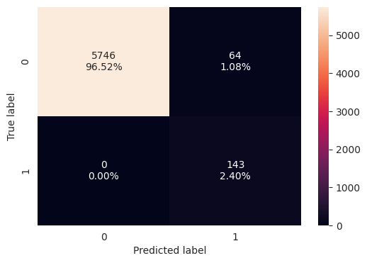
    


    None


                  precision    recall  f1-score   support
    
             0.0       1.00      0.99      0.99      5810
             1.0       0.69      1.00      0.82       143
    
        accuracy                           0.99      5953
       macro avg       0.85      0.99      0.91      5953
    weighted avg       0.99      0.99      0.99      5953
    


  <div id="df-75f555cd-1ddd-41c8-96af-3ae43d9bdd99" class="colab-df-container">
    <div>
<style scoped>
    .dataframe tbody tr th:only-of-type {
        vertical-align: middle;
    }

    .dataframe tbody tr th {
        vertical-align: top;
    }

    .dataframe thead th {
        text-align: right;
    }
</style>
<table border="1" class="dataframe">
  <thead>
    <tr style="text-align: right;">
      <th></th>
      <th>Accuracy</th>
      <th>Recall</th>
      <th>Precision</th>
      <th>F1</th>
    </tr>
  </thead>
  <tbody>
    <tr>
      <th>0</th>
      <td>0.989249</td>
      <td>1.0</td>
      <td>0.690821</td>
      <td>0.817143</td>
    </tr>
  </tbody>
</table>
</div>
    <div class="colab-df-buttons">

  <div class="colab-df-container">
    <button class="colab-df-convert" onclick="convertToInteractive('df-75f555cd-1ddd-41c8-96af-3ae43d9bdd99')"
            title="Convert this dataframe to an interactive table."
            style="display:none;">

  <svg xmlns="http://www.w3.org/2000/svg" height="24px" viewBox="0 -960 960 960">
    <path d="M120-120v-720h720v720H120Zm60-500h600v-160H180v160Zm220 220h160v-160H400v160Zm0 220h160v-160H400v160ZM180-400h160v-160H180v160Zm440 0h160v-160H620v160ZM180-180h160v-160H180v160Zm440 0h160v-160H620v160Z"/>
  </svg>
    </button>

  <style>
    .colab-df-container {
      display:flex;
      gap: 12px;
    }

    .colab-df-convert {
      background-color: #E8F0FE;
      border: none;
      border-radius: 50%;
      cursor: pointer;
      display: none;
      fill: #1967D2;
      height: 32px;
      padding: 0 0 0 0;
      width: 32px;
    }

    .colab-df-convert:hover {
      background-color: #E2EBFA;
      box-shadow: 0px 1px 2px rgba(60, 64, 67, 0.3), 0px 1px 3px 1px rgba(60, 64, 67, 0.15);
      fill: #174EA6;
    }

    .colab-df-buttons div {
      margin-bottom: 4px;
    }

    [theme=dark] .colab-df-convert {
      background-color: #3B4455;
      fill: #D2E3FC;
    }

    [theme=dark] .colab-df-convert:hover {
      background-color: #434B5C;
      box-shadow: 0px 1px 3px 1px rgba(0, 0, 0, 0.15);
      filter: drop-shadow(0px 1px 2px rgba(0, 0, 0, 0.3));
      fill: #FFFFFF;
    }
  </style>

    <script>
      const buttonEl =
        document.querySelector('#df-75f555cd-1ddd-41c8-96af-3ae43d9bdd99 button.colab-df-convert');
      buttonEl.style.display =
        google.colab.kernel.accessAllowed ? 'block' : 'none';

      async function convertToInteractive(key) {
        const element = document.querySelector('#df-75f555cd-1ddd-41c8-96af-3ae43d9bdd99');
        const dataTable =
          await google.colab.kernel.invokeFunction('convertToInteractive',
                                                    [key], {});
        if (!dataTable) return;

        const docLinkHtml = 'Like what you see? Visit the ' +
          '<a target="_blank" href=https://colab.research.google.com/notebooks/data_table.ipynb>data table notebook</a>'
          + ' to learn more about interactive tables.';
        element.innerHTML = '';
        dataTable['output_type'] = 'display_data';
        await google.colab.output.renderOutput(dataTable, element);
        const docLink = document.createElement('div');
        docLink.innerHTML = docLinkHtml;
        element.appendChild(docLink);
      }
    </script>
  </div>


    </div>
  </div>


Evaluate the tuned Decision Tree model on the validation dataset and display its performance metrics. Compare these results with the training performance to assess how well the tuned model generalizes to unseen data.


```python
print("Train and Valid comparison:")

dt_perf_models_test_compare_data = pd.concat([
    decision_tree_tuned_train_perf.T.rename(columns={0: 'Train Decision Tree'}),
    decision_tree_tuned_valid_perf.T.rename(columns={0: 'Valid Decision Tree'}),
    ], axis=1)

display(dt_perf_models_test_compare_data)
```

    Train and Valid comparison:


  <div id="df-9ddfa1ce-35a4-4a29-8157-60cc5b140720" class="colab-df-container">
    <div>
<style scoped>
    .dataframe tbody tr th:only-of-type {
        vertical-align: middle;
    }

    .dataframe tbody tr th {
        vertical-align: top;
    }

    .dataframe thead th {
        text-align: right;
    }
</style>
<table border="1" class="dataframe">
  <thead>
    <tr style="text-align: right;">
      <th></th>
      <th>Train Decision Tree</th>
      <th>Valid Decision Tree</th>
    </tr>
  </thead>
  <tbody>
    <tr>
      <th>Accuracy</th>
      <td>0.998164</td>
      <td>0.989249</td>
    </tr>
    <tr>
      <th>Recall</th>
      <td>1.000000</td>
      <td>1.000000</td>
    </tr>
    <tr>
      <th>Precision</th>
      <td>0.890086</td>
      <td>0.690821</td>
    </tr>
    <tr>
      <th>F1</th>
      <td>0.941847</td>
      <td>0.817143</td>
    </tr>
  </tbody>
</table>
</div>
    <div class="colab-df-buttons">

  <div class="colab-df-container">
    <button class="colab-df-convert" onclick="convertToInteractive('df-9ddfa1ce-35a4-4a29-8157-60cc5b140720')"
            title="Convert this dataframe to an interactive table."
            style="display:none;">

  <svg xmlns="http://www.w3.org/2000/svg" height="24px" viewBox="0 -960 960 960">
    <path d="M120-120v-720h720v720H120Zm60-500h600v-160H180v160Zm220 220h160v-160H400v160Zm0 220h160v-160H400v160ZM180-400h160v-160H180v160Zm440 0h160v-160H620v160ZM180-180h160v-160H180v160Zm440 0h160v-160H620v160Z"/>
  </svg>
    </button>

  <style>
    .colab-df-container {
      display:flex;
      gap: 12px;
    }

    .colab-df-convert {
      background-color: #E8F0FE;
      border: none;
      border-radius: 50%;
      cursor: pointer;
      display: none;
      fill: #1967D2;
      height: 32px;
      padding: 0 0 0 0;
      width: 32px;
    }

    .colab-df-convert:hover {
      background-color: #E2EBFA;
      box-shadow: 0px 1px 2px rgba(60, 64, 67, 0.3), 0px 1px 3px 1px rgba(60, 64, 67, 0.15);
      fill: #174EA6;
    }

    .colab-df-buttons div {
      margin-bottom: 4px;
    }

    [theme=dark] .colab-df-convert {
      background-color: #3B4455;
      fill: #D2E3FC;
    }

    [theme=dark] .colab-df-convert:hover {
      background-color: #434B5C;
      box-shadow: 0px 1px 3px 1px rgba(0, 0, 0, 0.15);
      filter: drop-shadow(0px 1px 2px rgba(0, 0, 0, 0.3));
      fill: #FFFFFF;
    }
  </style>

    <script>
      const buttonEl =
        document.querySelector('#df-9ddfa1ce-35a4-4a29-8157-60cc5b140720 button.colab-df-convert');
      buttonEl.style.display =
        google.colab.kernel.accessAllowed ? 'block' : 'none';

      async function convertToInteractive(key) {
        const element = document.querySelector('#df-9ddfa1ce-35a4-4a29-8157-60cc5b140720');
        const dataTable =
          await google.colab.kernel.invokeFunction('convertToInteractive',
                                                    [key], {});
        if (!dataTable) return;

        const docLinkHtml = 'Like what you see? Visit the ' +
          '<a target="_blank" href=https://colab.research.google.com/notebooks/data_table.ipynb>data table notebook</a>'
          + ' to learn more about interactive tables.';
        element.innerHTML = '';
        dataTable['output_type'] = 'display_data';
        await google.colab.output.renderOutput(dataTable, element);
        const docLink = document.createElement('div');
        docLink.innerHTML = docLinkHtml;
        element.appendChild(docLink);
      }
    </script>
  </div>


  <div id="id_5bbac7c2-36da-42dc-83d1-e4aa2d138680">
    <style>
      .colab-df-generate {
        background-color: #E8F0FE;
        border: none;
        border-radius: 50%;
        cursor: pointer;
        display: none;
        fill: #1967D2;
        height: 32px;
        padding: 0 0 0 0;
        width: 32px;
      }

      .colab-df-generate:hover {
        background-color: #E2EBFA;
        box-shadow: 0px 1px 2px rgba(60, 64, 67, 0.3), 0px 1px 3px 1px rgba(60, 64, 67, 0.15);
        fill: #174EA6;
      }

      [theme=dark] .colab-df-generate {
        background-color: #3B4455;
        fill: #D2E3FC;
      }

      [theme=dark] .colab-df-generate:hover {
        background-color: #434B5C;
        box-shadow: 0px 1px 3px 1px rgba(0, 0, 0, 0.15);
        filter: drop-shadow(0px 1px 2px rgba(0, 0, 0, 0.3));
        fill: #FFFFFF;
      }
    </style>
    <button class="colab-df-generate" onclick="generateWithVariable('dt_perf_models_test_compare_data')"
            title="Generate code using this dataframe."
            style="display:none;">

  <svg xmlns="http://www.w3.org/2000/svg" height="24px"viewBox="0 0 24 24"
       width="24px">
    <path d="M7,19H8.4L18.45,9,17,7.55,7,17.6ZM5,21V16.75L18.45,3.32a2,2,0,0,1,2.83,0l1.4,1.43a1.91,1.91,0,0,1,.58,1.4,1.91,1.91,0,0,1-.58,1.4L9.25,21ZM18.45,9,17,7.55Zm-12,3A5.31,5.31,0,0,0,4.9,8.1,5.31,5.31,0,0,0,1,6.5,5.31,5.31,0,0,0,4.9,4.9,5.31,5.31,0,0,0,6.5,1,5.31,5.31,0,0,0,8.1,4.9,5.31,5.31,0,0,0,12,6.5,5.46,5.46,0,0,0,6.5,12Z"/>
  </svg>
    </button>
    <script>
      (() => {
      const buttonEl =
        document.querySelector('#id_5bbac7c2-36da-42dc-83d1-e4aa2d138680 button.colab-df-generate');
      buttonEl.style.display =
        google.colab.kernel.accessAllowed ? 'block' : 'none';

      buttonEl.onclick = () => {
        google.colab.notebook.generateWithVariable('dt_perf_models_test_compare_data');
      }
      })();
    </script>
  </div>

    </div>
  </div>


The results show the tuned models do better in accuracy and recall but worse in Precision and F1 score.

## Random Forest

Perform the following steps to define the hyperparameter search space for the Random Forest model:

1. Choose values for **`n_estimators`**, which controls the number of trees in the forest. More trees generally improve stability but increase training time.
2. Choose values for **`max_depth`** to control the maximum depth of each tree. Deeper trees capture more complex patterns but are more likely to overfit.
3. Choose values for **`min_samples_split`** to control the minimum number of samples required to split a node. Larger values create more conservative trees.
4. Choose values for **`min_samples_leaf`** to control the minimum number of samples required in each leaf node. Larger values improve generalization by preventing overly specific splits.
5. Choose the **`max_features`** strategy (`sqrt` or `log2`) to control how many features are considered when searching for the best split in each tree.
6. Use the selected values to create the parameter grid for hyperparameter tuning and identify the best-performing model configuration.


```python

def random_forest_hyperparameters(best_params: dict, x_tree, y_tree):
  import numpy as np
  from sklearn.datasets import make_classification
  from sklearn.ensemble import RandomForestClassifier
  from sklearn.model_selection import RandomizedSearchCV, train_test_split

  # Initialize the base model
  rf_classifier = RandomForestClassifier(random_state=42)

  # Set up the Randomized Search
  crf_random_search = RandomizedSearchCV(
      estimator=rf_classifier,
      param_distributions=best_params,
      n_iter=50, # means it will randomly pick and test 50 different combinations
      cv=5, # Use 5-fold cross verification
      verbose=1,
      random_state=42,
      n_jobs=-1, # utilizes all available CPU cores for speed
      scoring="accuracy",  # Change to 'roc_auc' or 'f1' depending on your evaluation metric
  )

  # Execute the search on training data
  print("Starting hyperparameter tuning...")
  crf_random_search.fit(x_tree, y_tree)

  # Extract results
  print("\n--- Tuning Results ---")
  print(f"Best Hyperparameters: {crf_random_search.best_params_}")
  print(f"Best Cross-Validation Score: {crf_random_search.best_score_:.4f}")

  # Use the optimized model
  best_model = crf_random_search.best_estimator_
  print("\n--- Final Model ---")
  print(f"Best Model: {best_model}")
  test_accuracy = best_model.score(x_train, y_train)
  print(f"Test Set Accuracy: {test_accuracy:.4f}")
  return crf_random_search


```

Perform the following steps after hyperparameter tuning:

1. Retrieve the best-performing Random Forest model identified during the randomized search.
2. Retrain the selected model using the complete training dataset.
3. Evaluate the retrained model on the training dataset and display its performance metrics.
4. Evaluate the retrained model on the validation dataset and display its performance metrics.
5. Compare the training and validation results to assess how well the tuned model generalizes to unseen data.


```python
def random_forest_classify(best_params: dict, x_tree, y_tree):
  from sklearn.metrics import classification_report

  # Initialize the Random Forest Classifier with balanced class weights
  rfc = RandomForestClassifier(
      class_weight='balanced',
      random_state =42,
      n_estimators = best_params['n_estimators'], #250,
      max_depth = best_params['max_depth'], #100,
      min_samples_split = best_params['min_samples_split'],#2,
      min_samples_leaf = best_params['min_samples_leaf'],#1,
      max_features = best_params['max_features'], #'log2',
      criterion = best_params['criterion'],#'gini',
      bootstrap = best_params['bootstrap'], #False,
      )

  # Train the classifier
  rfc.fit(x_tree, y_tree)
  print('Train Analysis')
  plot_confusion_matrix(rfc, x_tree, y_tree)

  # Evaluate performance
  y_tree_pred = rfc.predict(x_tree)
  print(classification_report(y_tree, y_tree_pred))
  random_forest_train_perf = model_performance_classification(rfc, x_tree, y_tree)
  display(random_forest_train_perf)
  return random_forest_train_perf

```

Perform the following steps to tune the Random Forest model using randomized search:

1. Perform randomized search with **5-fold cross-validation** using the selected evaluation metric.
2. Train the model on each sampled hyperparameter combination and evaluate its cross-validation performance.
3. Display the best hyperparameter combination and its corresponding cross-validation score.

Tuned Random Forest Train Set


```python
  param_dist_tuning_rf = {
      # Forest structure
      "n_estimators": [int(x) for x in np.linspace(start=50, stop=100, num=10)],
      "bootstrap": [True, False],
      # Tree complexity controls
      "max_depth": [None] + [int(x) for x in np.linspace(10, 30, num=11)],
      "min_samples_split": [2, 5, 10],
      "min_samples_leaf": [1, 2, 4],
      # Feature subsampling
      "max_features": ["sqrt", "log2", 'None'],
      'criterion': ['gini', 'entropy']
  }
  random_forest_grid_search = random_forest_hyperparameters(param_dist_tuning_rf, x_train, y_train)
  random_forest_tuned_train_perf = random_forest_classify(random_forest_grid_search.best_params_, x_train, y_train)
```

    Starting hyperparameter tuning...
    Fitting 5 folds for each of 50 candidates, totalling 250 fits
    
    --- Tuning Results ---
    Best Hyperparameters: {'n_estimators': 72, 'min_samples_split': 2, 'min_samples_leaf': 4, 'max_features': 'sqrt', 'max_depth': 26, 'criterion': 'entropy', 'bootstrap': True}
    Best Cross-Validation Score: 0.9720
    
    --- Final Model ---
    Best Model: RandomForestClassifier(criterion='entropy', max_depth=26, min_samples_leaf=4,
                           n_estimators=72, random_state=42)
    Test Set Accuracy: 0.9993
    Train Analysis


    

    


    None


                  precision    recall  f1-score   support
    
             0.0       1.00      1.00      1.00     27369
             1.0       0.86      1.00      0.93       413
    
        accuracy                           1.00     27782
       macro avg       0.93      1.00      0.96     27782
    weighted avg       1.00      1.00      1.00     27782
    


  <div id="df-8396589c-f67c-4558-a532-e17ec1efe6f3" class="colab-df-container">
    <div>
<style scoped>
    .dataframe tbody tr th:only-of-type {
        vertical-align: middle;
    }

    .dataframe tbody tr th {
        vertical-align: top;
    }

    .dataframe thead th {
        text-align: right;
    }
</style>
<table border="1" class="dataframe">
  <thead>
    <tr style="text-align: right;">
      <th></th>
      <th>Accuracy</th>
      <th>Recall</th>
      <th>Precision</th>
      <th>F1</th>
    </tr>
  </thead>
  <tbody>
    <tr>
      <th>0</th>
      <td>0.99766</td>
      <td>1.0</td>
      <td>0.864017</td>
      <td>0.927048</td>
    </tr>
  </tbody>
</table>
</div>
    <div class="colab-df-buttons">

  <div class="colab-df-container">
    <button class="colab-df-convert" onclick="convertToInteractive('df-8396589c-f67c-4558-a532-e17ec1efe6f3')"
            title="Convert this dataframe to an interactive table."
            style="display:none;">

  <svg xmlns="http://www.w3.org/2000/svg" height="24px" viewBox="0 -960 960 960">
    <path d="M120-120v-720h720v720H120Zm60-500h600v-160H180v160Zm220 220h160v-160H400v160Zm0 220h160v-160H400v160ZM180-400h160v-160H180v160Zm440 0h160v-160H620v160ZM180-180h160v-160H180v160Zm440 0h160v-160H620v160Z"/>
  </svg>
    </button>

  <style>
    .colab-df-container {
      display:flex;
      gap: 12px;
    }

    .colab-df-convert {
      background-color: #E8F0FE;
      border: none;
      border-radius: 50%;
      cursor: pointer;
      display: none;
      fill: #1967D2;
      height: 32px;
      padding: 0 0 0 0;
      width: 32px;
    }

    .colab-df-convert:hover {
      background-color: #E2EBFA;
      box-shadow: 0px 1px 2px rgba(60, 64, 67, 0.3), 0px 1px 3px 1px rgba(60, 64, 67, 0.15);
      fill: #174EA6;
    }

    .colab-df-buttons div {
      margin-bottom: 4px;
    }

    [theme=dark] .colab-df-convert {
      background-color: #3B4455;
      fill: #D2E3FC;
    }

    [theme=dark] .colab-df-convert:hover {
      background-color: #434B5C;
      box-shadow: 0px 1px 3px 1px rgba(0, 0, 0, 0.15);
      filter: drop-shadow(0px 1px 2px rgba(0, 0, 0, 0.3));
      fill: #FFFFFF;
    }
  </style>

    <script>
      const buttonEl =
        document.querySelector('#df-8396589c-f67c-4558-a532-e17ec1efe6f3 button.colab-df-convert');
      buttonEl.style.display =
        google.colab.kernel.accessAllowed ? 'block' : 'none';

      async function convertToInteractive(key) {
        const element = document.querySelector('#df-8396589c-f67c-4558-a532-e17ec1efe6f3');
        const dataTable =
          await google.colab.kernel.invokeFunction('convertToInteractive',
                                                    [key], {});
        if (!dataTable) return;

        const docLinkHtml = 'Like what you see? Visit the ' +
          '<a target="_blank" href=https://colab.research.google.com/notebooks/data_table.ipynb>data table notebook</a>'
          + ' to learn more about interactive tables.';
        element.innerHTML = '';
        dataTable['output_type'] = 'display_data';
        await google.colab.output.renderOutput(dataTable, element);
        const docLink = document.createElement('div');
        docLink.innerHTML = docLinkHtml;
        element.appendChild(docLink);
      }
    </script>
  </div>


    </div>
  </div>


Tuned Random Forest Valid Set


```python

```


```python
  param_dist_tuning_rf = {
      # Forest structure
      "n_estimators": [int(x) for x in np.linspace(start=50, stop=100, num=10)],
      "bootstrap": [True, False],
      # Tree complexity controls
      "max_depth": [None] + [int(x) for x in np.linspace(10, 30, num=11)],
      "min_samples_split": [2, 5, 10],
      "min_samples_leaf": [1, 2, 4],
      # Feature subsampling
      "max_features": ["sqrt", "log2", 'None'],
      'criterion': ['gini', 'entropy']
  }
  random_forest_grid_search = random_forest_hyperparameters(param_dist_tuning_rf, x_valid, y_valid)
  random_forest_tuned_valid_perf = random_forest_classify(random_forest_grid_search.best_params_, x_valid, y_valid)
```

    Starting hyperparameter tuning...
    Fitting 5 folds for each of 50 candidates, totalling 250 fits
    
    --- Tuning Results ---
    Best Hyperparameters: {'n_estimators': 94, 'min_samples_split': 10, 'min_samples_leaf': 4, 'max_features': 'log2', 'max_depth': 18, 'criterion': 'gini', 'bootstrap': True}
    Best Cross-Validation Score: 0.9763
    
    --- Final Model ---
    Best Model: RandomForestClassifier(max_depth=18, max_features='log2', min_samples_leaf=4,
                           min_samples_split=10, n_estimators=94, random_state=42)
    Test Set Accuracy: 0.9851
    Train Analysis


    

    


    None


                  precision    recall  f1-score   support
    
             0.0       1.00      1.00      1.00      5810
             1.0       0.91      1.00      0.95       143
    
        accuracy                           1.00      5953
       macro avg       0.95      1.00      0.97      5953
    weighted avg       1.00      1.00      1.00      5953
    


  <div id="df-d346aa7d-e424-4ef7-9f62-3fe52c6a85cc" class="colab-df-container">
    <div>
<style scoped>
    .dataframe tbody tr th:only-of-type {
        vertical-align: middle;
    }

    .dataframe tbody tr th {
        vertical-align: top;
    }

    .dataframe thead th {
        text-align: right;
    }
</style>
<table border="1" class="dataframe">
  <thead>
    <tr style="text-align: right;">
      <th></th>
      <th>Accuracy</th>
      <th>Recall</th>
      <th>Precision</th>
      <th>F1</th>
    </tr>
  </thead>
  <tbody>
    <tr>
      <th>0</th>
      <td>0.99748</td>
      <td>1.0</td>
      <td>0.905063</td>
      <td>0.950166</td>
    </tr>
  </tbody>
</table>
</div>
    <div class="colab-df-buttons">

  <div class="colab-df-container">
    <button class="colab-df-convert" onclick="convertToInteractive('df-d346aa7d-e424-4ef7-9f62-3fe52c6a85cc')"
            title="Convert this dataframe to an interactive table."
            style="display:none;">

  <svg xmlns="http://www.w3.org/2000/svg" height="24px" viewBox="0 -960 960 960">
    <path d="M120-120v-720h720v720H120Zm60-500h600v-160H180v160Zm220 220h160v-160H400v160Zm0 220h160v-160H400v160ZM180-400h160v-160H180v160Zm440 0h160v-160H620v160ZM180-180h160v-160H180v160Zm440 0h160v-160H620v160Z"/>
  </svg>
    </button>

  <style>
    .colab-df-container {
      display:flex;
      gap: 12px;
    }

    .colab-df-convert {
      background-color: #E8F0FE;
      border: none;
      border-radius: 50%;
      cursor: pointer;
      display: none;
      fill: #1967D2;
      height: 32px;
      padding: 0 0 0 0;
      width: 32px;
    }

    .colab-df-convert:hover {
      background-color: #E2EBFA;
      box-shadow: 0px 1px 2px rgba(60, 64, 67, 0.3), 0px 1px 3px 1px rgba(60, 64, 67, 0.15);
      fill: #174EA6;
    }

    .colab-df-buttons div {
      margin-bottom: 4px;
    }

    [theme=dark] .colab-df-convert {
      background-color: #3B4455;
      fill: #D2E3FC;
    }

    [theme=dark] .colab-df-convert:hover {
      background-color: #434B5C;
      box-shadow: 0px 1px 3px 1px rgba(0, 0, 0, 0.15);
      filter: drop-shadow(0px 1px 2px rgba(0, 0, 0, 0.3));
      fill: #FFFFFF;
    }
  </style>

    <script>
      const buttonEl =
        document.querySelector('#df-d346aa7d-e424-4ef7-9f62-3fe52c6a85cc button.colab-df-convert');
      buttonEl.style.display =
        google.colab.kernel.accessAllowed ? 'block' : 'none';

      async function convertToInteractive(key) {
        const element = document.querySelector('#df-d346aa7d-e424-4ef7-9f62-3fe52c6a85cc');
        const dataTable =
          await google.colab.kernel.invokeFunction('convertToInteractive',
                                                    [key], {});
        if (!dataTable) return;

        const docLinkHtml = 'Like what you see? Visit the ' +
          '<a target="_blank" href=https://colab.research.google.com/notebooks/data_table.ipynb>data table notebook</a>'
          + ' to learn more about interactive tables.';
        element.innerHTML = '';
        dataTable['output_type'] = 'display_data';
        await google.colab.output.renderOutput(dataTable, element);
        const docLink = document.createElement('div');
        docLink.innerHTML = docLinkHtml;
        element.appendChild(docLink);
      }
    </script>
  </div>


    </div>
  </div>


Tuned Random Forest Test Set


```python
print("Train and Valid comparison:")

rf_perf_models_test_compare_data = pd.concat([
    random_forest_tuned_train_perf.T.rename(columns={0: 'Train Random Forest'}),
    random_forest_tuned_valid_perf.T.rename(columns={0: 'Valid Random Forest'}),
], axis=1)

display(rf_perf_models_test_compare_data)
```

    Train and Valid comparison:


  <div id="df-03ac1316-0640-4314-9546-3ad98d976eb9" class="colab-df-container">
    <div>
<style scoped>
    .dataframe tbody tr th:only-of-type {
        vertical-align: middle;
    }

    .dataframe tbody tr th {
        vertical-align: top;
    }

    .dataframe thead th {
        text-align: right;
    }
</style>
<table border="1" class="dataframe">
  <thead>
    <tr style="text-align: right;">
      <th></th>
      <th>Train Random Forest</th>
      <th>Valid Random Forest</th>
    </tr>
  </thead>
  <tbody>
    <tr>
      <th>Accuracy</th>
      <td>0.997660</td>
      <td>0.997480</td>
    </tr>
    <tr>
      <th>Recall</th>
      <td>1.000000</td>
      <td>1.000000</td>
    </tr>
    <tr>
      <th>Precision</th>
      <td>0.864017</td>
      <td>0.905063</td>
    </tr>
    <tr>
      <th>F1</th>
      <td>0.927048</td>
      <td>0.950166</td>
    </tr>
  </tbody>
</table>
</div>
    <div class="colab-df-buttons">

  <div class="colab-df-container">
    <button class="colab-df-convert" onclick="convertToInteractive('df-03ac1316-0640-4314-9546-3ad98d976eb9')"
            title="Convert this dataframe to an interactive table."
            style="display:none;">

  <svg xmlns="http://www.w3.org/2000/svg" height="24px" viewBox="0 -960 960 960">
    <path d="M120-120v-720h720v720H120Zm60-500h600v-160H180v160Zm220 220h160v-160H400v160Zm0 220h160v-160H400v160ZM180-400h160v-160H180v160Zm440 0h160v-160H620v160ZM180-180h160v-160H180v160Zm440 0h160v-160H620v160Z"/>
  </svg>
    </button>

  <style>
    .colab-df-container {
      display:flex;
      gap: 12px;
    }

    .colab-df-convert {
      background-color: #E8F0FE;
      border: none;
      border-radius: 50%;
      cursor: pointer;
      display: none;
      fill: #1967D2;
      height: 32px;
      padding: 0 0 0 0;
      width: 32px;
    }

    .colab-df-convert:hover {
      background-color: #E2EBFA;
      box-shadow: 0px 1px 2px rgba(60, 64, 67, 0.3), 0px 1px 3px 1px rgba(60, 64, 67, 0.15);
      fill: #174EA6;
    }

    .colab-df-buttons div {
      margin-bottom: 4px;
    }

    [theme=dark] .colab-df-convert {
      background-color: #3B4455;
      fill: #D2E3FC;
    }

    [theme=dark] .colab-df-convert:hover {
      background-color: #434B5C;
      box-shadow: 0px 1px 3px 1px rgba(0, 0, 0, 0.15);
      filter: drop-shadow(0px 1px 2px rgba(0, 0, 0, 0.3));
      fill: #FFFFFF;
    }
  </style>

    <script>
      const buttonEl =
        document.querySelector('#df-03ac1316-0640-4314-9546-3ad98d976eb9 button.colab-df-convert');
      buttonEl.style.display =
        google.colab.kernel.accessAllowed ? 'block' : 'none';

      async function convertToInteractive(key) {
        const element = document.querySelector('#df-03ac1316-0640-4314-9546-3ad98d976eb9');
        const dataTable =
          await google.colab.kernel.invokeFunction('convertToInteractive',
                                                    [key], {});
        if (!dataTable) return;

        const docLinkHtml = 'Like what you see? Visit the ' +
          '<a target="_blank" href=https://colab.research.google.com/notebooks/data_table.ipynb>data table notebook</a>'
          + ' to learn more about interactive tables.';
        element.innerHTML = '';
        dataTable['output_type'] = 'display_data';
        await google.colab.output.renderOutput(dataTable, element);
        const docLink = document.createElement('div');
        docLink.innerHTML = docLinkHtml;
        element.appendChild(docLink);
      }
    </script>
  </div>


  <div id="id_f2107155-1f4e-4be3-b096-6e4c8de3efd5">
    <style>
      .colab-df-generate {
        background-color: #E8F0FE;
        border: none;
        border-radius: 50%;
        cursor: pointer;
        display: none;
        fill: #1967D2;
        height: 32px;
        padding: 0 0 0 0;
        width: 32px;
      }

      .colab-df-generate:hover {
        background-color: #E2EBFA;
        box-shadow: 0px 1px 2px rgba(60, 64, 67, 0.3), 0px 1px 3px 1px rgba(60, 64, 67, 0.15);
        fill: #174EA6;
      }

      [theme=dark] .colab-df-generate {
        background-color: #3B4455;
        fill: #D2E3FC;
      }

      [theme=dark] .colab-df-generate:hover {
        background-color: #434B5C;
        box-shadow: 0px 1px 3px 1px rgba(0, 0, 0, 0.15);
        filter: drop-shadow(0px 1px 2px rgba(0, 0, 0, 0.3));
        fill: #FFFFFF;
      }
    </style>
    <button class="colab-df-generate" onclick="generateWithVariable('rf_perf_models_test_compare_data')"
            title="Generate code using this dataframe."
            style="display:none;">

  <svg xmlns="http://www.w3.org/2000/svg" height="24px"viewBox="0 0 24 24"
       width="24px">
    <path d="M7,19H8.4L18.45,9,17,7.55,7,17.6ZM5,21V16.75L18.45,3.32a2,2,0,0,1,2.83,0l1.4,1.43a1.91,1.91,0,0,1,.58,1.4,1.91,1.91,0,0,1-.58,1.4L9.25,21ZM18.45,9,17,7.55Zm-12,3A5.31,5.31,0,0,0,4.9,8.1,5.31,5.31,0,0,0,1,6.5,5.31,5.31,0,0,0,4.9,4.9,5.31,5.31,0,0,0,6.5,1,5.31,5.31,0,0,0,8.1,4.9,5.31,5.31,0,0,0,12,6.5,5.46,5.46,0,0,0,6.5,12Z"/>
  </svg>
    </button>
    <script>
      (() => {
      const buttonEl =
        document.querySelector('#id_f2107155-1f4e-4be3-b096-6e4c8de3efd5 button.colab-df-generate');
      buttonEl.style.display =
        google.colab.kernel.accessAllowed ? 'block' : 'none';

      buttonEl.onclick = () => {
        google.colab.notebook.generateWithVariable('rf_perf_models_test_compare_data');
      }
      })();
    </script>
  </div>

    </div>
  </div>


## Gradient Boosting

Perform the following steps to define the hyperparameter search space for the Gradient Boosting model:

1. Choose values for **`n_estimators`**, which controls the number of boosting stages. More boosting stages can improve learning but increase training time.
2. Choose values for **`learning_rate`**, which controls how quickly the model learns. Smaller values require more boosting stages, while larger values learn faster but may overfit.
3. Choose values for **`max_depth`** to control the maximum depth of each decision tree. Deeper trees capture more complex patterns but are more likely to overfit.
4. Choose values for **`subsample`**, which determines the fraction of training samples used for each boosting stage. Lower values improve generalization by introducing randomness, while higher values use more data for learning.
5. Choose the **`max_features`** strategy (`sqrt` or `log2`) to control how many features are considered when searching for the best split in each tree.
6. Use the selected values to create the parameter grid for hyperparameter tuning and identify the best-performing model configuration.


```python

```

Perform the following steps to tune the Gradient Boosting model using randomized search:

1. Perform randomized search with **3-fold cross-validation** using the selected evaluation metric.
2. Train the model on each sampled hyperparameter combination and evaluate its cross-validation performance.
3. Display the best hyperparameter combination and its corresponding cross-validation score.


```python

```

Perform the following steps after hyperparameter tuning:

1. Retrieve the best-performing Gradient Boosting model identified during the randomized search.
2. Retrain the selected model using the complete training dataset.
3. Evaluate the retrained model on the training dataset and display its performance metrics.
4. Evaluate the retrained model on the validation dataset and display its performance metrics.
5. Compare the training and validation results to assess how well the tuned model generalizes to unseen data.


```python

```

# **Final Model Selection**

Perform the following steps to compare the training performance of the tuned models:

1. Add the training performance metrics of the tuned models to the existing comparison table.
2. Display the updated comparison table.
3. Compare the baseline and tuned models to determine whether hyperparameter tuning improved the training performance.

Perform the following steps to compare the validation performance of the tuned models:

1. Add the validation performance metrics of the tuned models to the existing comparison table.
2. Display the updated comparison table.
3. Compare the baseline and tuned models to determine whether hyperparameter tuning improved the validation performance and generalization.


```python
print('------All Base Perf Tuned Validations------')
all_perf_validation_models_test_compare_data = pd.concat([
    decision_tree_valid_perf.T.rename(columns={1: 'All Tuned XGBoost Trees'}),
    random_forest_valid_perf.T.rename(columns={1: 'All Tuned Decision Trees'}),
    gradient_boost_valid_perf.T.rename(columns={1: 'All Tuned Random Forests'}),
    xgboost_valid_perf.T.rename(columns={1: 'All Tuned XGBoost Trees'}),
    neural_valid_perf.T.rename(columns={1: 'All Tuned Neural Networks'})
], axis=1)

display(all_perf_validation_models_test_compare_data)
```

    ------All Base Perf Tuned Validations------


  <div id="df-dbd5bbf2-4216-4c2a-9599-349e6c40680b" class="colab-df-container">
    <div>
<style scoped>
    .dataframe tbody tr th:only-of-type {
        vertical-align: middle;
    }

    .dataframe tbody tr th {
        vertical-align: top;
    }

    .dataframe thead th {
        text-align: right;
    }
</style>
<table border="1" class="dataframe">
  <thead>
    <tr style="text-align: right;">
      <th></th>
      <th>0</th>
      <th>0</th>
      <th>0</th>
      <th>0</th>
      <th>0</th>
    </tr>
  </thead>
  <tbody>
    <tr>
      <th>Accuracy</th>
      <td>1.0</td>
      <td>1.0</td>
      <td>0.999664</td>
      <td>1.0</td>
      <td>0.996304</td>
    </tr>
    <tr>
      <th>Recall</th>
      <td>1.0</td>
      <td>1.0</td>
      <td>1.000000</td>
      <td>1.0</td>
      <td>0.916084</td>
    </tr>
    <tr>
      <th>Precision</th>
      <td>1.0</td>
      <td>1.0</td>
      <td>0.986207</td>
      <td>1.0</td>
      <td>0.929078</td>
    </tr>
    <tr>
      <th>F1</th>
      <td>1.0</td>
      <td>1.0</td>
      <td>0.993056</td>
      <td>1.0</td>
      <td>0.922535</td>
    </tr>
  </tbody>
</table>
</div>
    <div class="colab-df-buttons">

  <div class="colab-df-container">
    <button class="colab-df-convert" onclick="convertToInteractive('df-dbd5bbf2-4216-4c2a-9599-349e6c40680b')"
            title="Convert this dataframe to an interactive table."
            style="display:none;">

  <svg xmlns="http://www.w3.org/2000/svg" height="24px" viewBox="0 -960 960 960">
    <path d="M120-120v-720h720v720H120Zm60-500h600v-160H180v160Zm220 220h160v-160H400v160Zm0 220h160v-160H400v160ZM180-400h160v-160H180v160Zm440 0h160v-160H620v160ZM180-180h160v-160H180v160Zm440 0h160v-160H620v160Z"/>
  </svg>
    </button>

  <style>
    .colab-df-container {
      display:flex;
      gap: 12px;
    }

    .colab-df-convert {
      background-color: #E8F0FE;
      border: none;
      border-radius: 50%;
      cursor: pointer;
      display: none;
      fill: #1967D2;
      height: 32px;
      padding: 0 0 0 0;
      width: 32px;
    }

    .colab-df-convert:hover {
      background-color: #E2EBFA;
      box-shadow: 0px 1px 2px rgba(60, 64, 67, 0.3), 0px 1px 3px 1px rgba(60, 64, 67, 0.15);
      fill: #174EA6;
    }

    .colab-df-buttons div {
      margin-bottom: 4px;
    }

    [theme=dark] .colab-df-convert {
      background-color: #3B4455;
      fill: #D2E3FC;
    }

    [theme=dark] .colab-df-convert:hover {
      background-color: #434B5C;
      box-shadow: 0px 1px 3px 1px rgba(0, 0, 0, 0.15);
      filter: drop-shadow(0px 1px 2px rgba(0, 0, 0, 0.3));
      fill: #FFFFFF;
    }
  </style>

    <script>
      const buttonEl =
        document.querySelector('#df-dbd5bbf2-4216-4c2a-9599-349e6c40680b button.colab-df-convert');
      buttonEl.style.display =
        google.colab.kernel.accessAllowed ? 'block' : 'none';

      async function convertToInteractive(key) {
        const element = document.querySelector('#df-dbd5bbf2-4216-4c2a-9599-349e6c40680b');
        const dataTable =
          await google.colab.kernel.invokeFunction('convertToInteractive',
                                                    [key], {});
        if (!dataTable) return;

        const docLinkHtml = 'Like what you see? Visit the ' +
          '<a target="_blank" href=https://colab.research.google.com/notebooks/data_table.ipynb>data table notebook</a>'
          + ' to learn more about interactive tables.';
        element.innerHTML = '';
        dataTable['output_type'] = 'display_data';
        await google.colab.output.renderOutput(dataTable, element);
        const docLink = document.createElement('div');
        docLink.innerHTML = docLinkHtml;
        element.appendChild(docLink);
      }
    </script>
  </div>


  <div id="id_610d085a-2865-4d8f-bdea-2f26f1b18f1f">
    <style>
      .colab-df-generate {
        background-color: #E8F0FE;
        border: none;
        border-radius: 50%;
        cursor: pointer;
        display: none;
        fill: #1967D2;
        height: 32px;
        padding: 0 0 0 0;
        width: 32px;
      }

      .colab-df-generate:hover {
        background-color: #E2EBFA;
        box-shadow: 0px 1px 2px rgba(60, 64, 67, 0.3), 0px 1px 3px 1px rgba(60, 64, 67, 0.15);
        fill: #174EA6;
      }

      [theme=dark] .colab-df-generate {
        background-color: #3B4455;
        fill: #D2E3FC;
      }

      [theme=dark] .colab-df-generate:hover {
        background-color: #434B5C;
        box-shadow: 0px 1px 3px 1px rgba(0, 0, 0, 0.15);
        filter: drop-shadow(0px 1px 2px rgba(0, 0, 0, 0.3));
        fill: #FFFFFF;
      }
    </style>
    <button class="colab-df-generate" onclick="generateWithVariable('all_perf_validation_models_test_compare_data')"
            title="Generate code using this dataframe."
            style="display:none;">

  <svg xmlns="http://www.w3.org/2000/svg" height="24px"viewBox="0 0 24 24"
       width="24px">
    <path d="M7,19H8.4L18.45,9,17,7.55,7,17.6ZM5,21V16.75L18.45,3.32a2,2,0,0,1,2.83,0l1.4,1.43a1.91,1.91,0,0,1,.58,1.4,1.91,1.91,0,0,1-.58,1.4L9.25,21ZM18.45,9,17,7.55Zm-12,3A5.31,5.31,0,0,0,4.9,8.1,5.31,5.31,0,0,0,1,6.5,5.31,5.31,0,0,0,4.9,4.9,5.31,5.31,0,0,0,6.5,1,5.31,5.31,0,0,0,8.1,4.9,5.31,5.31,0,0,0,12,6.5,5.46,5.46,0,0,0,6.5,12Z"/>
  </svg>
    </button>
    <script>
      (() => {
      const buttonEl =
        document.querySelector('#id_610d085a-2865-4d8f-bdea-2f26f1b18f1f button.colab-df-generate');
      buttonEl.style.display =
        google.colab.kernel.accessAllowed ? 'block' : 'none';

      buttonEl.onclick = () => {
        google.colab.notebook.generateWithVariable('all_perf_validation_models_test_compare_data');
      }
      })();
    </script>
  </div>

    </div>
  </div>


```python
print('------All Tuned Perf Valid Validations')
all_perf_validation_models_test_compare_data = pd.concat([
    decision_tree_tuned_valid_perf.T.rename(columns={1: 'All Tuned XGBoost Trees'}),
    random_forest_tuned_valid_perf.T.rename(columns={1: 'All Tuned Decision Trees'}),
    xgboost_tuned_valid_perf.T.rename(columns={1: 'All Tuned Random Forests'})
], axis=1)

display(all_perf_validation_models_test_compare_data)
```

    ------All Tuned Perf Valid Validations


  <div id="df-cc4808d8-18ad-4c8f-8ecf-392f45ec4286" class="colab-df-container">
    <div>
<style scoped>
    .dataframe tbody tr th:only-of-type {
        vertical-align: middle;
    }

    .dataframe tbody tr th {
        vertical-align: top;
    }

    .dataframe thead th {
        text-align: right;
    }
</style>
<table border="1" class="dataframe">
  <thead>
    <tr style="text-align: right;">
      <th></th>
      <th>0</th>
      <th>0</th>
      <th>0</th>
    </tr>
  </thead>
  <tbody>
    <tr>
      <th>Accuracy</th>
      <td>0.989249</td>
      <td>0.997480</td>
      <td>1.0</td>
    </tr>
    <tr>
      <th>Recall</th>
      <td>1.000000</td>
      <td>1.000000</td>
      <td>1.0</td>
    </tr>
    <tr>
      <th>Precision</th>
      <td>0.690821</td>
      <td>0.905063</td>
      <td>1.0</td>
    </tr>
    <tr>
      <th>F1</th>
      <td>0.817143</td>
      <td>0.950166</td>
      <td>1.0</td>
    </tr>
  </tbody>
</table>
</div>
    <div class="colab-df-buttons">

  <div class="colab-df-container">
    <button class="colab-df-convert" onclick="convertToInteractive('df-cc4808d8-18ad-4c8f-8ecf-392f45ec4286')"
            title="Convert this dataframe to an interactive table."
            style="display:none;">

  <svg xmlns="http://www.w3.org/2000/svg" height="24px" viewBox="0 -960 960 960">
    <path d="M120-120v-720h720v720H120Zm60-500h600v-160H180v160Zm220 220h160v-160H400v160Zm0 220h160v-160H400v160ZM180-400h160v-160H180v160Zm440 0h160v-160H620v160ZM180-180h160v-160H180v160Zm440 0h160v-160H620v160Z"/>
  </svg>
    </button>

  <style>
    .colab-df-container {
      display:flex;
      gap: 12px;
    }

    .colab-df-convert {
      background-color: #E8F0FE;
      border: none;
      border-radius: 50%;
      cursor: pointer;
      display: none;
      fill: #1967D2;
      height: 32px;
      padding: 0 0 0 0;
      width: 32px;
    }

    .colab-df-convert:hover {
      background-color: #E2EBFA;
      box-shadow: 0px 1px 2px rgba(60, 64, 67, 0.3), 0px 1px 3px 1px rgba(60, 64, 67, 0.15);
      fill: #174EA6;
    }

    .colab-df-buttons div {
      margin-bottom: 4px;
    }

    [theme=dark] .colab-df-convert {
      background-color: #3B4455;
      fill: #D2E3FC;
    }

    [theme=dark] .colab-df-convert:hover {
      background-color: #434B5C;
      box-shadow: 0px 1px 3px 1px rgba(0, 0, 0, 0.15);
      filter: drop-shadow(0px 1px 2px rgba(0, 0, 0, 0.3));
      fill: #FFFFFF;
    }
  </style>

    <script>
      const buttonEl =
        document.querySelector('#df-cc4808d8-18ad-4c8f-8ecf-392f45ec4286 button.colab-df-convert');
      buttonEl.style.display =
        google.colab.kernel.accessAllowed ? 'block' : 'none';

      async function convertToInteractive(key) {
        const element = document.querySelector('#df-cc4808d8-18ad-4c8f-8ecf-392f45ec4286');
        const dataTable =
          await google.colab.kernel.invokeFunction('convertToInteractive',
                                                    [key], {});
        if (!dataTable) return;

        const docLinkHtml = 'Like what you see? Visit the ' +
          '<a target="_blank" href=https://colab.research.google.com/notebooks/data_table.ipynb>data table notebook</a>'
          + ' to learn more about interactive tables.';
        element.innerHTML = '';
        dataTable['output_type'] = 'display_data';
        await google.colab.output.renderOutput(dataTable, element);
        const docLink = document.createElement('div');
        docLink.innerHTML = docLinkHtml;
        element.appendChild(docLink);
      }
    </script>
  </div>


  <div id="id_3060e830-78e2-4f56-a122-d4b80e533e7b">
    <style>
      .colab-df-generate {
        background-color: #E8F0FE;
        border: none;
        border-radius: 50%;
        cursor: pointer;
        display: none;
        fill: #1967D2;
        height: 32px;
        padding: 0 0 0 0;
        width: 32px;
      }

      .colab-df-generate:hover {
        background-color: #E2EBFA;
        box-shadow: 0px 1px 2px rgba(60, 64, 67, 0.3), 0px 1px 3px 1px rgba(60, 64, 67, 0.15);
        fill: #174EA6;
      }

      [theme=dark] .colab-df-generate {
        background-color: #3B4455;
        fill: #D2E3FC;
      }

      [theme=dark] .colab-df-generate:hover {
        background-color: #434B5C;
        box-shadow: 0px 1px 3px 1px rgba(0, 0, 0, 0.15);
        filter: drop-shadow(0px 1px 2px rgba(0, 0, 0, 0.3));
        fill: #FFFFFF;
      }
    </style>
    <button class="colab-df-generate" onclick="generateWithVariable('all_perf_validation_models_test_compare_data')"
            title="Generate code using this dataframe."
            style="display:none;">

  <svg xmlns="http://www.w3.org/2000/svg" height="24px"viewBox="0 0 24 24"
       width="24px">
    <path d="M7,19H8.4L18.45,9,17,7.55,7,17.6ZM5,21V16.75L18.45,3.32a2,2,0,0,1,2.83,0l1.4,1.43a1.91,1.91,0,0,1,.58,1.4,1.91,1.91,0,0,1-.58,1.4L9.25,21ZM18.45,9,17,7.55Zm-12,3A5.31,5.31,0,0,0,4.9,8.1,5.31,5.31,0,0,0,1,6.5,5.31,5.31,0,0,0,4.9,4.9,5.31,5.31,0,0,0,6.5,1,5.31,5.31,0,0,0,8.1,4.9,5.31,5.31,0,0,0,12,6.5,5.46,5.46,0,0,0,6.5,12Z"/>
  </svg>
    </button>
    <script>
      (() => {
      const buttonEl =
        document.querySelector('#id_3060e830-78e2-4f56-a122-d4b80e533e7b button.colab-df-generate');
      buttonEl.style.display =
        google.colab.kernel.accessAllowed ? 'block' : 'none';

      buttonEl.onclick = () => {
        google.colab.notebook.generateWithVariable('all_perf_validation_models_test_compare_data');
      }
      })();
    </script>
  </div>

    </div>
  </div>


Perform the following steps to select the final model:

1. Review the performance of all baseline and tuned models using the selected evaluation metric.
2. Select the model that best meets the business objective and demonstrates strong generalization on the validation dataset.
3. Assign the selected model as the final model for evaluation on the test dataset.

Looks like XGBoost did the best across base and tuned models.

The metric used was F1.

The F1 score was 1, which is perfect.  This could be a result of overfitting or not enough data.


```python
final_model = xgboost_search_train.best_estimator_
print(final_model)
print(final_model.get_xgb_params()['reg_lambda'])
```

    XGBClassifier(base_score=None, booster=None, callbacks=None,
                  colsample_bylevel=None, colsample_bynode=None,
                  colsample_bytree=0.8, device=None, early_stopping_rounds=None,
                  enable_categorical=True, eval_metric='logloss',
                  feature_types=None, feature_weights=None, gamma=0.1,
                  grow_policy=None, importance_type=None,
                  interaction_constraints=None, learning_rate=0.01, max_bin=None,
                  max_cat_threshold=None, max_cat_to_onehot=None,
                  max_delta_step=None, max_depth=4, max_leaves=None,
                  min_child_weight=5, missing=nan, monotone_constraints=None,
                  multi_strategy=None, n_estimators=57, n_jobs=None,
                  num_parallel_tree=None, ...)
    1.0


## Feature Importance


```python
def plot_feature_importances(model, X, y, feature_names=None, color="violet", figsize=(10, 10)):
    """
    Plots feature importances for both Traditional ML models (XGBoost, RF)
    and Deep Learning models (ANNs).

    Parameters:
    - model: Trained model object (XGBoost, Sklearn, Keras wrapper, etc.)
    - X: Evaluation features (DataFrame or 2D array)
    - y: Evaluation targets (Series or 1D array)
    - feature_names: List of feature names. If None and X is a DataFrame, uses X.columns.
    """
    # 1. Automatically grab feature names if not provided
    if feature_names is None:
        if hasattr(X, 'columns'):
            feature_names = X.columns
        else:
            feature_names = [f"Feature {i}" for i in range(X.shape[1])]

    # Convert X to numpy if it's a DataFrame for permutation calculation safety
    X_val = X.values if hasattr(X, 'columns') else X

    # 2. Extract or calculate importances
    if hasattr(model, 'feature_importances_'):
        print("💡 Detected Tree-based model. Extracting built-in feature importances...")
        importances = model.feature_importances_
        title = "Feature Importances (Tree-based Model)"
        xlabel = "Relative Importance"
    else:
        print("💡 Detected ANN/Black-box model. Calculating Permutation Importance...")
        # n_repeats is how many times a feature is shuffled; higher is more accurate but slower
        result = permutation_importance(model, X_val, y, n_repeats=5, random_state=42)
        importances = result.importances_mean
        title = "Feature Importances (Permutation Importance - ANN)"
        xlabel = "Mean Performance Drop when Shuffled"

    # 3. Sort the importances in ascending order
    indices = np.argsort(importances)

    # 4. Plotting
    plt.figure(figsize=figsize)
    plt.title(title)
    plt.barh(range(len(indices)), importances[indices], color=color, align="center")
    plt.yticks(range(len(indices)), [feature_names[i] for i in indices])
    plt.xlabel(xlabel)
    plt.tight_layout()
    plt.show()
```


```python
plot_feature_importances(final_model, x_test, y_test)
```

    💡 Detected Tree-based model. Extracting built-in feature importances...


    
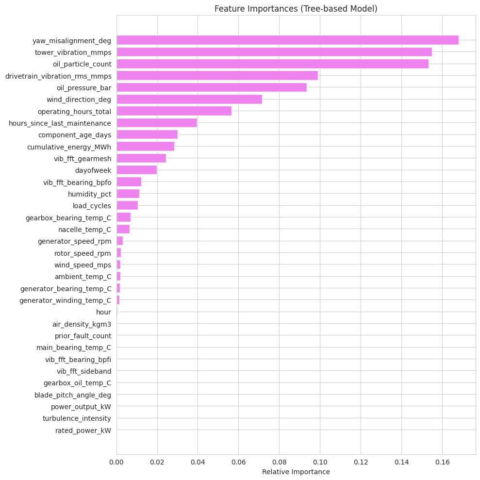
    


## Final Model Test Performance

1. Evaluate the selected model using the unseen test dataset.
2. Display the performance metrics and confusion matrix to measure how well the model generalizes to new data.
3. Use the test results as the final estimate of the model's real-world performance.


```python
from scipy.stats import randint

param_grid_xgboost = {
    'n_estimators': 57,
    'max_depth': 4,
    'learning_rate': 0.01,
    'min_child_weight': 5,
    "gamma": 0.1,
    "subsample": 1.0,
    "colsample_bytree": 0.8,
    "reg_alpha": 1.0,
    "reg_lambda": 1.0,
}

xgboost_tuned_train_perf = xgboost_classify(param_grid_xgboost, x_test, y_test)
```

    Tree Perf


    
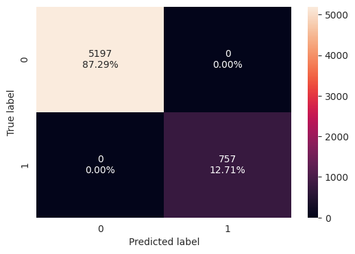
    


    None


                  precision    recall  f1-score   support
    
             0.0       1.00      1.00      1.00      5197
             1.0       1.00      1.00      1.00       757
    
        accuracy                           1.00      5954
       macro avg       1.00      1.00      1.00      5954
    weighted avg       1.00      1.00      1.00      5954
    
    Model Accuracy: 100.00%


  <div id="df-4d0f5837-6953-4195-8996-88b12fe14e37" class="colab-df-container">
    <div>
<style scoped>
    .dataframe tbody tr th:only-of-type {
        vertical-align: middle;
    }

    .dataframe tbody tr th {
        vertical-align: top;
    }

    .dataframe thead th {
        text-align: right;
    }
</style>
<table border="1" class="dataframe">
  <thead>
    <tr style="text-align: right;">
      <th></th>
      <th>Accuracy</th>
      <th>Recall</th>
      <th>Precision</th>
      <th>F1</th>
    </tr>
  </thead>
  <tbody>
    <tr>
      <th>0</th>
      <td>1.0</td>
      <td>1.0</td>
      <td>1.0</td>
      <td>1.0</td>
    </tr>
  </tbody>
</table>
</div>
    <div class="colab-df-buttons">

  <div class="colab-df-container">
    <button class="colab-df-convert" onclick="convertToInteractive('df-4d0f5837-6953-4195-8996-88b12fe14e37')"
            title="Convert this dataframe to an interactive table."
            style="display:none;">

  <svg xmlns="http://www.w3.org/2000/svg" height="24px" viewBox="0 -960 960 960">
    <path d="M120-120v-720h720v720H120Zm60-500h600v-160H180v160Zm220 220h160v-160H400v160Zm0 220h160v-160H400v160ZM180-400h160v-160H180v160Zm440 0h160v-160H620v160ZM180-180h160v-160H180v160Zm440 0h160v-160H620v160Z"/>
  </svg>
    </button>

  <style>
    .colab-df-container {
      display:flex;
      gap: 12px;
    }

    .colab-df-convert {
      background-color: #E8F0FE;
      border: none;
      border-radius: 50%;
      cursor: pointer;
      display: none;
      fill: #1967D2;
      height: 32px;
      padding: 0 0 0 0;
      width: 32px;
    }

    .colab-df-convert:hover {
      background-color: #E2EBFA;
      box-shadow: 0px 1px 2px rgba(60, 64, 67, 0.3), 0px 1px 3px 1px rgba(60, 64, 67, 0.15);
      fill: #174EA6;
    }

    .colab-df-buttons div {
      margin-bottom: 4px;
    }

    [theme=dark] .colab-df-convert {
      background-color: #3B4455;
      fill: #D2E3FC;
    }

    [theme=dark] .colab-df-convert:hover {
      background-color: #434B5C;
      box-shadow: 0px 1px 3px 1px rgba(0, 0, 0, 0.15);
      filter: drop-shadow(0px 1px 2px rgba(0, 0, 0, 0.3));
      fill: #FFFFFF;
    }
  </style>

    <script>
      const buttonEl =
        document.querySelector('#df-4d0f5837-6953-4195-8996-88b12fe14e37 button.colab-df-convert');
      buttonEl.style.display =
        google.colab.kernel.accessAllowed ? 'block' : 'none';

      async function convertToInteractive(key) {
        const element = document.querySelector('#df-4d0f5837-6953-4195-8996-88b12fe14e37');
        const dataTable =
          await google.colab.kernel.invokeFunction('convertToInteractive',
                                                    [key], {});
        if (!dataTable) return;

        const docLinkHtml = 'Like what you see? Visit the ' +
          '<a target="_blank" href=https://colab.research.google.com/notebooks/data_table.ipynb>data table notebook</a>'
          + ' to learn more about interactive tables.';
        element.innerHTML = '';
        dataTable['output_type'] = 'display_data';
        await google.colab.output.renderOutput(dataTable, element);
        const docLink = document.createElement('div');
        docLink.innerHTML = docLinkHtml;
        element.appendChild(docLink);
      }
    </script>
  </div>


    </div>
  </div>


# **Business Insights and Recommendations**

##Process
- Data Collected: Supervisory   Control and Data Acquisition (SCADA) systems capture 10-minute averages of drivetrain vibration, bearing and oil temperatures, rotor and generator speed, and power output.  These samples are taken across 15 turbines
-   Model Used: Used XGBoost, a time-series anomaly detection and survival analysis model to predict the Remaining Useful Life (RUL) of the gearbox components.
- Metric Used:  F1.  This metric
 balances both high recall and high precision. This allows for limiting false negatives which  cause missed faults that can lead to castatrope. It also limits false positives which can overwhelm maintenance crews with false alarms while still catching critical faults before they happen.

## Business Insights

- Finding: Incorrect Yaw degrees contribute the most to avoidable failures.  Yaw is affected by numerous factors including bad nacelle readings, machinery wear (bearings, gears), and low power out put.  Machine wear increases when when wind speeds exceed 15 m/s, a sustained bearing temperature spike above 80°C paired with minor vibration anomalies indicates an potential turbine failure.  Yaw displacement, tower vibration, oil particle count, drivetrain vibration, oil pressure bar, hours since last maintenance, and component age in days all play significant roles in predicting failure.
- Root Cause Analysis: The data proves that standard scheduled is sufficient but misses rapid, declining degradation cycles and yaw deflection that occur during wind events or cold temperatures.

## Recommendations

-  Actionable Step 1:  Continue maintanence schedule as is, making sure to check yaw displacement, tower vibration, oil particle count, drivetrain vibration, oil pressure bar.
-  Actionable Step 2: Deploy an automated alert system that triggers a preventative maintenance inspection the moment tower vibration exceeds 1.5 rms mmps.  
-  Actionable Step 3: Deploy an automated alert system that alerts when gearbox bearing temp exceeds 75 degrees Celcius.
- Actionable Step 4: Deploy an alert when oil particle count exceeds 20.
- Actionable Step 5: Deploy an alert when yaw displacement exceeds .06 degrees.
- Actionable Step 6: Deploy an alert when tower vibration exceeds 1.437 mmps.
- Actionable Step 7: Deploy an alert when nacelle temp exceeds 27.4 degrees Celcius.
- Actionable Step 8: Monitor wind speed, wind speed is optimal for power out when it's between 11.2 and 24mph.  Higher that that the power output declines.
- Actionable Step 9: Pay attention to Turbine 001.  That turbine has the most faults.
- Actionable Step 10: Implement an automated "de-rating" protocol (temporarily capping the tower vibrations) during high-wind events if early thermal stress signs appear, extending component life until a crew arrives.
- Actionable Step 11: Shift from a rigid calendar-based maintenance schedule to a dynamic, predictive scheduling model, prioritizing technicians based on turbine health scores.


##Expected Impact

Reducing catastrophic gearbox failures saving annually in logistics and preserves power generation revenue.  The gearbox alone represents approximately 13% of the overall capital cost of an onshore turbine, and within gearboxes the failures are dominated by bearings: one widely-cited breakdown puts the split at bearings (70%), gears (26%) and other causes (4%).  Noting when these conditions are approaching danger zones can provide maintenance with guidance on where to focus their energies.
